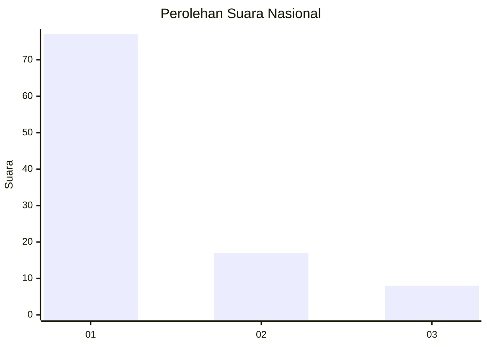
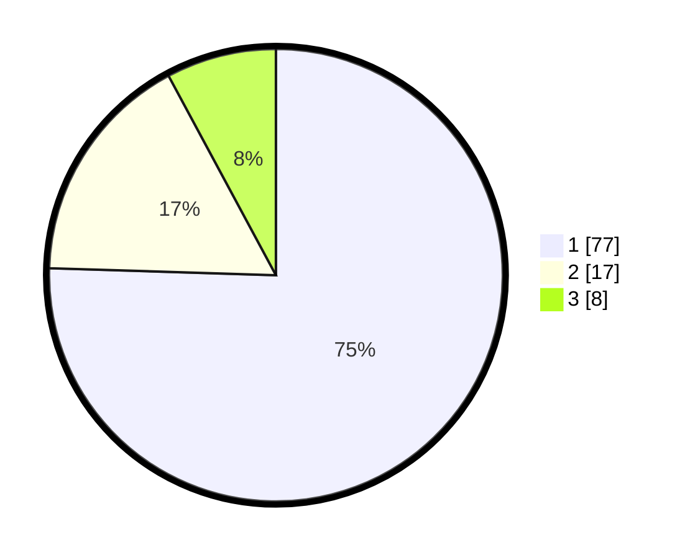

# Hasil

## Grafik

## Tabel

| No. | Nama Paslon    | Suara | Suara (raw) | Persentase |
|:--- |:-------------- | -----:| -----------:| ----------:|
| 1   | ANIES MUHAIMIN | 77    | [77][p-1]   | 75,49      |
| 2   | PRABOWO GIBRAN | 17    | [17][p-2]   | 16,67      |
| 3   | GANJAR MAHFUD  | 8     | [8][p-3]    | 7,84       |

[p-1]: https://github.com/gigit-pemilu/pemilu-2024/blob/main/pilpres/hitung-suara/sub/13-sumatera-barat/sub/06-agam/sub/02-lubuk-basung/sub/2005-manggopoh/sub/028-tps/sub/paslon-1.txt
[p-2]: https://github.com/gigit-pemilu/pemilu-2024/blob/main/pilpres/hitung-suara/sub/13-sumatera-barat/sub/06-agam/sub/02-lubuk-basung/sub/2005-manggopoh/sub/028-tps/sub/paslon-2.txt
[p-3]: https://github.com/gigit-pemilu/pemilu-2024/blob/main/pilpres/hitung-suara/sub/13-sumatera-barat/sub/06-agam/sub/02-lubuk-basung/sub/2005-manggopoh/sub/028-tps/sub/paslon-3.txt

## Foto C Plano

https://sirekap-obj-formc.kpu.go.id/1aec/pemilu/ppwp/13/06/02/20/05/1306022005028-20240214-233414--a751e054-9532-48bb-850c-6944146bac5a.jpg

https://sirekap-obj-formc.kpu.go.id/1aec/pemilu/ppwp/13/06/02/20/05/1306022005028-20240214-233516--4785729d-4be0-4804-a807-d752c261fff6.jpg

https://sirekap-obj-formc.kpu.go.id/1aec/pemilu/ppwp/13/06/02/20/05/1306022005028-20240214-234832--fac783b0-1e83-41dd-b7e2-54106ade9a19.jpg

## Metadata

| Key        | Value               |
| ---------- | ------------------- |
| Time Stamp | 2024-02-25 13:00:00 |

