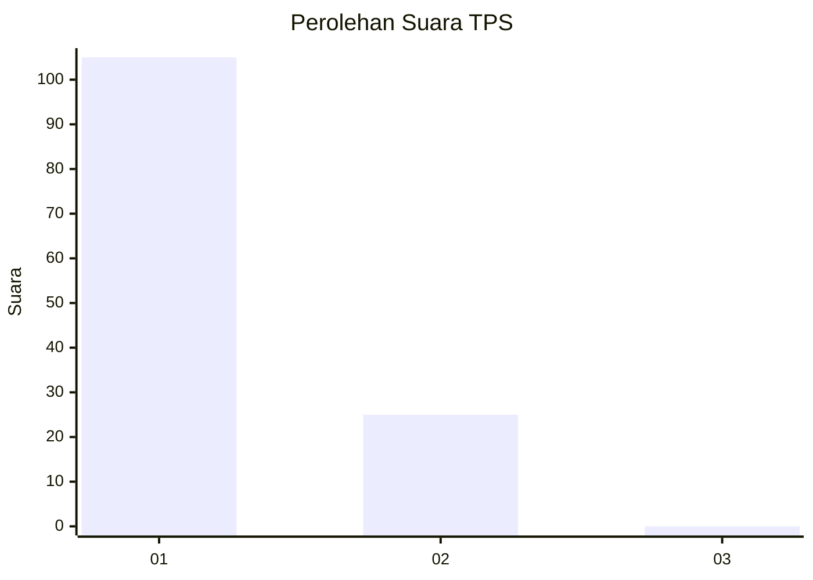
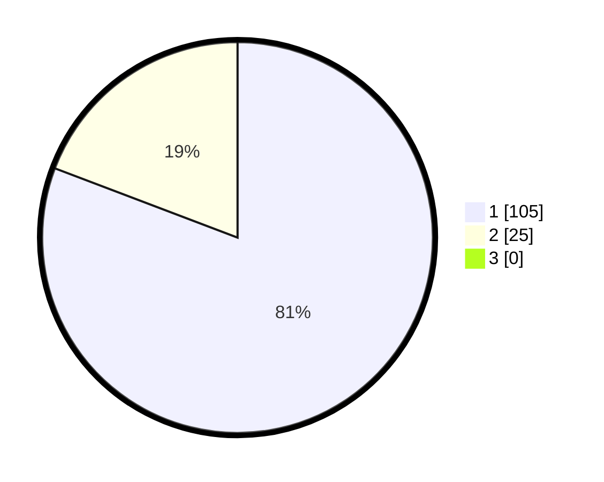

# Hasil

## Grafik

## Tabel

| No. | Nama Paslon    | Suara | Suara (raw) | Persentase |
|:--- |:-------------- | -----:| -----------:| ----------:|
| 1   | ANIES MUHAIMIN | 105   | [105][p-1]  | 80,77      |
| 2   | PRABOWO GIBRAN | 25    | [25][p-2]   | 19,23      |
| 3   | GANJAR MAHFUD  | 0     | [0][p-3]    | 0,00       |

[p-1]: https://github.com/gigit-pemilu/pemilu-2024-13-sumatera-barat/blob/main/pilpres/hitung-suara/sub/13-sumatera-barat/sub/06-agam/sub/02-lubuk-basung/sub/2005-manggopoh/sub/030-tps/sub/paslon-1.txt
[p-2]: https://github.com/gigit-pemilu/pemilu-2024-13-sumatera-barat/blob/main/pilpres/hitung-suara/sub/13-sumatera-barat/sub/06-agam/sub/02-lubuk-basung/sub/2005-manggopoh/sub/030-tps/sub/paslon-2.txt
[p-3]: https://github.com/gigit-pemilu/pemilu-2024-13-sumatera-barat/blob/main/pilpres/hitung-suara/sub/13-sumatera-barat/sub/06-agam/sub/02-lubuk-basung/sub/2005-manggopoh/sub/030-tps/sub/paslon-3.txt

## Foto C Plano

https://sirekap-obj-formc.kpu.go.id/6724/pemilu/ppwp/13/06/02/20/05/1306022005030-20240214-233456--221d5f1e-0a8d-45cf-b0eb-0ba0d3a50c65.jpg

https://sirekap-obj-formc.kpu.go.id/6724/pemilu/ppwp/13/06/02/20/05/1306022005030-20240214-233624--21e02dad-ca07-43f1-834e-16b468c0f3de.jpg

https://sirekap-obj-formc.kpu.go.id/6724/pemilu/ppwp/13/06/02/20/05/1306022005030-20240214-233813--79746dc5-d0f4-4c74-9f5e-fb5c90ad6b7d.jpg

## Metadata

| Key        | Value               |
| ---------- | ------------------- |
| Time Stamp | 2024-02-25 18:00:00 |

