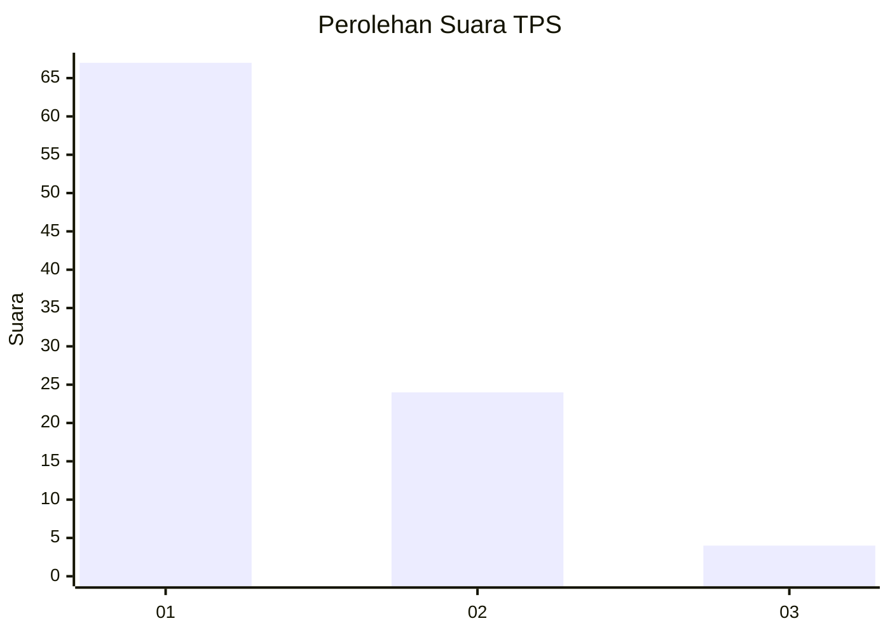
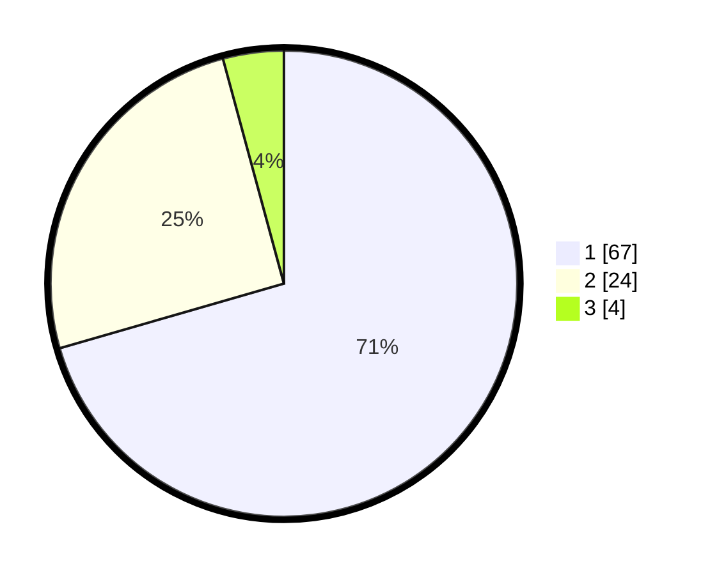

# Hasil

## Grafik

## Tabel

| No. | Nama Paslon    | Suara | Suara (raw) | Persentase |
|:--- |:-------------- | -----:| -----------:| ----------:|
| 1   | ANIES MUHAIMIN | 67    | [67][p-1]   | 70,53      |
| 2   | PRABOWO GIBRAN | 24    | [24][p-2]   | 25,26      |
| 3   | GANJAR MAHFUD  | 4     | [4][p-3]    | 4,21       |

[p-1]: https://github.com/gigit-pemilu/pemilu-2024-13-sumatera-barat/blob/main/pilpres/hitung-suara/sub/13-sumatera-barat/sub/06-agam/sub/02-lubuk-basung/sub/2005-manggopoh/sub/034-tps/sub/paslon-1.txt
[p-2]: https://github.com/gigit-pemilu/pemilu-2024-13-sumatera-barat/blob/main/pilpres/hitung-suara/sub/13-sumatera-barat/sub/06-agam/sub/02-lubuk-basung/sub/2005-manggopoh/sub/034-tps/sub/paslon-2.txt
[p-3]: https://github.com/gigit-pemilu/pemilu-2024-13-sumatera-barat/blob/main/pilpres/hitung-suara/sub/13-sumatera-barat/sub/06-agam/sub/02-lubuk-basung/sub/2005-manggopoh/sub/034-tps/sub/paslon-3.txt

## Foto C Plano

https://sirekap-obj-formc.kpu.go.id/7f0b/pemilu/ppwp/13/06/02/20/05/1306022005034-20240214-193946--de2e07c7-9a51-4fe5-8f4a-d139f7f02890.jpg

https://sirekap-obj-formc.kpu.go.id/7f0b/pemilu/ppwp/13/06/02/20/05/1306022005034-20240214-194358--c18a437b-c751-448a-bab0-0e3a274b54bd.jpg

https://sirekap-obj-formc.kpu.go.id/7f0b/pemilu/ppwp/13/06/02/20/05/1306022005034-20240214-195258--d3f9b852-a5cc-46d6-877b-7299fcfcacdb.jpg

## Metadata

| Key        | Value               |
| ---------- | ------------------- |
| Time Stamp | 2024-02-24 22:31:28 |

