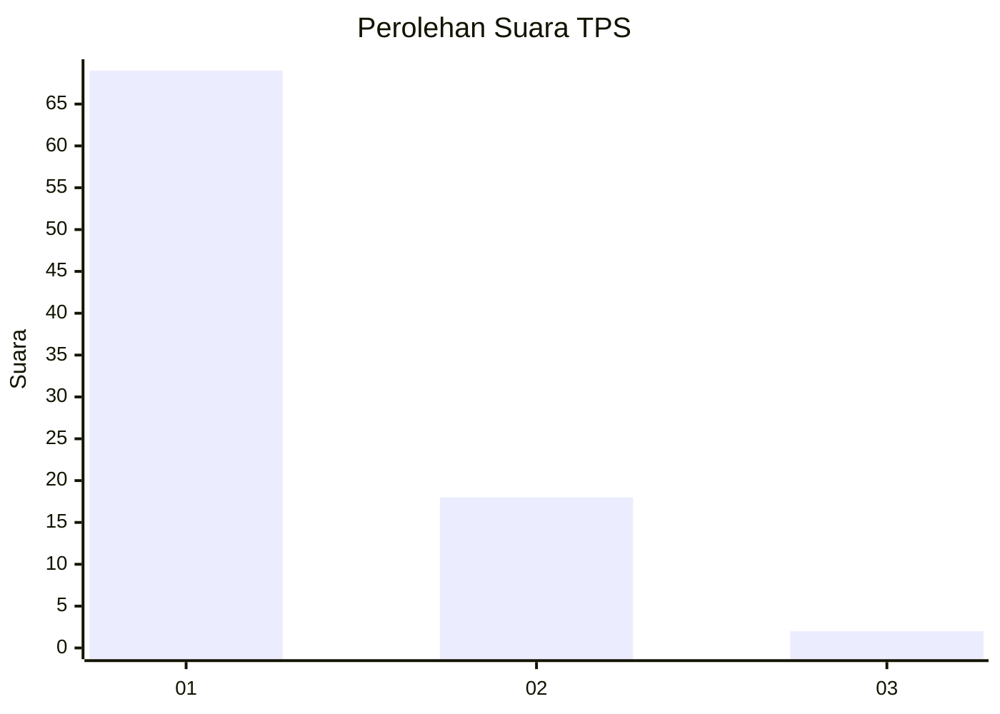
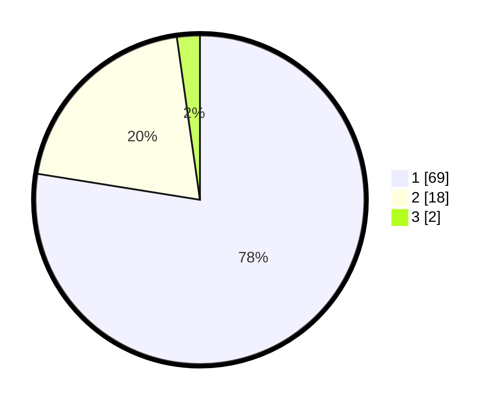

# Hasil

## Grafik

## Tabel

| No. | Nama Paslon    | Suara | Suara (raw) | Persentase |
|:--- |:-------------- | -----:| -----------:| ----------:|
| 1   | ANIES MUHAIMIN | 69    | [69][p-1]   | 77,53      |
| 2   | PRABOWO GIBRAN | 18    | [18][p-2]   | 20,22      |
| 3   | GANJAR MAHFUD  | 2     | [2][p-3]    | 2,25       |

[p-1]: https://github.com/gigit-pemilu/pemilu-2024-13-sumatera-barat/blob/main/pilpres/hitung-suara/sub/13-sumatera-barat/sub/06-agam/sub/02-lubuk-basung/sub/2005-manggopoh/sub/035-tps/sub/paslon-1.txt
[p-2]: https://github.com/gigit-pemilu/pemilu-2024-13-sumatera-barat/blob/main/pilpres/hitung-suara/sub/13-sumatera-barat/sub/06-agam/sub/02-lubuk-basung/sub/2005-manggopoh/sub/035-tps/sub/paslon-2.txt
[p-3]: https://github.com/gigit-pemilu/pemilu-2024-13-sumatera-barat/blob/main/pilpres/hitung-suara/sub/13-sumatera-barat/sub/06-agam/sub/02-lubuk-basung/sub/2005-manggopoh/sub/035-tps/sub/paslon-3.txt

## Foto C Plano

https://sirekap-obj-formc.kpu.go.id/aa73/pemilu/ppwp/13/06/02/20/05/1306022005035-20240214-222852--34b93d9a-47ca-427a-83c1-022f7e3b9b06.jpg

https://sirekap-obj-formc.kpu.go.id/aa73/pemilu/ppwp/13/06/02/20/05/1306022005035-20240214-223221--b0939efd-38d0-40ad-ab4b-8ea544eede98.jpg

https://sirekap-obj-formc.kpu.go.id/aa73/pemilu/ppwp/13/06/02/20/05/1306022005035-20240214-225043--e9e030e9-6a2d-4e8d-a91d-2b8891dafa3f.jpg

## Metadata

| Key        | Value               |
| ---------- | ------------------- |
| Time Stamp | 2024-02-24 22:31:28 |

