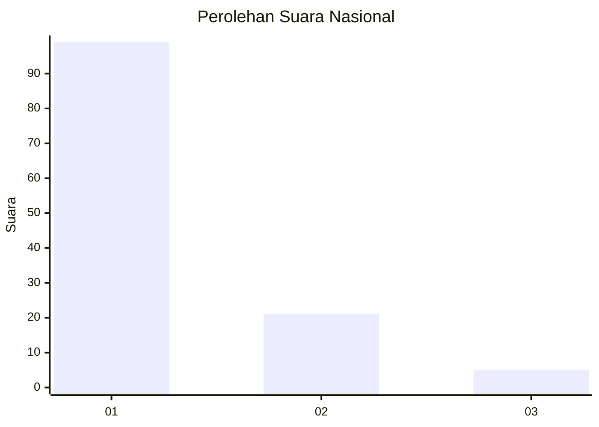
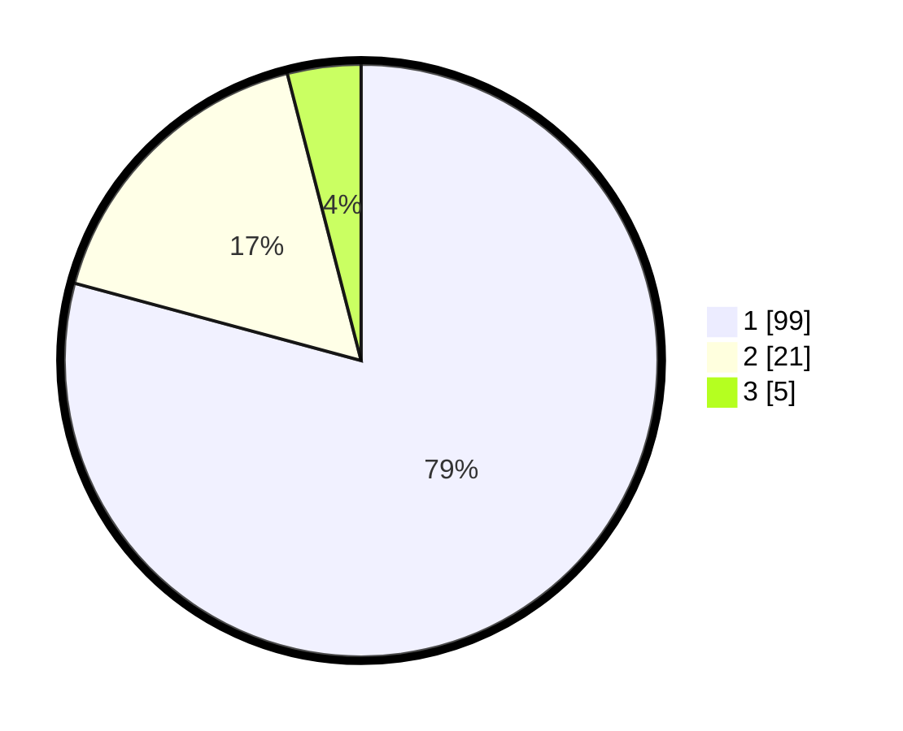

# Hasil

## Grafik

## Tabel

| No. | Nama Paslon    | Suara | Suara (raw) | Persentase |
|:--- |:-------------- | -----:| -----------:| ----------:|
| 1   | ANIES MUHAIMIN | 99    | [99][p-1]   | 79,20      |
| 2   | PRABOWO GIBRAN | 21    | [21][p-2]   | 16,80      |
| 3   | GANJAR MAHFUD  | 5     | [5][p-3]    | 4,00       |

[p-1]: https://github.com/gigit-pemilu/pemilu-2024/blob/main/pilpres/hitung-suara/sub/13-sumatera-barat/sub/06-agam/sub/02-lubuk-basung/sub/2005-manggopoh/sub/042-tps/sub/paslon-1.txt
[p-2]: https://github.com/gigit-pemilu/pemilu-2024/blob/main/pilpres/hitung-suara/sub/13-sumatera-barat/sub/06-agam/sub/02-lubuk-basung/sub/2005-manggopoh/sub/042-tps/sub/paslon-2.txt
[p-3]: https://github.com/gigit-pemilu/pemilu-2024/blob/main/pilpres/hitung-suara/sub/13-sumatera-barat/sub/06-agam/sub/02-lubuk-basung/sub/2005-manggopoh/sub/042-tps/sub/paslon-3.txt

## Foto C Plano

https://sirekap-obj-formc.kpu.go.id/44c5/pemilu/ppwp/13/06/02/20/05/1306022005042-20240214-234904--f0e77c0c-43f1-4c17-bafd-0b9d1a6b9eaa.jpg

https://sirekap-obj-formc.kpu.go.id/44c5/pemilu/ppwp/13/06/02/20/05/1306022005042-20240214-235147--76bfd033-cdc1-4e9a-8aa7-61f63b85a103.jpg

https://sirekap-obj-formc.kpu.go.id/44c5/pemilu/ppwp/13/06/02/20/05/1306022005042-20240214-235631--fd47acc3-5fc0-49aa-ac52-3ec240ba1260.jpg

## Metadata

| Key        | Value               |
| ---------- | ------------------- |
| Time Stamp | 2024-02-24 22:31:28 |

