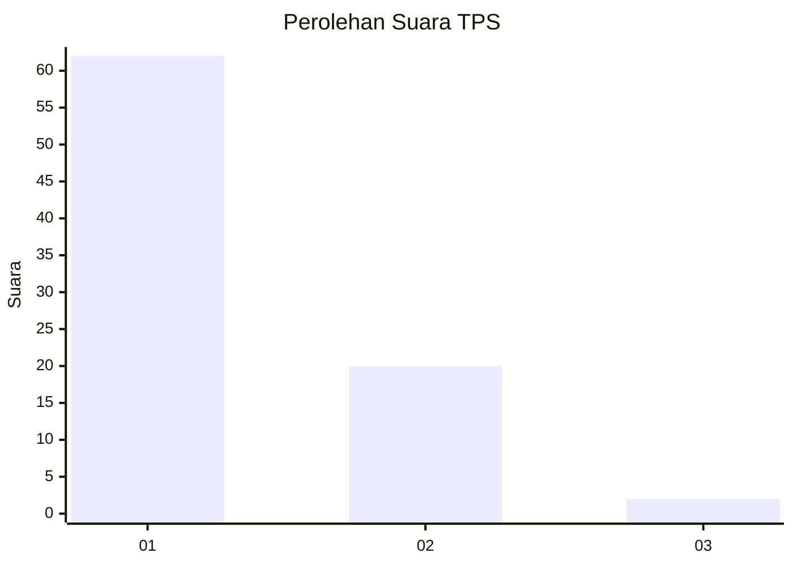
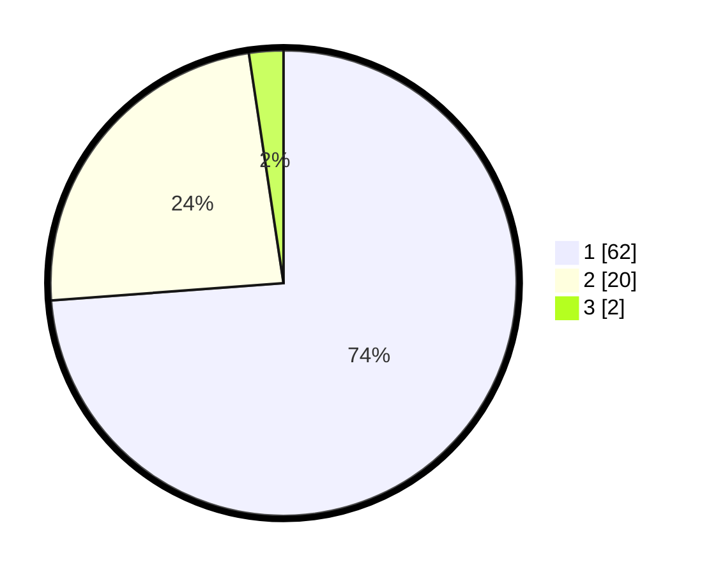

# Hasil

## Grafik

## Tabel

| No. | Nama Paslon    | Suara | Suara (raw) | Persentase |
|:--- |:-------------- | -----:| -----------:| ----------:|
| 1   | ANIES MUHAIMIN | 62    | [62][p-1]   | 73,81      |
| 2   | PRABOWO GIBRAN | 20    | [20][p-2]   | 23,81      |
| 3   | GANJAR MAHFUD  | 2     | [2][p-3]    | 2,38       |

[p-1]: https://github.com/gigit-pemilu/pemilu-2024-13-sumatera-barat/blob/main/pilpres/hitung-suara/sub/13-sumatera-barat/sub/06-agam/sub/02-lubuk-basung/sub/2005-manggopoh/sub/060-tps/sub/paslon-1.txt
[p-2]: https://github.com/gigit-pemilu/pemilu-2024-13-sumatera-barat/blob/main/pilpres/hitung-suara/sub/13-sumatera-barat/sub/06-agam/sub/02-lubuk-basung/sub/2005-manggopoh/sub/060-tps/sub/paslon-2.txt
[p-3]: https://github.com/gigit-pemilu/pemilu-2024-13-sumatera-barat/blob/main/pilpres/hitung-suara/sub/13-sumatera-barat/sub/06-agam/sub/02-lubuk-basung/sub/2005-manggopoh/sub/060-tps/sub/paslon-3.txt

## Foto C Plano

https://sirekap-obj-formc.kpu.go.id/781a/pemilu/ppwp/13/06/02/20/05/1306022005060-20240214-220334--d19759ea-fd8d-4e72-b2e2-3180f2f59a14.jpg

https://sirekap-obj-formc.kpu.go.id/781a/pemilu/ppwp/13/06/02/20/05/1306022005060-20240214-220514--a6032424-d9dd-4de7-b3cf-55156b8d76ac.jpg

https://sirekap-obj-formc.kpu.go.id/781a/pemilu/ppwp/13/06/02/20/05/1306022005060-20240214-220550--540a93ca-ca87-47c5-9641-d7fcdab9376b.jpg

## Metadata

| Key        | Value               |
| ---------- | ------------------- |
| Time Stamp | 2024-02-25 15:00:00 |

