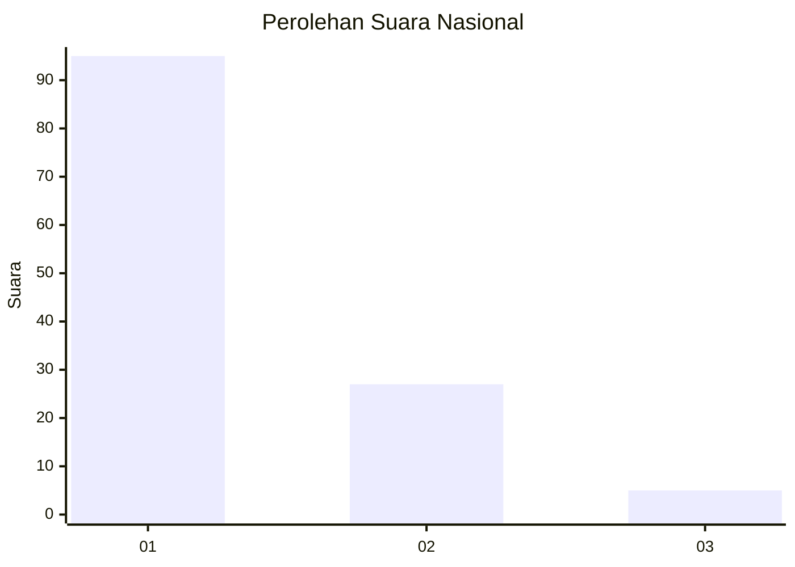
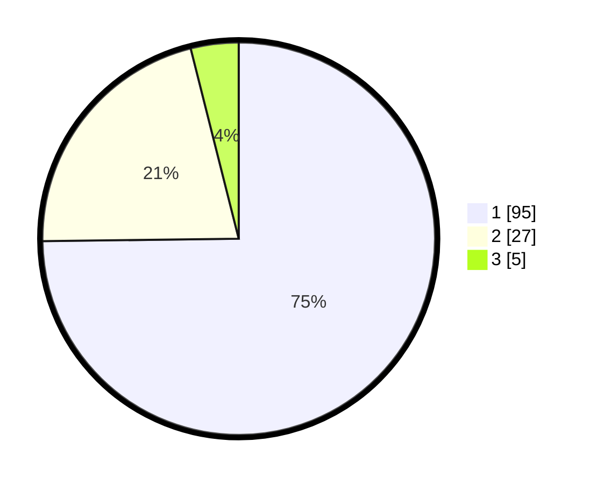

# Hasil

## Grafik

## Tabel

| No. | Nama Paslon    | Suara | Suara (raw) | Persentase |
|:--- |:-------------- | -----:| -----------:| ----------:|
| 1   | ANIES MUHAIMIN | 95    | [95][p-1]   | 74,80      |
| 2   | PRABOWO GIBRAN | 27    | [27][p-2]   | 21,26      |
| 3   | GANJAR MAHFUD  | 5     | [5][p-3]    | 3,94       |

[p-1]: https://github.com/gigit-pemilu/pemilu-2024/blob/main/pilpres/hitung-suara/sub/13-sumatera-barat/sub/06-agam/sub/02-lubuk-basung/sub/2005-manggopoh/sub/067-tps/sub/paslon-1.txt
[p-2]: https://github.com/gigit-pemilu/pemilu-2024/blob/main/pilpres/hitung-suara/sub/13-sumatera-barat/sub/06-agam/sub/02-lubuk-basung/sub/2005-manggopoh/sub/067-tps/sub/paslon-2.txt
[p-3]: https://github.com/gigit-pemilu/pemilu-2024/blob/main/pilpres/hitung-suara/sub/13-sumatera-barat/sub/06-agam/sub/02-lubuk-basung/sub/2005-manggopoh/sub/067-tps/sub/paslon-3.txt

## Foto C Plano

https://sirekap-obj-formc.kpu.go.id/33bd/pemilu/ppwp/13/06/02/20/05/1306022005067-20240215-032557--7ac03cab-0cfc-4b22-ae65-a9c4f9314506.jpg

https://sirekap-obj-formc.kpu.go.id/33bd/pemilu/ppwp/13/06/02/20/05/1306022005067-20240215-032805--3df58838-c88c-4ba9-845b-35df40fbb86a.jpg

https://sirekap-obj-formc.kpu.go.id/33bd/pemilu/ppwp/13/06/02/20/05/1306022005067-20240215-104807--27fcd45d-4553-4c38-93d8-c1c27d1143f7.jpg

## Metadata

| Key        | Value               |
| ---------- | ------------------- |
| Time Stamp | 2024-02-21 23:00:00 |

