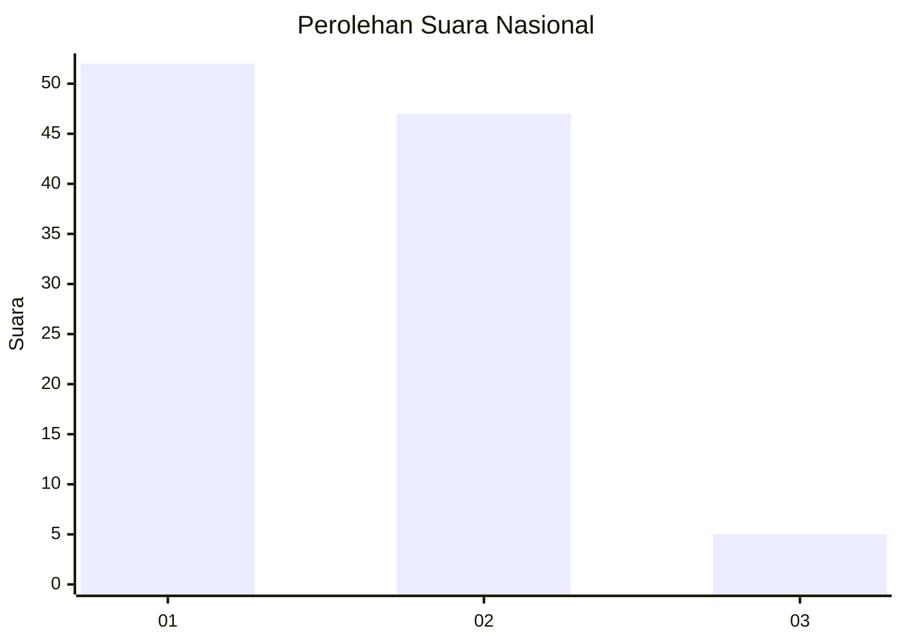
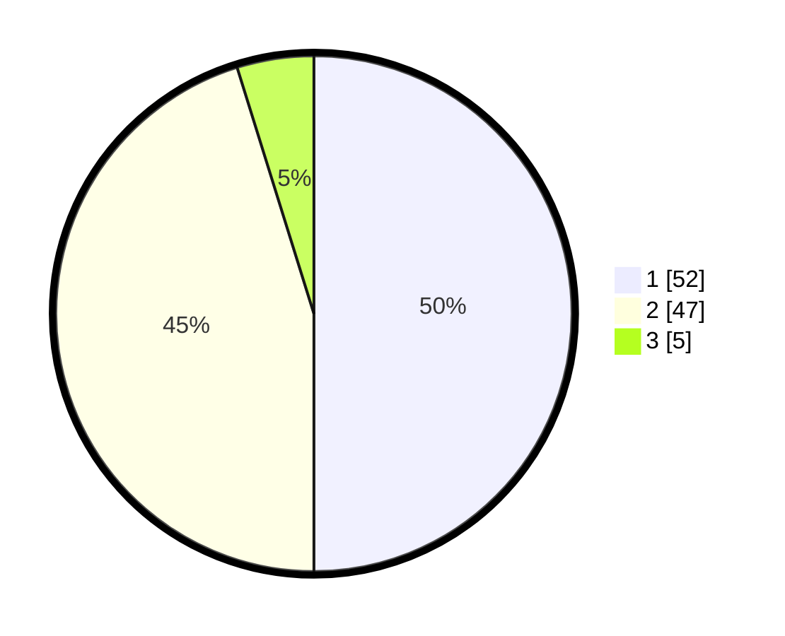

# Hasil

## Grafik

## Tabel

| No. | Nama Paslon    | Suara | Suara (raw) | Persentase |
|:--- |:-------------- | -----:| -----------:| ----------:|
| 1   | ANIES MUHAIMIN | 52    | [52][p-1]   | 50,00      |
| 2   | PRABOWO GIBRAN | 47    | [47][p-2]   | 45,19      |
| 3   | GANJAR MAHFUD  | 5     | [5][p-3]    | 4,81       |

[p-1]: https://github.com/gigit-pemilu/pemilu-2024/blob/main/pilpres/hitung-suara/sub/13-sumatera-barat/sub/06-agam/sub/02-lubuk-basung/sub/2005-manggopoh/sub/072-tps/sub/paslon-1.txt
[p-2]: https://github.com/gigit-pemilu/pemilu-2024/blob/main/pilpres/hitung-suara/sub/13-sumatera-barat/sub/06-agam/sub/02-lubuk-basung/sub/2005-manggopoh/sub/072-tps/sub/paslon-2.txt
[p-3]: https://github.com/gigit-pemilu/pemilu-2024/blob/main/pilpres/hitung-suara/sub/13-sumatera-barat/sub/06-agam/sub/02-lubuk-basung/sub/2005-manggopoh/sub/072-tps/sub/paslon-3.txt

## Foto C Plano

https://sirekap-obj-formc.kpu.go.id/322d/pemilu/ppwp/13/06/02/20/05/1306022005072-20240215-024715--6feb1576-8273-4ccc-b2ee-5e65dae8bf02.jpg

https://sirekap-obj-formc.kpu.go.id/322d/pemilu/ppwp/13/06/02/20/05/1306022005072-20240215-024734--9f017eba-c5f7-4a37-9284-b8a7c865e871.jpg

https://sirekap-obj-formc.kpu.go.id/322d/pemilu/ppwp/13/06/02/20/05/1306022005072-20240215-024741--15883da3-3867-4066-93d7-5929b36c664a.jpg

## Metadata

| Key        | Value               |
| ---------- | ------------------- |
| Time Stamp | 2024-02-15 12:00:28 |

