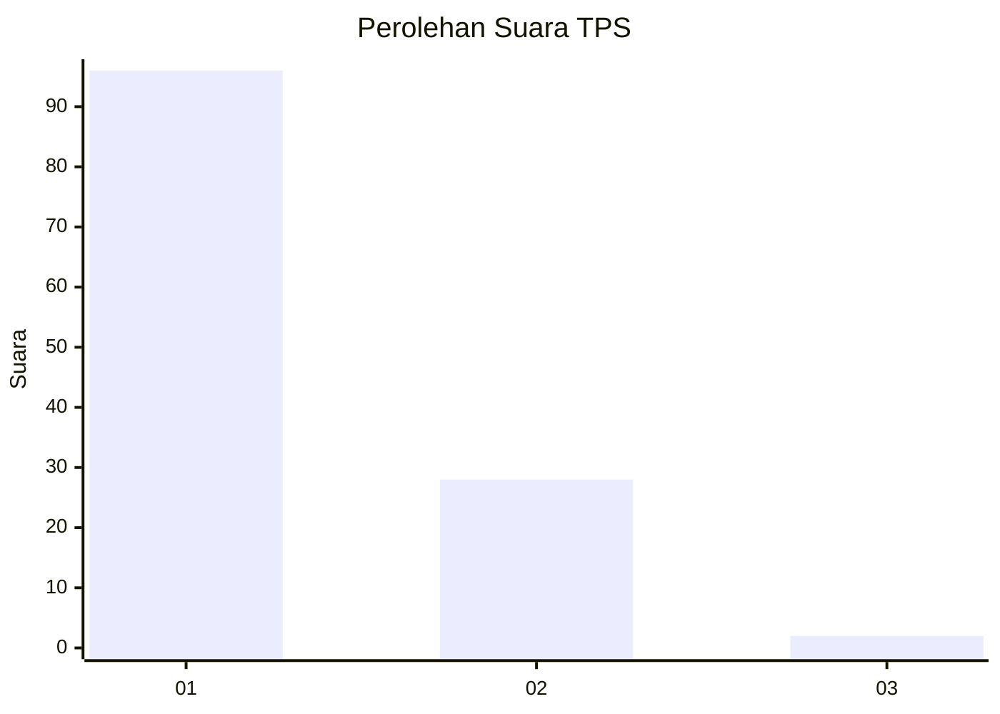
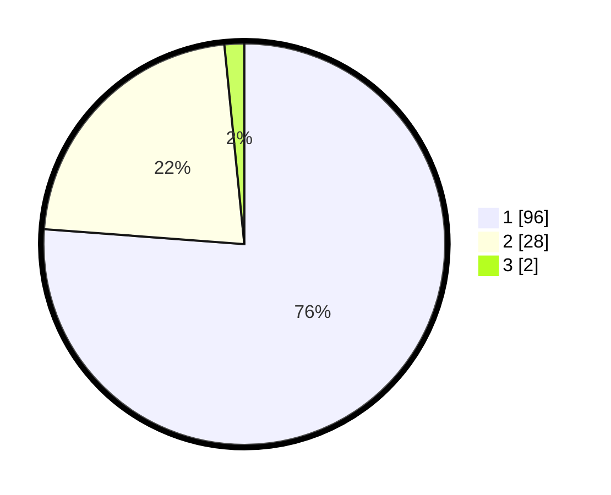

# Hasil

## Grafik

## Tabel

| No. | Nama Paslon    | Suara | Suara (raw) | Persentase |
|:--- |:-------------- | -----:| -----------:| ----------:|
| 1   | ANIES MUHAIMIN | 96    | [96][p-1]   | 76,19      |
| 2   | PRABOWO GIBRAN | 28    | [28][p-2]   | 22,22      |
| 3   | GANJAR MAHFUD  | 2     | [2][p-3]    | 1,59       |

[p-1]: https://github.com/gigit-pemilu/pemilu-2024-13-sumatera-barat/blob/main/pilpres/hitung-suara/sub/13-sumatera-barat/sub/06-agam/sub/02-lubuk-basung/sub/2005-manggopoh/sub/083-tps/sub/paslon-1.txt
[p-2]: https://github.com/gigit-pemilu/pemilu-2024-13-sumatera-barat/blob/main/pilpres/hitung-suara/sub/13-sumatera-barat/sub/06-agam/sub/02-lubuk-basung/sub/2005-manggopoh/sub/083-tps/sub/paslon-2.txt
[p-3]: https://github.com/gigit-pemilu/pemilu-2024-13-sumatera-barat/blob/main/pilpres/hitung-suara/sub/13-sumatera-barat/sub/06-agam/sub/02-lubuk-basung/sub/2005-manggopoh/sub/083-tps/sub/paslon-3.txt

## Foto C Plano

https://sirekap-obj-formc.kpu.go.id/7cd4/pemilu/ppwp/13/06/02/20/05/1306022005083-20240214-214637--2d6c6ac7-0bdf-406f-9f3b-e2d33158c176.jpg

https://sirekap-obj-formc.kpu.go.id/7cd4/pemilu/ppwp/13/06/02/20/05/1306022005083-20240215-034324--fc7933e0-e4f3-4e36-b30a-9df47d8df474.jpg

https://sirekap-obj-formc.kpu.go.id/7cd4/pemilu/ppwp/13/06/02/20/05/1306022005083-20240214-214415--4edcf810-81ed-4b78-b6c6-ce8183614115.jpg

## Metadata

| Key        | Value               |
| ---------- | ------------------- |
| Time Stamp | 2024-02-25 16:00:00 |

