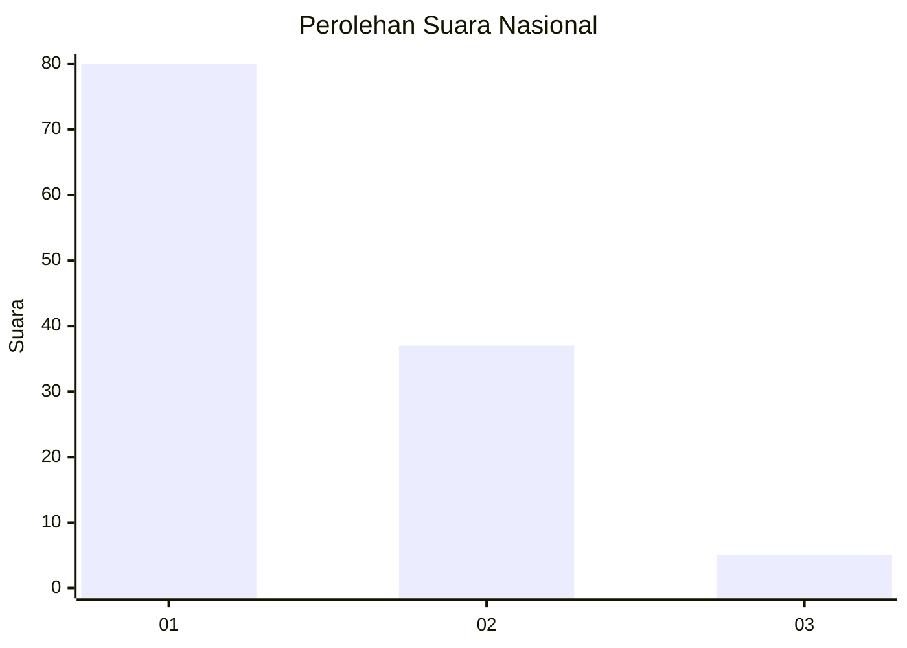
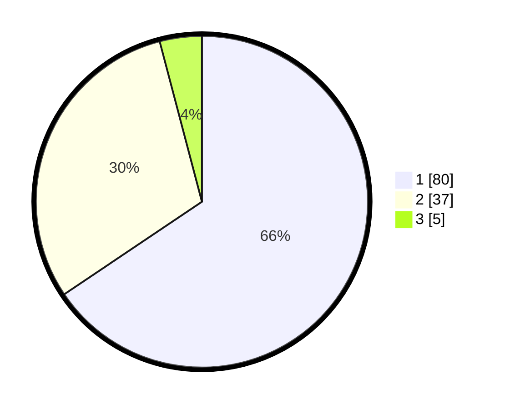

# Hasil

## Grafik

## Tabel

| No. | Nama Paslon    | Suara | Suara (raw) | Persentase |
|:--- |:-------------- | -----:| -----------:| ----------:|
| 1   | ANIES MUHAIMIN | 80    | [80][p-1]   | 65,57      |
| 2   | PRABOWO GIBRAN | 37    | [37][p-2]   | 30,33      |
| 3   | GANJAR MAHFUD  | 5     | [5][p-3]    | 4,10       |

[p-1]: https://github.com/gigit-pemilu/pemilu-2024/blob/main/pilpres/hitung-suara/sub/13-sumatera-barat/sub/06-agam/sub/03-tanjung-raya/sub/2008-koto-gadang-anam-koto/sub/002-tps/sub/paslon-1.txt
[p-2]: https://github.com/gigit-pemilu/pemilu-2024/blob/main/pilpres/hitung-suara/sub/13-sumatera-barat/sub/06-agam/sub/03-tanjung-raya/sub/2008-koto-gadang-anam-koto/sub/002-tps/sub/paslon-2.txt
[p-3]: https://github.com/gigit-pemilu/pemilu-2024/blob/main/pilpres/hitung-suara/sub/13-sumatera-barat/sub/06-agam/sub/03-tanjung-raya/sub/2008-koto-gadang-anam-koto/sub/002-tps/sub/paslon-3.txt

## Foto C Plano

https://sirekap-obj-formc.kpu.go.id/e05c/pemilu/ppwp/13/06/03/20/08/1306032008002-20240215-130739--e4f6ee82-b6a7-42b2-bb44-c42477a382dc.jpg

https://sirekap-obj-formc.kpu.go.id/e05c/pemilu/ppwp/13/06/03/20/08/1306032008002-20240215-130746--112d820b-307e-401f-83f3-412535852d32.jpg

https://sirekap-obj-formc.kpu.go.id/e05c/pemilu/ppwp/13/06/03/20/08/1306032008002-20240215-130755--8540490f-22bf-4c5b-bf30-3aad65fa5513.jpg

## Metadata

| Key        | Value               |
| ---------- | ------------------- |
| Time Stamp | 2024-02-25 16:00:00 |

