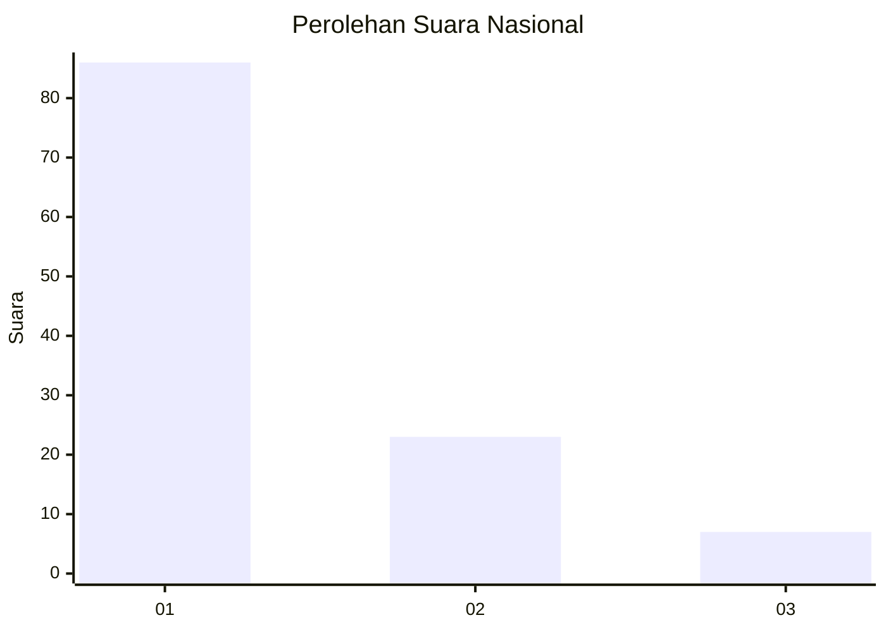
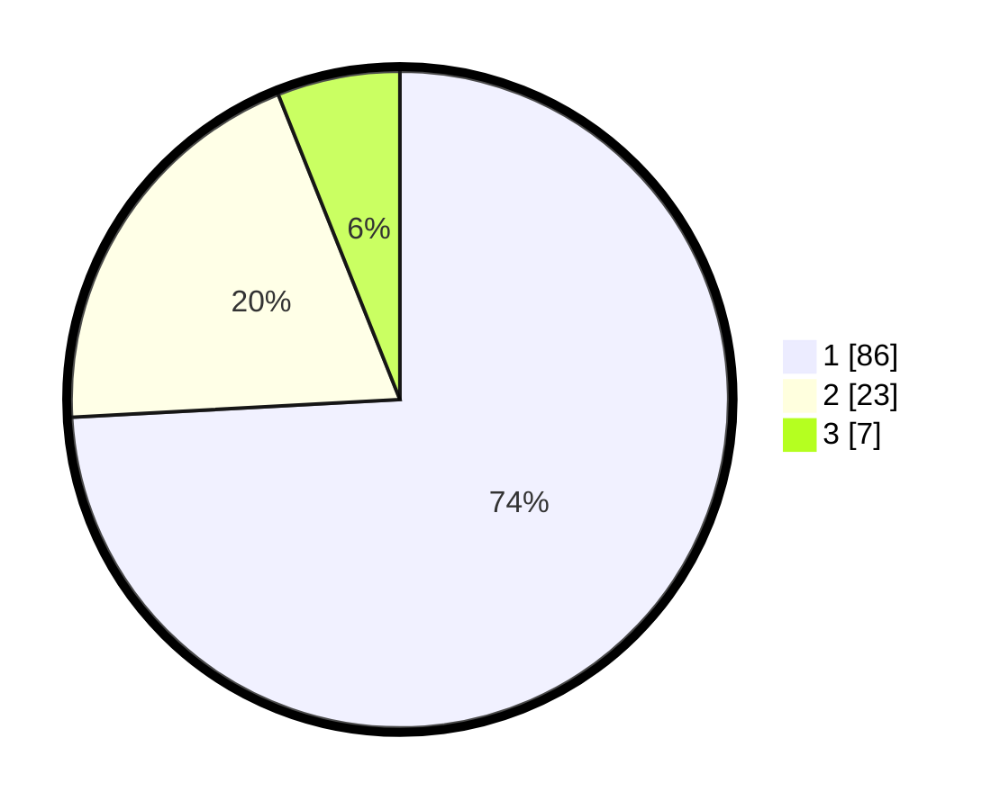

# Hasil

## Grafik

## Tabel

| No. | Nama Paslon    | Suara | Suara (raw) | Persentase |
|:--- |:-------------- | -----:| -----------:| ----------:|
| 1   | ANIES MUHAIMIN | 86    | [86][p-1]   | 74,14      |
| 2   | PRABOWO GIBRAN | 23    | [23][p-2]   | 19,83      |
| 3   | GANJAR MAHFUD  | 7     | [7][p-3]    | 6,03       |

[p-1]: https://github.com/gigit-pemilu/pemilu-2024/blob/main/pilpres/hitung-suara/sub/13-sumatera-barat/sub/06-agam/sub/03-tanjung-raya/sub/2011-dalko/sub/004-tps/sub/paslon-1.txt
[p-2]: https://github.com/gigit-pemilu/pemilu-2024/blob/main/pilpres/hitung-suara/sub/13-sumatera-barat/sub/06-agam/sub/03-tanjung-raya/sub/2011-dalko/sub/004-tps/sub/paslon-2.txt
[p-3]: https://github.com/gigit-pemilu/pemilu-2024/blob/main/pilpres/hitung-suara/sub/13-sumatera-barat/sub/06-agam/sub/03-tanjung-raya/sub/2011-dalko/sub/004-tps/sub/paslon-3.txt

## Foto C Plano

https://sirekap-obj-formc.kpu.go.id/2db8/pemilu/ppwp/13/06/03/20/11/1306032011004-20240214-204523--35f3e4f5-4beb-459b-8042-4d72a1295049.jpg

https://sirekap-obj-formc.kpu.go.id/2db8/pemilu/ppwp/13/06/03/20/11/1306032011004-20240220-144114--2ea943c3-7a44-429f-a1b7-b86060b7e405.jpg

https://sirekap-obj-formc.kpu.go.id/2db8/pemilu/ppwp/13/06/03/20/11/1306032011004-20240220-144338--3d293f6a-c3af-48a7-875c-edc21ed288cb.jpg

## Metadata

| Key        | Value               |
| ---------- | ------------------- |
| Time Stamp | 2024-02-20 15:00:00 |

