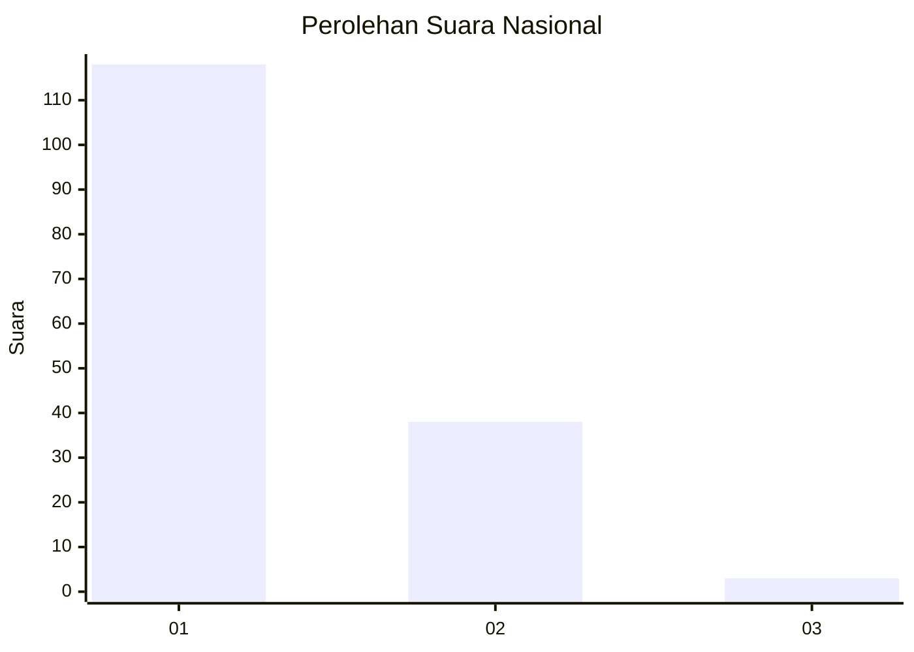
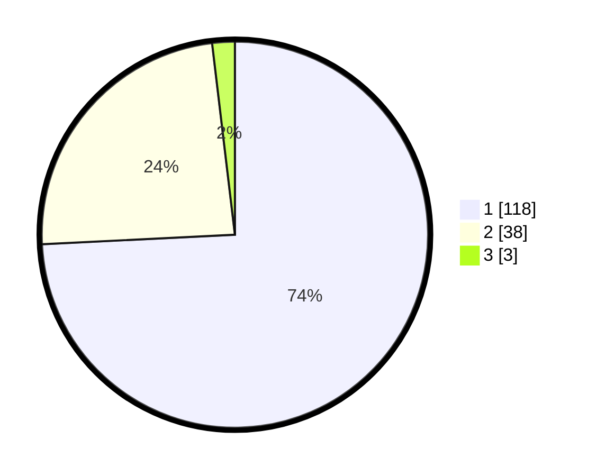

# Hasil

## Grafik

## Tabel

| No. | Nama Paslon    | Suara | Suara (raw) | Persentase |
|:--- |:-------------- | -----:| -----------:| ----------:|
| 1   | ANIES MUHAIMIN | 118   | [118][p-1]  | 74,21      |
| 2   | PRABOWO GIBRAN | 38    | [38][p-2]   | 23,90      |
| 3   | GANJAR MAHFUD  | 3     | [3][p-3]    | 1,89       |

[p-1]: https://github.com/gigit-pemilu/pemilu-2024/blob/main/pilpres/hitung-suara/sub/13-sumatera-barat/sub/06-agam/sub/03-tanjung-raya/sub/2011-dalko/sub/005-tps/sub/paslon-1.txt
[p-2]: https://github.com/gigit-pemilu/pemilu-2024/blob/main/pilpres/hitung-suara/sub/13-sumatera-barat/sub/06-agam/sub/03-tanjung-raya/sub/2011-dalko/sub/005-tps/sub/paslon-2.txt
[p-3]: https://github.com/gigit-pemilu/pemilu-2024/blob/main/pilpres/hitung-suara/sub/13-sumatera-barat/sub/06-agam/sub/03-tanjung-raya/sub/2011-dalko/sub/005-tps/sub/paslon-3.txt

## Foto C Plano

https://sirekap-obj-formc.kpu.go.id/593e/pemilu/ppwp/13/06/03/20/11/1306032011005-20240220-165211--e0932b65-28d9-4748-b670-4dec18591326.jpg

https://sirekap-obj-formc.kpu.go.id/593e/pemilu/ppwp/13/06/03/20/11/1306032011005-20240220-165409--bb0e046e-61ee-485e-8c37-5f4b98543d62.jpg

https://sirekap-obj-formc.kpu.go.id/593e/pemilu/ppwp/13/06/03/20/11/1306032011005-20240214-231950--110b6736-d713-44e0-ac48-96aeb611cd60.jpg

## Metadata

| Key        | Value               |
| ---------- | ------------------- |
| Time Stamp | 2024-02-25 22:00:00 |

