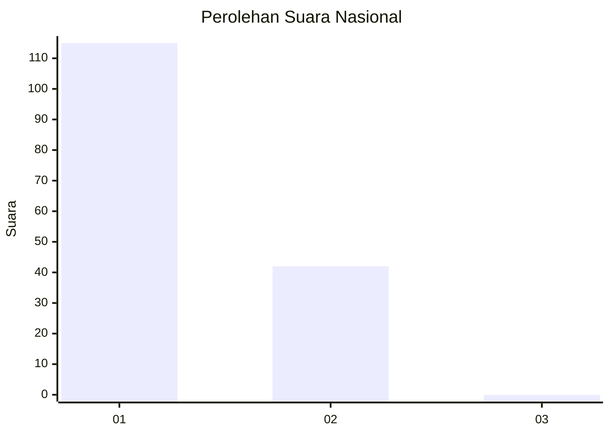
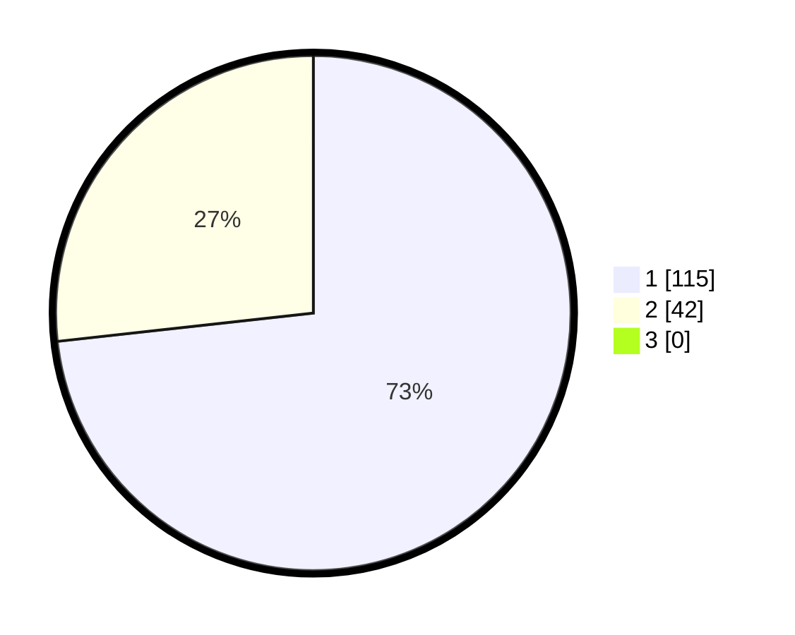

# Hasil

## Grafik

## Tabel

| No. | Nama Paslon    | Suara | Suara (raw) | Persentase |
|:--- |:-------------- | -----:| -----------:| ----------:|
| 1   | ANIES MUHAIMIN | 115   | [115][p-1]  | 73,25      |
| 2   | PRABOWO GIBRAN | 42    | [42][p-2]   | 26,75      |
| 3   | GANJAR MAHFUD  | 0     | [0][p-3]    | 0,00       |

[p-1]: https://github.com/gigit-pemilu/pemilu-2024/blob/main/pilpres/hitung-suara/sub/13-sumatera-barat/sub/06-agam/sub/06-banuhampu/sub/2001-padang-lua/sub/002-tps/sub/paslon-1.txt
[p-2]: https://github.com/gigit-pemilu/pemilu-2024/blob/main/pilpres/hitung-suara/sub/13-sumatera-barat/sub/06-agam/sub/06-banuhampu/sub/2001-padang-lua/sub/002-tps/sub/paslon-2.txt
[p-3]: https://github.com/gigit-pemilu/pemilu-2024/blob/main/pilpres/hitung-suara/sub/13-sumatera-barat/sub/06-agam/sub/06-banuhampu/sub/2001-padang-lua/sub/002-tps/sub/paslon-3.txt

## Foto C Plano

https://sirekap-obj-formc.kpu.go.id/8d27/pemilu/ppwp/13/06/06/20/01/1306062001002-20240218-205700--467bb4c3-b1da-4cc6-9d9a-68f3da585fce.jpg

https://sirekap-obj-formc.kpu.go.id/8d27/pemilu/ppwp/13/06/06/20/01/1306062001002-20240217-152616--34a4d592-90e5-433e-a014-2245bb5fb408.jpg

https://sirekap-obj-formc.kpu.go.id/8d27/pemilu/ppwp/13/06/06/20/01/1306062001002-20240217-152709--ad95ebe7-855d-45f1-a97d-5303462195e8.jpg

## Metadata

| Key        | Value               |
| ---------- | ------------------- |
| Time Stamp | 2024-02-25 20:00:00 |

