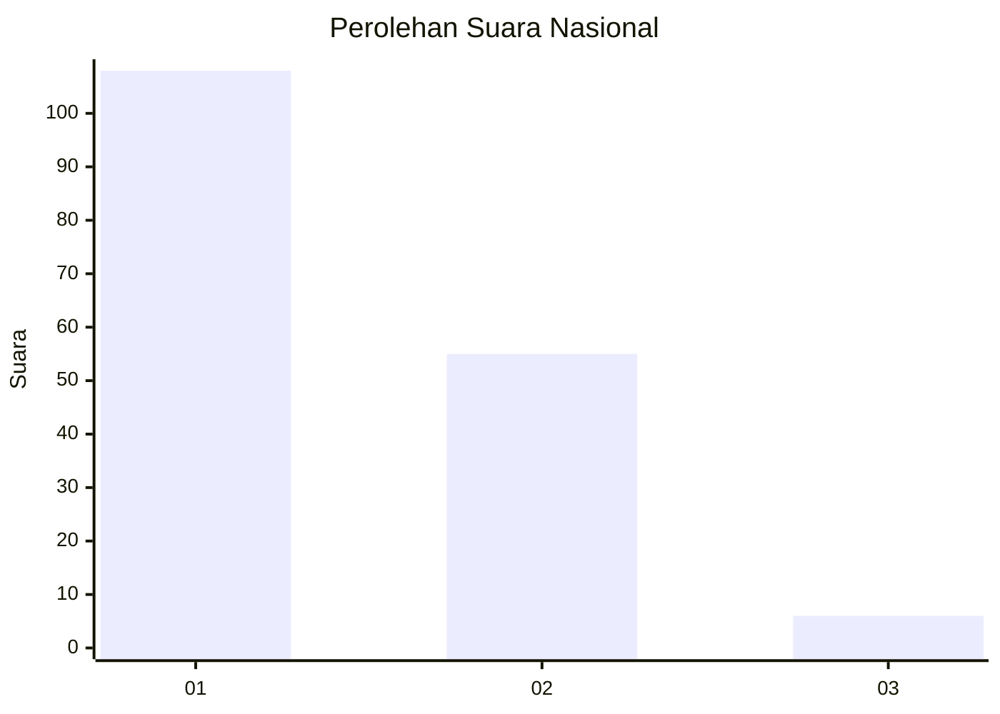
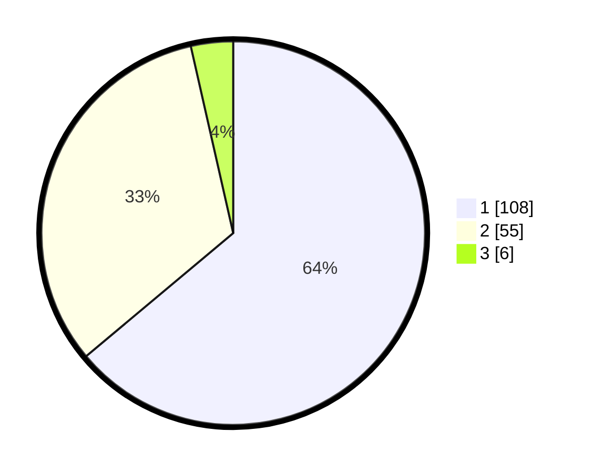

# Hasil

## Grafik

## Tabel

| No. | Nama Paslon    | Suara | Suara (raw) | Persentase |
|:--- |:-------------- | -----:| -----------:| ----------:|
| 1   | ANIES MUHAIMIN | 108   | [108][p-1]  | 63,91      |
| 2   | PRABOWO GIBRAN | 55    | [55][p-2]   | 32,54      |
| 3   | GANJAR MAHFUD  | 6     | [6][p-3]    | 3,55       |

[p-1]: https://github.com/gigit-pemilu/pemilu-2024/blob/main/pilpres/hitung-suara/sub/13-sumatera-barat/sub/06-agam/sub/06-banuhampu/sub/2001-padang-lua/sub/003-tps/sub/paslon-1.txt
[p-2]: https://github.com/gigit-pemilu/pemilu-2024/blob/main/pilpres/hitung-suara/sub/13-sumatera-barat/sub/06-agam/sub/06-banuhampu/sub/2001-padang-lua/sub/003-tps/sub/paslon-2.txt
[p-3]: https://github.com/gigit-pemilu/pemilu-2024/blob/main/pilpres/hitung-suara/sub/13-sumatera-barat/sub/06-agam/sub/06-banuhampu/sub/2001-padang-lua/sub/003-tps/sub/paslon-3.txt

## Foto C Plano

https://sirekap-obj-formc.kpu.go.id/e74d/pemilu/ppwp/13/06/06/20/01/1306062001003-20240214-223939--bb957086-9577-4741-bc45-50441f460657.jpg

https://sirekap-obj-formc.kpu.go.id/e74d/pemilu/ppwp/13/06/06/20/01/1306062001003-20240214-224054--ce548834-0052-473b-867d-96fcc0d2e87f.jpg

https://sirekap-obj-formc.kpu.go.id/e74d/pemilu/ppwp/13/06/06/20/01/1306062001003-20240214-224211--5a623c85-09c7-4891-af85-8e3047c942b0.jpg

## Metadata

| Key        | Value               |
| ---------- | ------------------- |
| Time Stamp | 2024-02-17 16:00:02 |

