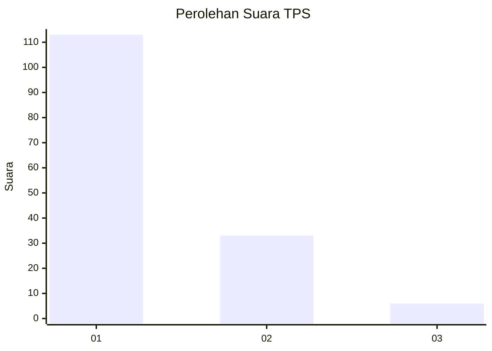
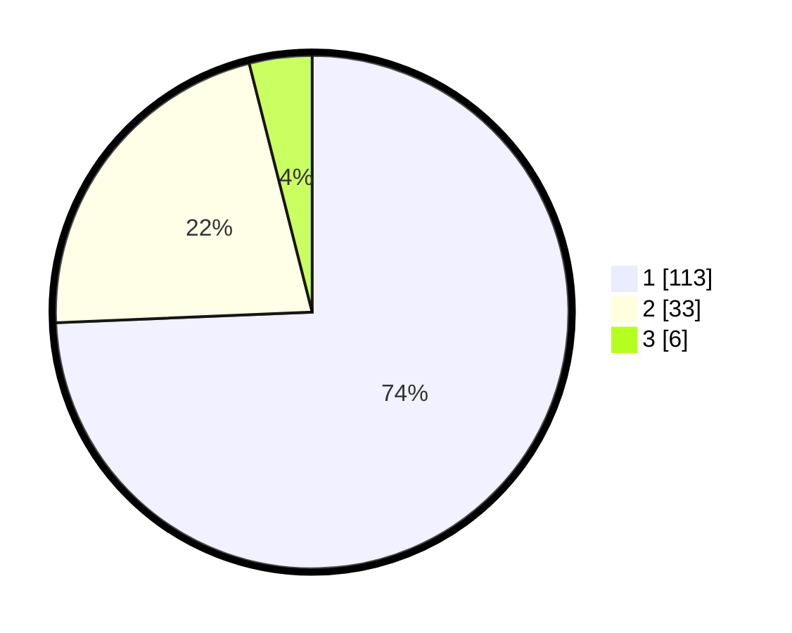

# Hasil

## Grafik

## Tabel

| No. | Nama Paslon    | Suara | Suara (raw) | Persentase |
|:--- |:-------------- | -----:| -----------:| ----------:|
| 1   | ANIES MUHAIMIN | 113   | [113][p-1]  | 74,34      |
| 2   | PRABOWO GIBRAN | 33    | [33][p-2]   | 21,71      |
| 3   | GANJAR MAHFUD  | 6     | [6][p-3]    | 3,95       |

[p-1]: https://github.com/gigit-pemilu/pemilu-2024-13-sumatera-barat/blob/main/pilpres/hitung-suara/sub/13-sumatera-barat/sub/06-agam/sub/06-banuhampu/sub/2001-padang-lua/sub/005-tps/sub/paslon-1.txt
[p-2]: https://github.com/gigit-pemilu/pemilu-2024-13-sumatera-barat/blob/main/pilpres/hitung-suara/sub/13-sumatera-barat/sub/06-agam/sub/06-banuhampu/sub/2001-padang-lua/sub/005-tps/sub/paslon-2.txt
[p-3]: https://github.com/gigit-pemilu/pemilu-2024-13-sumatera-barat/blob/main/pilpres/hitung-suara/sub/13-sumatera-barat/sub/06-agam/sub/06-banuhampu/sub/2001-padang-lua/sub/005-tps/sub/paslon-3.txt

## Foto C Plano

https://sirekap-obj-formc.kpu.go.id/4bef/pemilu/ppwp/13/06/06/20/01/1306062001005-20240217-203223--a092f61c-2958-40da-8776-1034cc041fe5.jpg

https://sirekap-obj-formc.kpu.go.id/4bef/pemilu/ppwp/13/06/06/20/01/1306062001005-20240217-203256--a2ecfdd1-29f0-445d-9371-87eb375bbb4d.jpg

https://sirekap-obj-formc.kpu.go.id/4bef/pemilu/ppwp/13/06/06/20/01/1306062001005-20240217-203330--446ee4d7-e07e-4e48-9256-cbc423a908f4.jpg

## Metadata

| Key        | Value               |
| ---------- | ------------------- |
| Time Stamp | 2024-02-25 00:00:00 |

