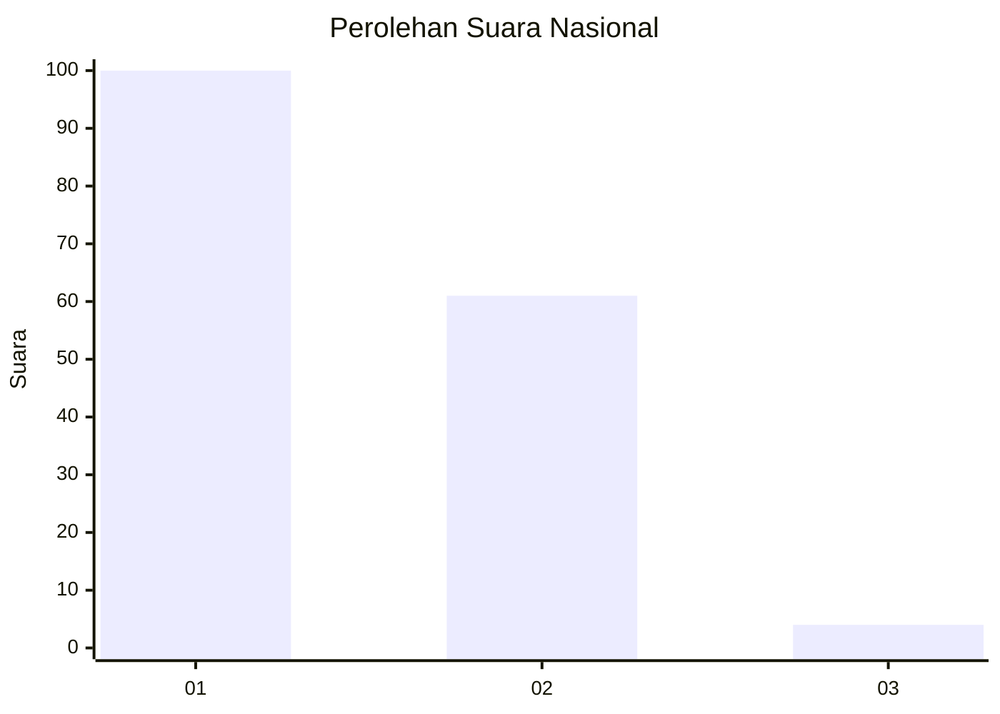
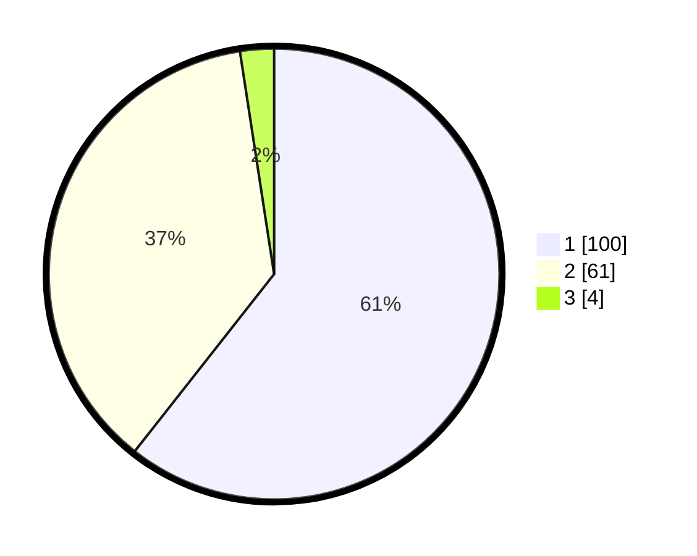

# Hasil

## Grafik

## Tabel

| No. | Nama Paslon    | Suara | Suara (raw) | Persentase |
|:--- |:-------------- | -----:| -----------:| ----------:|
| 1   | ANIES MUHAIMIN | 100   | [100][p-1]  | 60,61      |
| 2   | PRABOWO GIBRAN | 61    | [61][p-2]   | 36,97      |
| 3   | GANJAR MAHFUD  | 4     | [4][p-3]    | 2,42       |

[p-1]: https://github.com/gigit-pemilu/pemilu-2024/blob/main/pilpres/hitung-suara/sub/13-sumatera-barat/sub/06-agam/sub/06-banuhampu/sub/2001-padang-lua/sub/006-tps/sub/paslon-1.txt
[p-2]: https://github.com/gigit-pemilu/pemilu-2024/blob/main/pilpres/hitung-suara/sub/13-sumatera-barat/sub/06-agam/sub/06-banuhampu/sub/2001-padang-lua/sub/006-tps/sub/paslon-2.txt
[p-3]: https://github.com/gigit-pemilu/pemilu-2024/blob/main/pilpres/hitung-suara/sub/13-sumatera-barat/sub/06-agam/sub/06-banuhampu/sub/2001-padang-lua/sub/006-tps/sub/paslon-3.txt

## Foto C Plano

https://sirekap-obj-formc.kpu.go.id/df4d/pemilu/ppwp/13/06/06/20/01/1306062001006-20240217-225220--60cd8c3a-5f98-43c5-9652-3abc8e5971fe.jpg

https://sirekap-obj-formc.kpu.go.id/df4d/pemilu/ppwp/13/06/06/20/01/1306062001006-20240217-225355--cf4c9a1b-d44a-428a-9a36-4b32d3366d70.jpg

https://sirekap-obj-formc.kpu.go.id/df4d/pemilu/ppwp/13/06/06/20/01/1306062001006-20240217-225454--26ff5a0d-b81f-4f7a-a123-1ad65eecf838.jpg

## Metadata

| Key        | Value               |
| ---------- | ------------------- |
| Time Stamp | 2024-02-25 22:00:00 |

