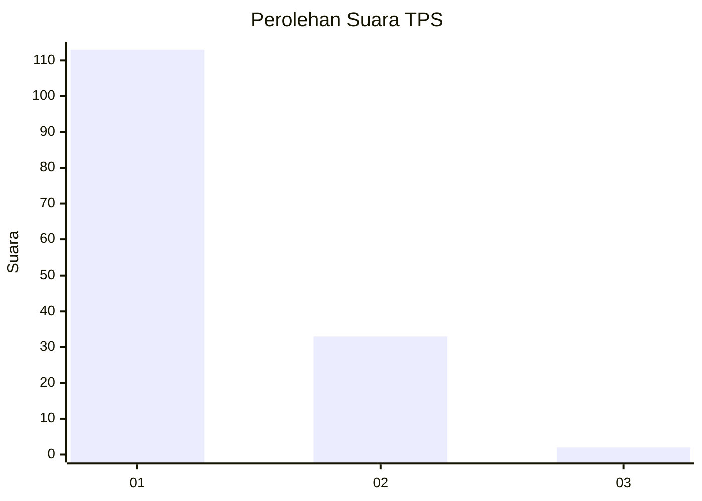
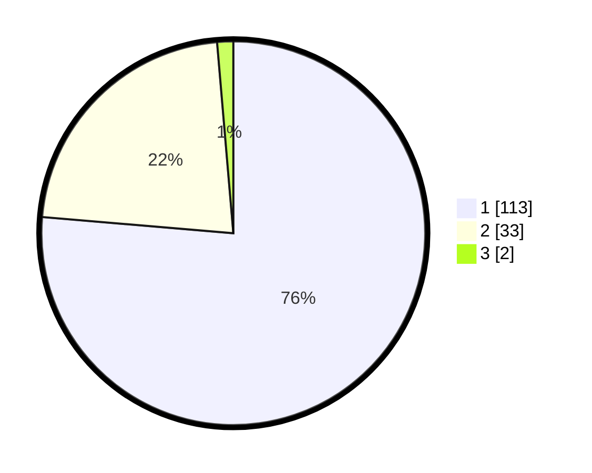

# Hasil

## Grafik

## Tabel

| No. | Nama Paslon    | Suara | Suara (raw) | Persentase |
|:--- |:-------------- | -----:| -----------:| ----------:|
| 1   | ANIES MUHAIMIN | 113   | [113][p-1]  | 76,35      |
| 2   | PRABOWO GIBRAN | 33    | [33][p-2]   | 22,30      |
| 3   | GANJAR MAHFUD  | 2     | [2][p-3]    | 1,35       |

[p-1]: https://github.com/gigit-pemilu/pemilu-2024-13-sumatera-barat/blob/main/pilpres/hitung-suara/sub/13-sumatera-barat/sub/06-agam/sub/06-banuhampu/sub/2002-taluak-ampek-suku/sub/005-tps/sub/paslon-1.txt
[p-2]: https://github.com/gigit-pemilu/pemilu-2024-13-sumatera-barat/blob/main/pilpres/hitung-suara/sub/13-sumatera-barat/sub/06-agam/sub/06-banuhampu/sub/2002-taluak-ampek-suku/sub/005-tps/sub/paslon-2.txt
[p-3]: https://github.com/gigit-pemilu/pemilu-2024-13-sumatera-barat/blob/main/pilpres/hitung-suara/sub/13-sumatera-barat/sub/06-agam/sub/06-banuhampu/sub/2002-taluak-ampek-suku/sub/005-tps/sub/paslon-3.txt

## Foto C Plano

https://sirekap-obj-formc.kpu.go.id/01a7/pemilu/ppwp/13/06/06/20/02/1306062002005-20240220-140801--a427c062-6fea-4512-ba40-8b0ad63246ff.jpg

https://sirekap-obj-formc.kpu.go.id/01a7/pemilu/ppwp/13/06/06/20/02/1306062002005-20240220-140838--21028843-9cdc-4a61-adcd-658a1dbdc48b.jpg

https://sirekap-obj-formc.kpu.go.id/01a7/pemilu/ppwp/13/06/06/20/02/1306062002005-20240220-140911--604bd57e-9f93-4f0c-ac60-4423393f3019.jpg

## Metadata

| Key        | Value               |
| ---------- | ------------------- |
| Time Stamp | 2024-02-24 22:31:28 |

