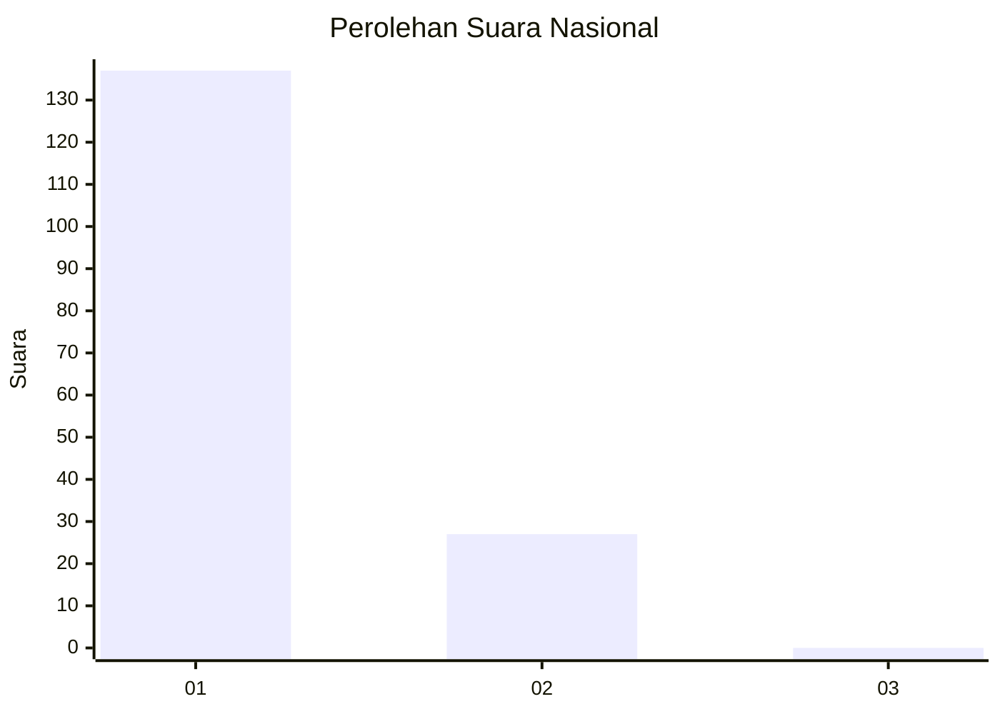
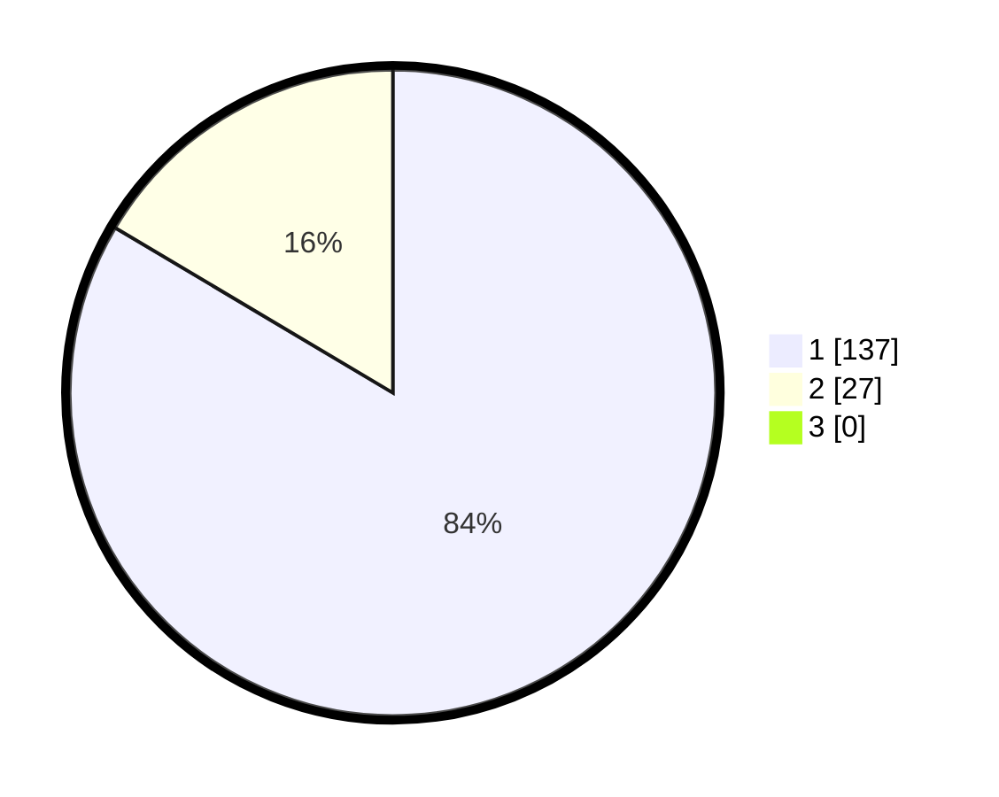

# Hasil

## Grafik

## Tabel

| No. | Nama Paslon    | Suara | Suara (raw) | Persentase |
|:--- |:-------------- | -----:| -----------:| ----------:|
| 1   | ANIES MUHAIMIN | 137   | [137][p-1]  | 83,54      |
| 2   | PRABOWO GIBRAN | 27    | [27][p-2]   | 16,46      |
| 3   | GANJAR MAHFUD  | 0     | [0][p-3]    | 0,00       |

[p-1]: https://github.com/gigit-pemilu/pemilu-2024/blob/main/pilpres/hitung-suara/sub/13-sumatera-barat/sub/06-agam/sub/06-banuhampu/sub/2002-taluak-ampek-suku/sub/008-tps/sub/paslon-1.txt
[p-2]: https://github.com/gigit-pemilu/pemilu-2024/blob/main/pilpres/hitung-suara/sub/13-sumatera-barat/sub/06-agam/sub/06-banuhampu/sub/2002-taluak-ampek-suku/sub/008-tps/sub/paslon-2.txt
[p-3]: https://github.com/gigit-pemilu/pemilu-2024/blob/main/pilpres/hitung-suara/sub/13-sumatera-barat/sub/06-agam/sub/06-banuhampu/sub/2002-taluak-ampek-suku/sub/008-tps/sub/paslon-3.txt

## Foto C Plano

https://sirekap-obj-formc.kpu.go.id/0f9f/pemilu/ppwp/13/06/06/20/02/1306062002008-20240220-143250--9d99aa2e-b299-4b4d-b254-5e847532b3ec.jpg

https://sirekap-obj-formc.kpu.go.id/0f9f/pemilu/ppwp/13/06/06/20/02/1306062002008-20240220-143323--d242907e-7e54-4baa-aed9-3af324c12eb5.jpg

https://sirekap-obj-formc.kpu.go.id/0f9f/pemilu/ppwp/13/06/06/20/02/1306062002008-20240220-143354--1d39fff9-4fd8-442e-aee0-1eb2508d7dab.jpg

## Metadata

| Key        | Value               |
| ---------- | ------------------- |
| Time Stamp | 2024-02-25 22:00:00 |

