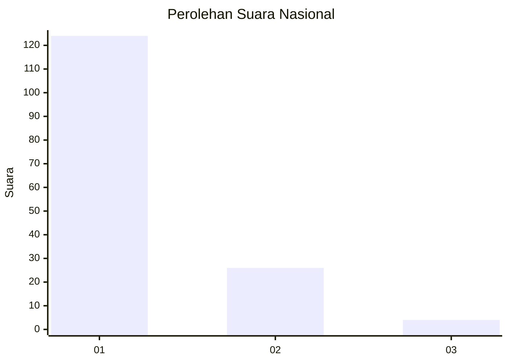
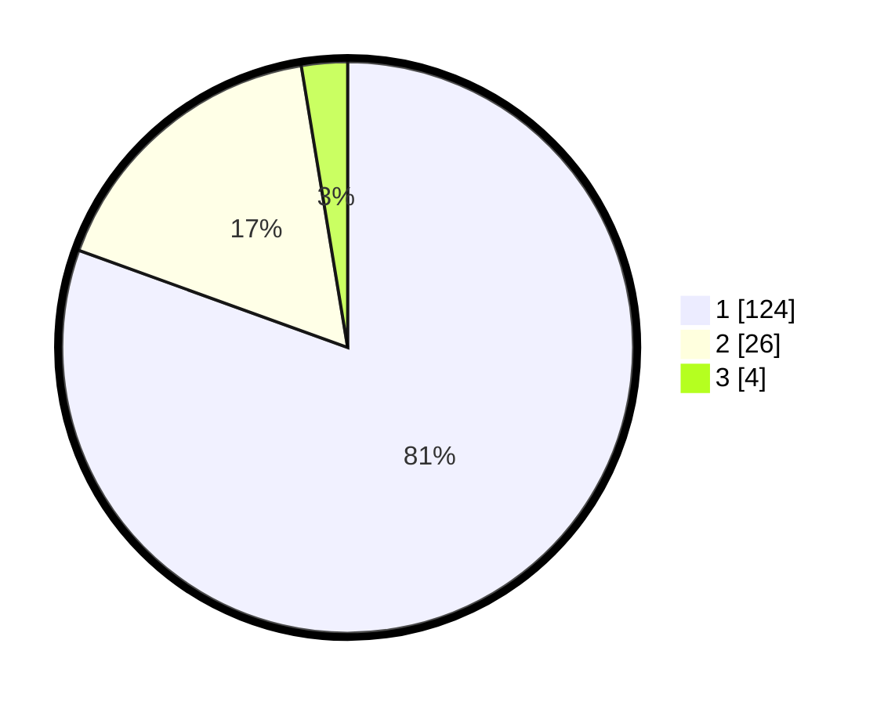

# Hasil

## Grafik

## Tabel

| No. | Nama Paslon    | Suara | Suara (raw) | Persentase |
|:--- |:-------------- | -----:| -----------:| ----------:|
| 1   | ANIES MUHAIMIN | 124   | [124][p-1]  | 80,52      |
| 2   | PRABOWO GIBRAN | 26    | [26][p-2]   | 16,88      |
| 3   | GANJAR MAHFUD  | 4     | [4][p-3]    | 2,60       |

[p-1]: https://github.com/gigit-pemilu/pemilu-2024/blob/main/pilpres/hitung-suara/sub/13-sumatera-barat/sub/06-agam/sub/06-banuhampu/sub/2002-taluak-ampek-suku/sub/011-tps/sub/paslon-1.txt
[p-2]: https://github.com/gigit-pemilu/pemilu-2024/blob/main/pilpres/hitung-suara/sub/13-sumatera-barat/sub/06-agam/sub/06-banuhampu/sub/2002-taluak-ampek-suku/sub/011-tps/sub/paslon-2.txt
[p-3]: https://github.com/gigit-pemilu/pemilu-2024/blob/main/pilpres/hitung-suara/sub/13-sumatera-barat/sub/06-agam/sub/06-banuhampu/sub/2002-taluak-ampek-suku/sub/011-tps/sub/paslon-3.txt

## Foto C Plano

https://sirekap-obj-formc.kpu.go.id/73df/pemilu/ppwp/13/06/06/20/02/1306062002011-20240215-023721--b0927dfc-a85c-4602-942e-3ce04b68352e.jpg

https://sirekap-obj-formc.kpu.go.id/73df/pemilu/ppwp/13/06/06/20/02/1306062002011-20240215-013343--978bbd27-1e7a-47b4-9ac2-94907f4ae08f.jpg

https://sirekap-obj-formc.kpu.go.id/73df/pemilu/ppwp/13/06/06/20/02/1306062002011-20240215-013853--c41799e8-a8dc-4062-a7a4-8f5732078826.jpg

## Metadata

| Key        | Value               |
| ---------- | ------------------- |
| Time Stamp | 2024-02-25 11:00:00 |

