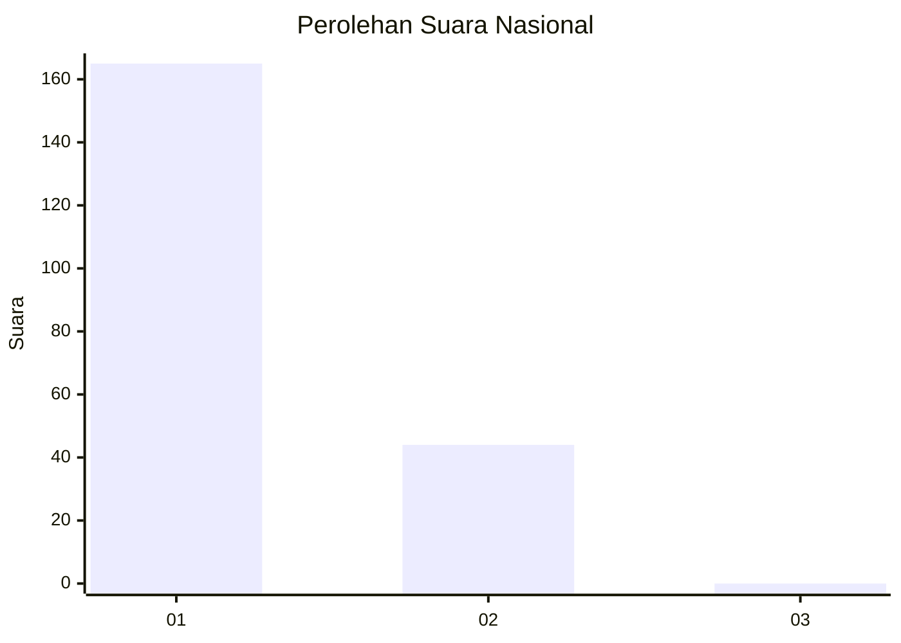
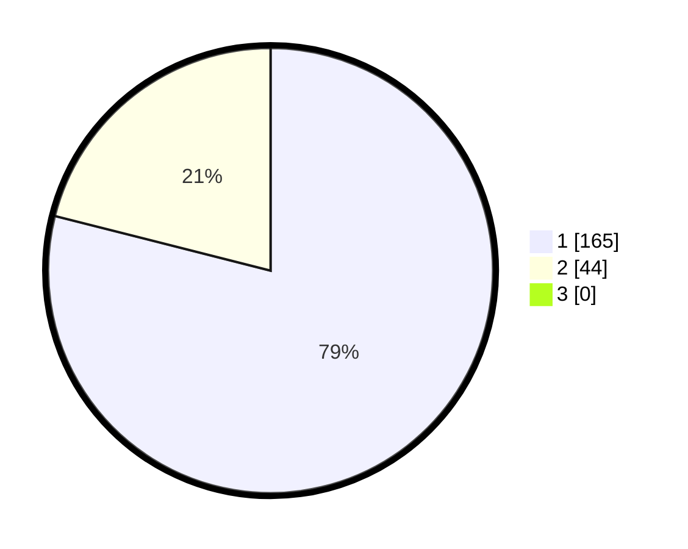

# Hasil

## Grafik

## Tabel

| No. | Nama Paslon    | Suara | Suara (raw) | Persentase |
|:--- |:-------------- | -----:| -----------:| ----------:|
| 1   | ANIES MUHAIMIN | 165   | [165][p-1]  | 78,95      |
| 2   | PRABOWO GIBRAN | 44    | [44][p-2]   | 21,05      |
| 3   | GANJAR MAHFUD  | 0     | [0][p-3]    | 0,00       |

[p-1]: https://github.com/gigit-pemilu/pemilu-2024/blob/main/pilpres/hitung-suara/sub/13-sumatera-barat/sub/06-agam/sub/06-banuhampu/sub/2002-taluak-ampek-suku/sub/013-tps/sub/paslon-1.txt
[p-2]: https://github.com/gigit-pemilu/pemilu-2024/blob/main/pilpres/hitung-suara/sub/13-sumatera-barat/sub/06-agam/sub/06-banuhampu/sub/2002-taluak-ampek-suku/sub/013-tps/sub/paslon-2.txt
[p-3]: https://github.com/gigit-pemilu/pemilu-2024/blob/main/pilpres/hitung-suara/sub/13-sumatera-barat/sub/06-agam/sub/06-banuhampu/sub/2002-taluak-ampek-suku/sub/013-tps/sub/paslon-3.txt

## Foto C Plano

https://sirekap-obj-formc.kpu.go.id/eb53/pemilu/ppwp/13/06/06/20/02/1306062002013-20240214-190617--4ca4b2cd-292b-44a6-a6e9-ab2b4f509eb1.jpg

https://sirekap-obj-formc.kpu.go.id/eb53/pemilu/ppwp/13/06/06/20/02/1306062002013-20240214-191039--3434e550-e236-4bf9-b581-481605dab5c6.jpg

https://sirekap-obj-formc.kpu.go.id/eb53/pemilu/ppwp/13/06/06/20/02/1306062002013-20240214-160124--1b465d3e-d64d-40b8-98ef-d22bc2de0c82.jpg

## Metadata

| Key        | Value               |
| ---------- | ------------------- |
| Time Stamp | 2024-02-25 20:00:00 |

