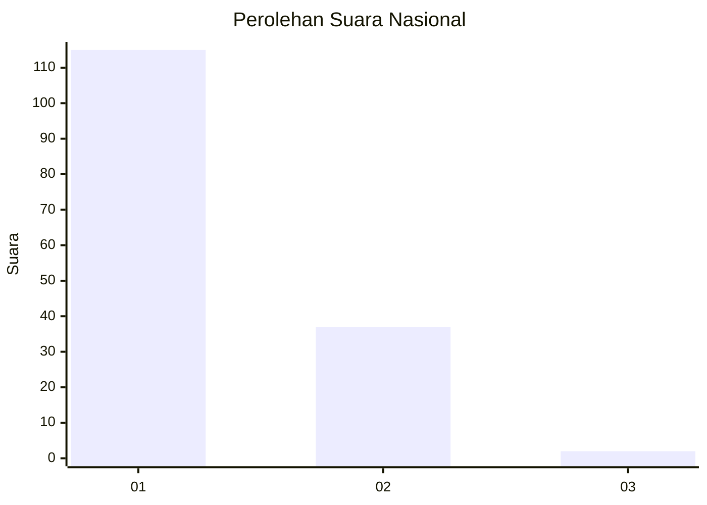
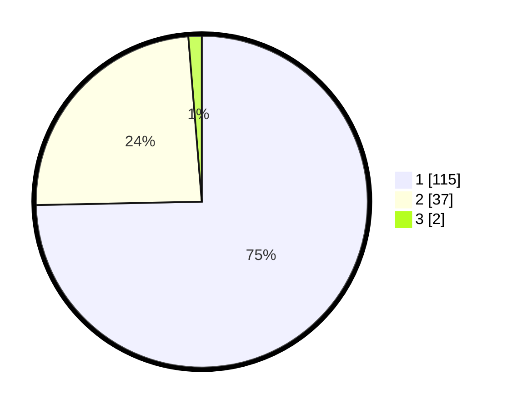

# Hasil

## Grafik

## Tabel

| No. | Nama Paslon    | Suara | Suara (raw) | Persentase |
|:--- |:-------------- | -----:| -----------:| ----------:|
| 1   | ANIES MUHAIMIN | 115   | [115][p-1]  | 74,68      |
| 2   | PRABOWO GIBRAN | 37    | [37][p-2]   | 24,03      |
| 3   | GANJAR MAHFUD  | 2     | [2][p-3]    | 1,30       |

[p-1]: https://github.com/gigit-pemilu/pemilu-2024/blob/main/pilpres/hitung-suara/sub/13-sumatera-barat/sub/06-agam/sub/06-banuhampu/sub/2003-pakan-sinayan/sub/002-tps/sub/paslon-1.txt
[p-2]: https://github.com/gigit-pemilu/pemilu-2024/blob/main/pilpres/hitung-suara/sub/13-sumatera-barat/sub/06-agam/sub/06-banuhampu/sub/2003-pakan-sinayan/sub/002-tps/sub/paslon-2.txt
[p-3]: https://github.com/gigit-pemilu/pemilu-2024/blob/main/pilpres/hitung-suara/sub/13-sumatera-barat/sub/06-agam/sub/06-banuhampu/sub/2003-pakan-sinayan/sub/002-tps/sub/paslon-3.txt

## Foto C Plano

https://sirekap-obj-formc.kpu.go.id/dd7b/pemilu/ppwp/13/06/06/20/03/1306062003002-20240219-103418--75cbdb45-70e2-4213-826f-d19982cb21a4.jpg

https://sirekap-obj-formc.kpu.go.id/dd7b/pemilu/ppwp/13/06/06/20/03/1306062003002-20240216-213216--86b1bc90-4aad-47a8-9723-2c4424a19296.jpg

https://sirekap-obj-formc.kpu.go.id/dd7b/pemilu/ppwp/13/06/06/20/03/1306062003002-20240214-200127--c4813021-4e9b-41a6-a100-130edba757ca.jpg

## Metadata

| Key        | Value               |
| ---------- | ------------------- |
| Time Stamp | 2024-02-25 10:00:00 |

