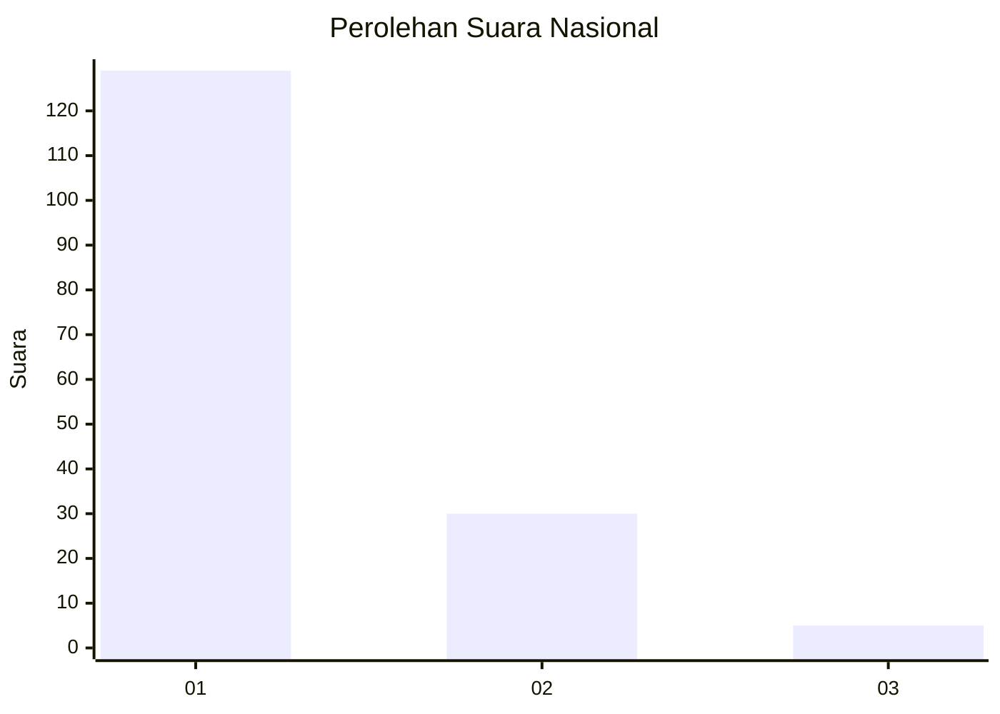
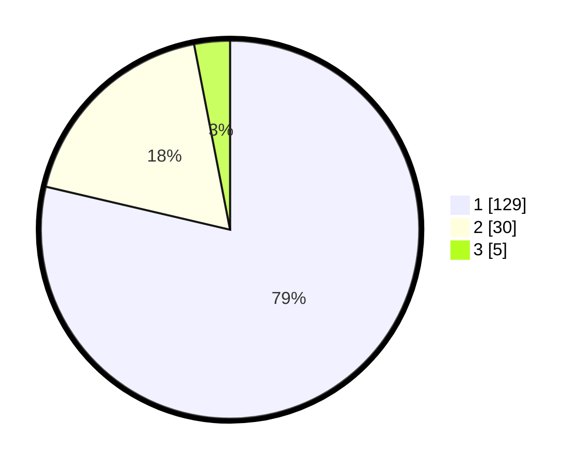

# Hasil

## Grafik

## Tabel

| No. | Nama Paslon    | Suara | Suara (raw) | Persentase |
|:--- |:-------------- | -----:| -----------:| ----------:|
| 1   | ANIES MUHAIMIN | 129   | [129][p-1]  | 78,66      |
| 2   | PRABOWO GIBRAN | 30    | [30][p-2]   | 18,29      |
| 3   | GANJAR MAHFUD  | 5     | [5][p-3]    | 3,05       |

[p-1]: https://github.com/gigit-pemilu/pemilu-2024/blob/main/pilpres/hitung-suara/sub/13-sumatera-barat/sub/06-agam/sub/06-banuhampu/sub/2003-pakan-sinayan/sub/006-tps/sub/paslon-1.txt
[p-2]: https://github.com/gigit-pemilu/pemilu-2024/blob/main/pilpres/hitung-suara/sub/13-sumatera-barat/sub/06-agam/sub/06-banuhampu/sub/2003-pakan-sinayan/sub/006-tps/sub/paslon-2.txt
[p-3]: https://github.com/gigit-pemilu/pemilu-2024/blob/main/pilpres/hitung-suara/sub/13-sumatera-barat/sub/06-agam/sub/06-banuhampu/sub/2003-pakan-sinayan/sub/006-tps/sub/paslon-3.txt

## Foto C Plano

https://sirekap-obj-formc.kpu.go.id/7204/pemilu/ppwp/13/06/06/20/03/1306062003006-20240215-003750--a82ed7b4-ba44-4aa6-8ce3-3b95581f9777.jpg

https://sirekap-obj-formc.kpu.go.id/7204/pemilu/ppwp/13/06/06/20/03/1306062003006-20240215-003841--61cca0e5-9e17-4b6d-962c-c172e96456aa.jpg

https://sirekap-obj-formc.kpu.go.id/7204/pemilu/ppwp/13/06/06/20/03/1306062003006-20240215-003948--aed27878-08ee-45d9-9fd4-97c02696b96f.jpg

## Metadata

| Key        | Value               |
| ---------- | ------------------- |
| Time Stamp | 2024-02-25 21:00:00 |

