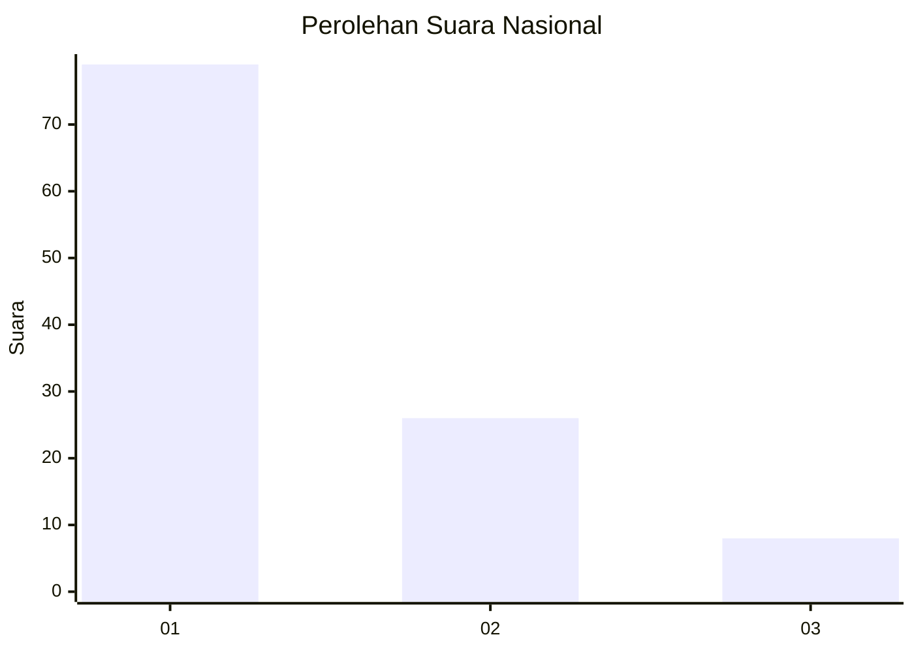
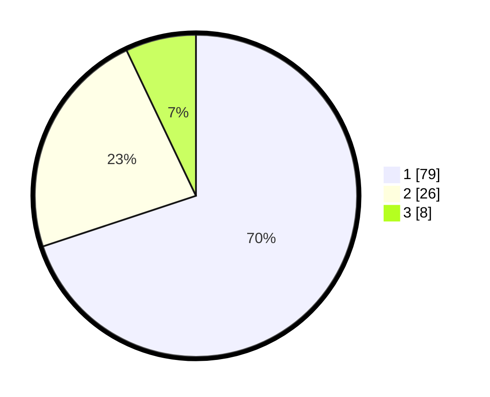

# Hasil

## Grafik

## Tabel

| No. | Nama Paslon    | Suara | Suara (raw) | Persentase |
|:--- |:-------------- | -----:| -----------:| ----------:|
| 1   | ANIES MUHAIMIN | 79    | [79][p-1]   | 69,91      |
| 2   | PRABOWO GIBRAN | 26    | [26][p-2]   | 23,01      |
| 3   | GANJAR MAHFUD  | 8     | [8][p-3]    | 7,08       |

[p-1]: https://github.com/gigit-pemilu/pemilu-2024/blob/main/pilpres/hitung-suara/sub/13-sumatera-barat/sub/06-agam/sub/06-banuhampu/sub/2003-pakan-sinayan/sub/009-tps/sub/paslon-1.txt
[p-2]: https://github.com/gigit-pemilu/pemilu-2024/blob/main/pilpres/hitung-suara/sub/13-sumatera-barat/sub/06-agam/sub/06-banuhampu/sub/2003-pakan-sinayan/sub/009-tps/sub/paslon-2.txt
[p-3]: https://github.com/gigit-pemilu/pemilu-2024/blob/main/pilpres/hitung-suara/sub/13-sumatera-barat/sub/06-agam/sub/06-banuhampu/sub/2003-pakan-sinayan/sub/009-tps/sub/paslon-3.txt

## Foto C Plano

https://sirekap-obj-formc.kpu.go.id/b6b3/pemilu/ppwp/13/06/06/20/03/1306062003009-20240219-165619--9c3f15d6-fbed-4036-9664-f74a8839aada.jpg

https://sirekap-obj-formc.kpu.go.id/b6b3/pemilu/ppwp/13/06/06/20/03/1306062003009-20240216-104808--ceca58d3-90a7-4e93-8ea4-5a32e2cd4d4c.jpg

https://sirekap-obj-formc.kpu.go.id/b6b3/pemilu/ppwp/13/06/06/20/03/1306062003009-20240216-104837--bcac3f1f-6ef7-4502-8ad1-6debfca7fc8f.jpg

## Metadata

| Key        | Value               |
| ---------- | ------------------- |
| Time Stamp | 2024-02-19 17:00:00 |

