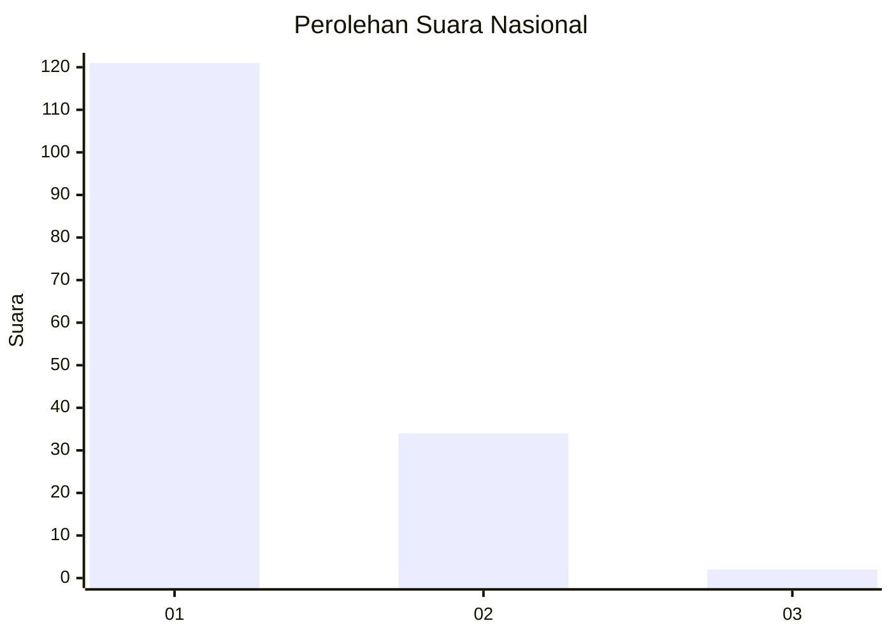
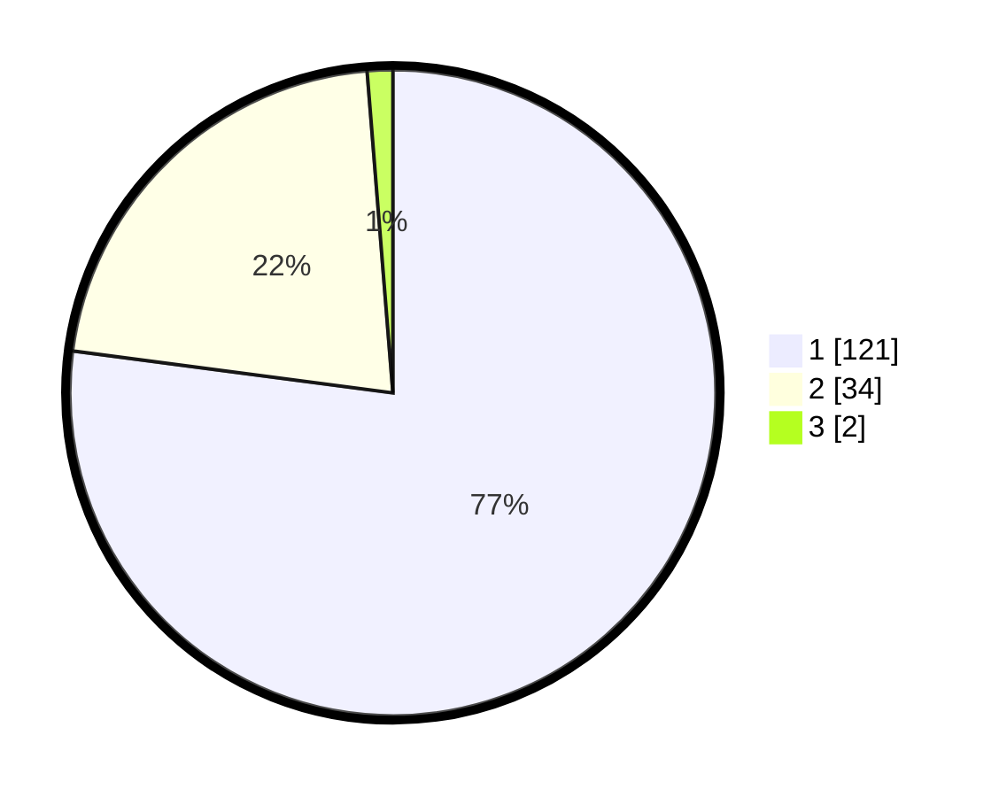

# Hasil

## Grafik

## Tabel

| No. | Nama Paslon    | Suara | Suara (raw) | Persentase |
|:--- |:-------------- | -----:| -----------:| ----------:|
| 1   | ANIES MUHAIMIN | 121   | [121][p-1]  | 77,07      |
| 2   | PRABOWO GIBRAN | 34    | [34][p-2]   | 21,66      |
| 3   | GANJAR MAHFUD  | 2     | [2][p-3]    | 1,27       |

[p-1]: https://github.com/gigit-pemilu/pemilu-2024/blob/main/pilpres/hitung-suara/sub/13-sumatera-barat/sub/06-agam/sub/06-banuhampu/sub/2003-pakan-sinayan/sub/014-tps/sub/paslon-1.txt
[p-2]: https://github.com/gigit-pemilu/pemilu-2024/blob/main/pilpres/hitung-suara/sub/13-sumatera-barat/sub/06-agam/sub/06-banuhampu/sub/2003-pakan-sinayan/sub/014-tps/sub/paslon-2.txt
[p-3]: https://github.com/gigit-pemilu/pemilu-2024/blob/main/pilpres/hitung-suara/sub/13-sumatera-barat/sub/06-agam/sub/06-banuhampu/sub/2003-pakan-sinayan/sub/014-tps/sub/paslon-3.txt

## Foto C Plano

https://sirekap-obj-formc.kpu.go.id/79a3/pemilu/ppwp/13/06/06/20/03/1306062003014-20240214-210506--9700bd05-221e-471d-878b-2bed7b5a125e.jpg

https://sirekap-obj-formc.kpu.go.id/79a3/pemilu/ppwp/13/06/06/20/03/1306062003014-20240214-210534--de8d0909-c01f-475d-94fa-a1de03f25971.jpg

https://sirekap-obj-formc.kpu.go.id/79a3/pemilu/ppwp/13/06/06/20/03/1306062003014-20240214-210557--ce974ac4-149f-42f4-808d-2e6bbe35c58d.jpg

## Metadata

| Key        | Value               |
| ---------- | ------------------- |
| Time Stamp | 2024-02-24 22:31:28 |

