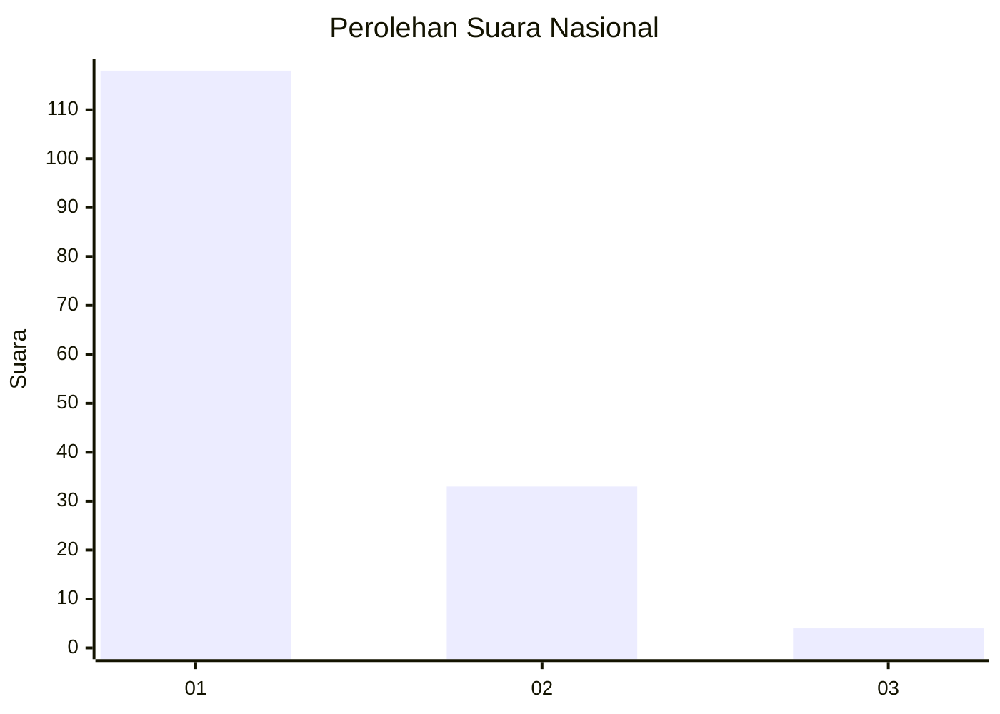
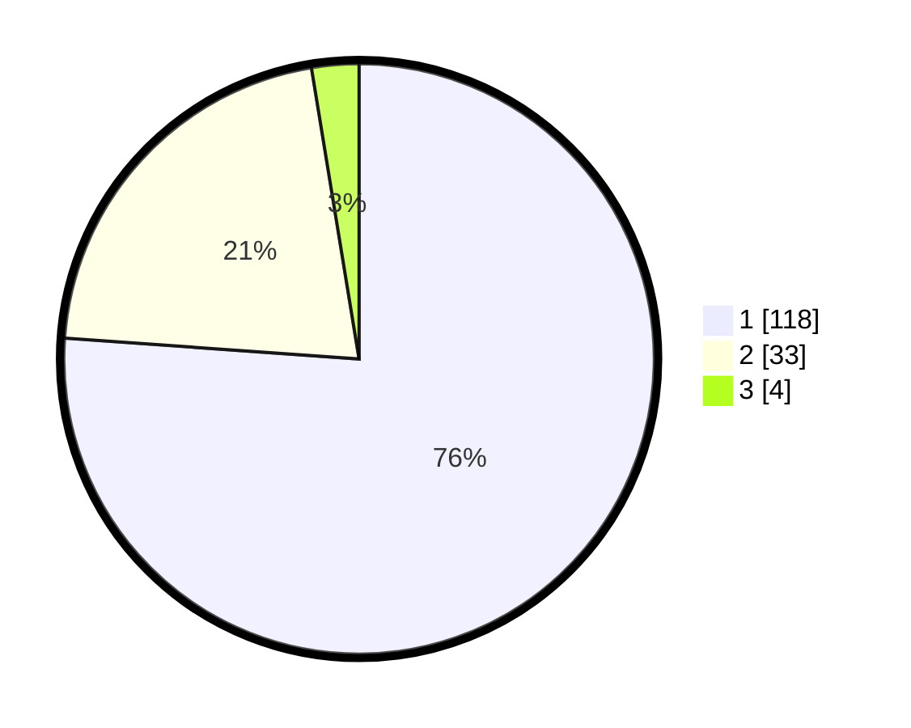

# Hasil

## Grafik

## Tabel

| No. | Nama Paslon    | Suara | Suara (raw) | Persentase |
|:--- |:-------------- | -----:| -----------:| ----------:|
| 1   | ANIES MUHAIMIN | 118   | [118][p-1]  | 76,13      |
| 2   | PRABOWO GIBRAN | 33    | [33][p-2]   | 21,29      |
| 3   | GANJAR MAHFUD  | 4     | [4][p-3]    | 2,58       |

[p-1]: https://github.com/gigit-pemilu/pemilu-2024/blob/main/pilpres/hitung-suara/sub/13-sumatera-barat/sub/06-agam/sub/06-banuhampu/sub/2003-pakan-sinayan/sub/015-tps/sub/paslon-1.txt
[p-2]: https://github.com/gigit-pemilu/pemilu-2024/blob/main/pilpres/hitung-suara/sub/13-sumatera-barat/sub/06-agam/sub/06-banuhampu/sub/2003-pakan-sinayan/sub/015-tps/sub/paslon-2.txt
[p-3]: https://github.com/gigit-pemilu/pemilu-2024/blob/main/pilpres/hitung-suara/sub/13-sumatera-barat/sub/06-agam/sub/06-banuhampu/sub/2003-pakan-sinayan/sub/015-tps/sub/paslon-3.txt

## Foto C Plano

https://sirekap-obj-formc.kpu.go.id/bab6/pemilu/ppwp/13/06/06/20/03/1306062003015-20240215-012806--3157fc6d-b00c-46c3-abf9-3909eed2946b.jpg

https://sirekap-obj-formc.kpu.go.id/bab6/pemilu/ppwp/13/06/06/20/03/1306062003015-20240215-013021--69474548-b17b-4e0b-9896-060c50ed183e.jpg

https://sirekap-obj-formc.kpu.go.id/bab6/pemilu/ppwp/13/06/06/20/03/1306062003015-20240215-013118--9be096d3-785b-45f3-8e34-b82b19043958.jpg

## Metadata

| Key        | Value               |
| ---------- | ------------------- |
| Time Stamp | 2024-02-25 00:00:00 |

