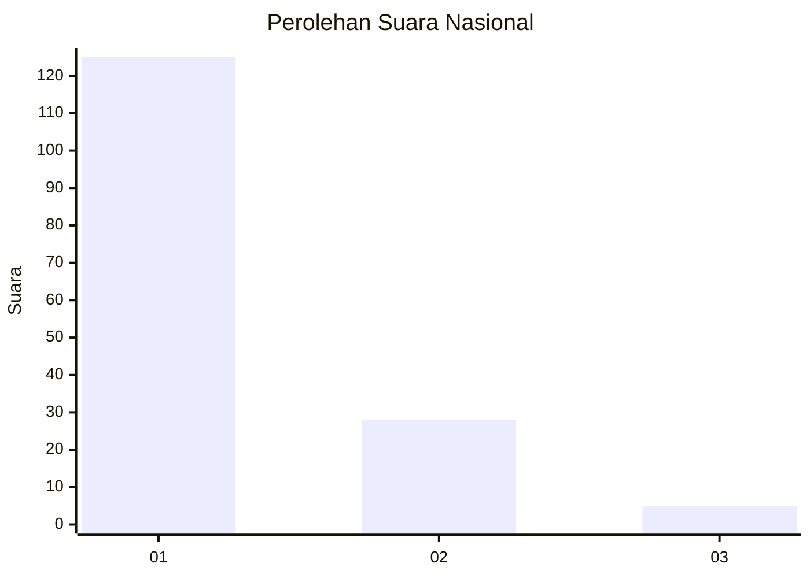
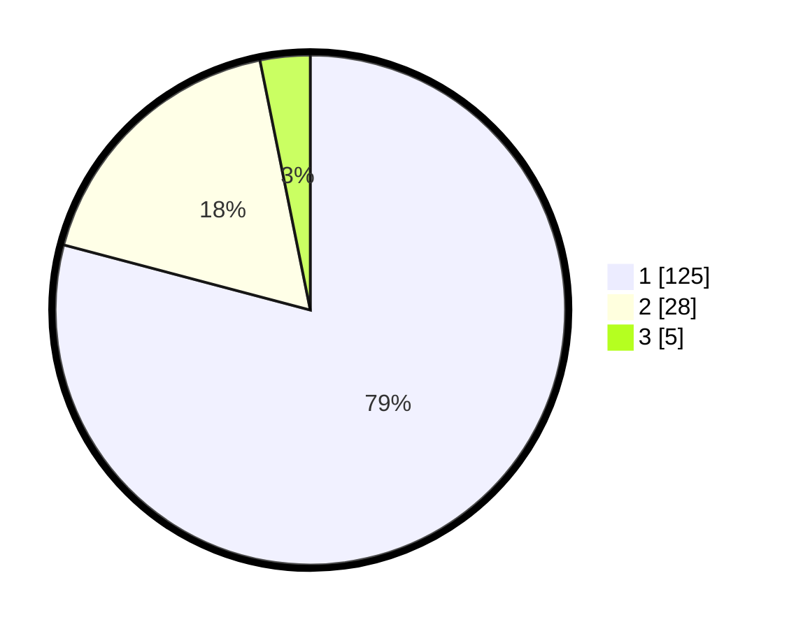

# Hasil

## Grafik

## Tabel

| No. | Nama Paslon    | Suara | Suara (raw) | Persentase |
|:--- |:-------------- | -----:| -----------:| ----------:|
| 1   | ANIES MUHAIMIN | 125   | [125][p-1]  | 79,11      |
| 2   | PRABOWO GIBRAN | 28    | [28][p-2]   | 17,72      |
| 3   | GANJAR MAHFUD  | 5     | [5][p-3]    | 3,16       |

[p-1]: https://github.com/gigit-pemilu/pemilu-2024/blob/main/pilpres/hitung-suara/sub/13-sumatera-barat/sub/06-agam/sub/06-banuhampu/sub/2004-kubang-putiah/sub/001-tps/sub/paslon-1.txt
[p-2]: https://github.com/gigit-pemilu/pemilu-2024/blob/main/pilpres/hitung-suara/sub/13-sumatera-barat/sub/06-agam/sub/06-banuhampu/sub/2004-kubang-putiah/sub/001-tps/sub/paslon-2.txt
[p-3]: https://github.com/gigit-pemilu/pemilu-2024/blob/main/pilpres/hitung-suara/sub/13-sumatera-barat/sub/06-agam/sub/06-banuhampu/sub/2004-kubang-putiah/sub/001-tps/sub/paslon-3.txt

## Foto C Plano

https://sirekap-obj-formc.kpu.go.id/3441/pemilu/ppwp/13/06/06/20/04/1306062004001-20240214-220310--a1d6aea0-30f2-4a97-afbc-d022882bcbfe.jpg

https://sirekap-obj-formc.kpu.go.id/3441/pemilu/ppwp/13/06/06/20/04/1306062004001-20240214-220331--b7e1cbea-fccf-478b-9e7a-8bdcd0155951.jpg

https://sirekap-obj-formc.kpu.go.id/3441/pemilu/ppwp/13/06/06/20/04/1306062004001-20240214-220347--0f875435-336c-486b-be83-93e7e0a68225.jpg

## Metadata

| Key        | Value               |
| ---------- | ------------------- |
| Time Stamp | 2024-02-24 22:31:28 |

