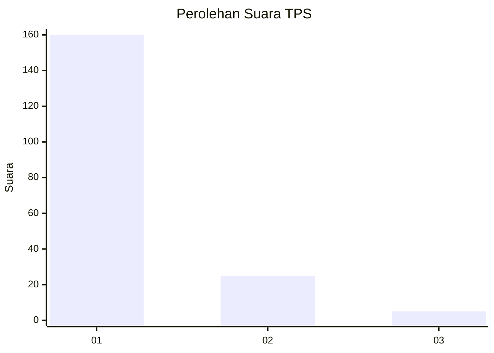
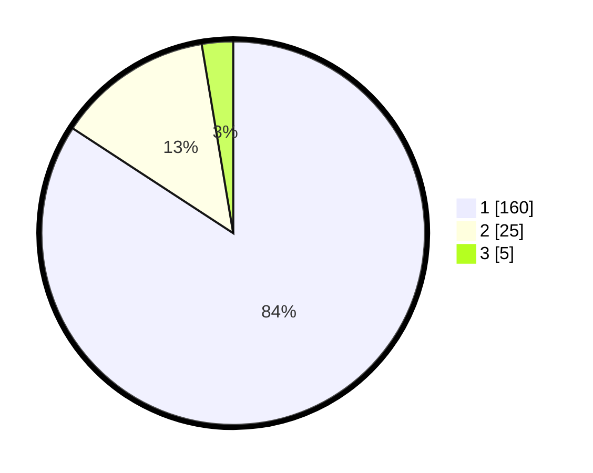

# Hasil

## Grafik

## Tabel

| No. | Nama Paslon    | Suara | Suara (raw) | Persentase |
|:--- |:-------------- | -----:| -----------:| ----------:|
| 1   | ANIES MUHAIMIN | 160   | [160][p-1]  | 84,21      |
| 2   | PRABOWO GIBRAN | 25    | [25][p-2]   | 13,16      |
| 3   | GANJAR MAHFUD  | 5     | [5][p-3]    | 2,63       |

[p-1]: https://github.com/gigit-pemilu/pemilu-2024-13-sumatera-barat/blob/main/pilpres/hitung-suara/sub/13-sumatera-barat/sub/06-agam/sub/06-banuhampu/sub/2004-kubang-putiah/sub/004-tps/sub/paslon-1.txt
[p-2]: https://github.com/gigit-pemilu/pemilu-2024-13-sumatera-barat/blob/main/pilpres/hitung-suara/sub/13-sumatera-barat/sub/06-agam/sub/06-banuhampu/sub/2004-kubang-putiah/sub/004-tps/sub/paslon-2.txt
[p-3]: https://github.com/gigit-pemilu/pemilu-2024-13-sumatera-barat/blob/main/pilpres/hitung-suara/sub/13-sumatera-barat/sub/06-agam/sub/06-banuhampu/sub/2004-kubang-putiah/sub/004-tps/sub/paslon-3.txt

## Foto C Plano

https://sirekap-obj-formc.kpu.go.id/9955/pemilu/ppwp/13/06/06/20/04/1306062004004-20240214-202114--0f431dc8-bcb8-49f1-99b4-e873dd43f2bf.jpg

https://sirekap-obj-formc.kpu.go.id/9955/pemilu/ppwp/13/06/06/20/04/1306062004004-20240214-203510--92742eb3-f101-4b64-b0a7-f4bdda8458cb.jpg

https://sirekap-obj-formc.kpu.go.id/9955/pemilu/ppwp/13/06/06/20/04/1306062004004-20240214-203616--e7a5b559-2c38-4e02-8eb3-49e902b9d8b9.jpg

## Metadata

| Key        | Value               |
| ---------- | ------------------- |
| Time Stamp | 2024-02-25 18:00:00 |

