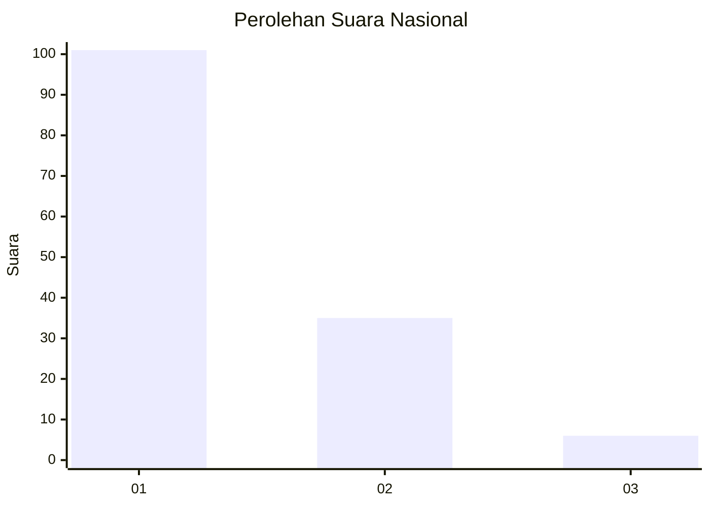
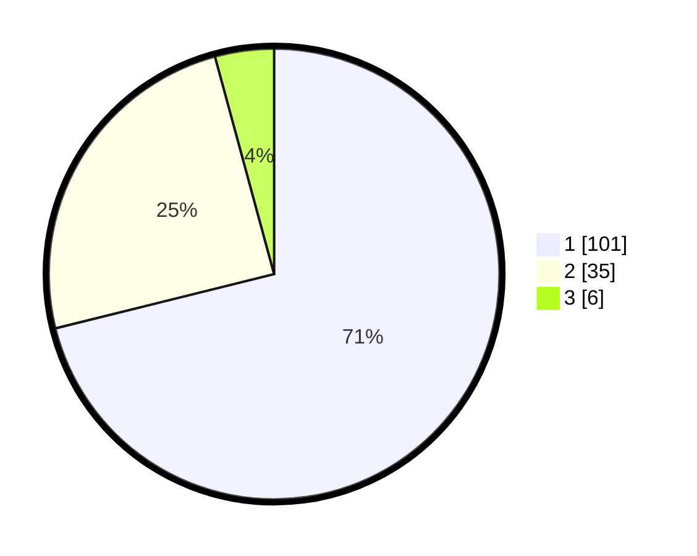

# Hasil

## Grafik

## Tabel

| No. | Nama Paslon    | Suara | Suara (raw) | Persentase |
|:--- |:-------------- | -----:| -----------:| ----------:|
| 1   | ANIES MUHAIMIN | 101   | [101][p-1]  | 71,13      |
| 2   | PRABOWO GIBRAN | 35    | [35][p-2]   | 24,65      |
| 3   | GANJAR MAHFUD  | 6     | [6][p-3]    | 4,23       |

[p-1]: https://github.com/gigit-pemilu/pemilu-2024/blob/main/pilpres/hitung-suara/sub/13-sumatera-barat/sub/06-agam/sub/06-banuhampu/sub/2004-kubang-putiah/sub/008-tps/sub/paslon-1.txt
[p-2]: https://github.com/gigit-pemilu/pemilu-2024/blob/main/pilpres/hitung-suara/sub/13-sumatera-barat/sub/06-agam/sub/06-banuhampu/sub/2004-kubang-putiah/sub/008-tps/sub/paslon-2.txt
[p-3]: https://github.com/gigit-pemilu/pemilu-2024/blob/main/pilpres/hitung-suara/sub/13-sumatera-barat/sub/06-agam/sub/06-banuhampu/sub/2004-kubang-putiah/sub/008-tps/sub/paslon-3.txt

## Foto C Plano

https://sirekap-obj-formc.kpu.go.id/281b/pemilu/ppwp/13/06/06/20/04/1306062004008-20240215-002727--636f4a96-52e4-4a0d-825d-356f9db713ff.jpg

https://sirekap-obj-formc.kpu.go.id/281b/pemilu/ppwp/13/06/06/20/04/1306062004008-20240215-002907--aac2f112-9b23-4548-9d06-687ce4bce194.jpg

https://sirekap-obj-formc.kpu.go.id/281b/pemilu/ppwp/13/06/06/20/04/1306062004008-20240215-003046--ee962fc0-019b-48f7-9399-a6ee3019437e.jpg

## Metadata

| Key        | Value               |
| ---------- | ------------------- |
| Time Stamp | 2024-02-24 22:31:28 |

