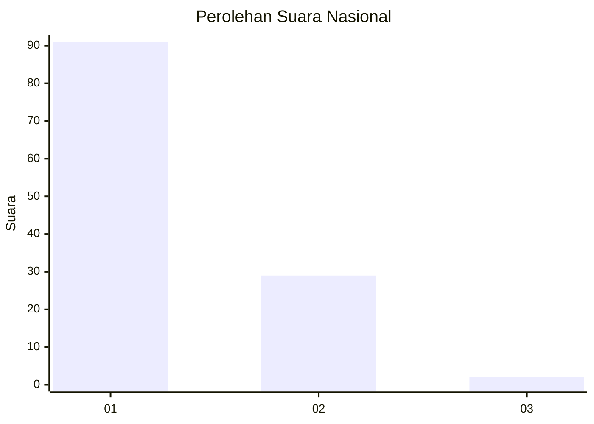
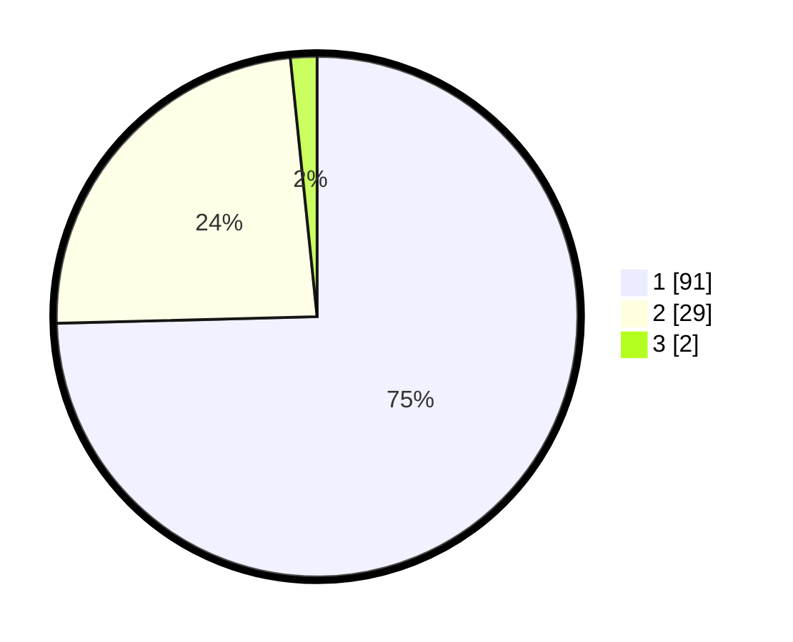

# Hasil

## Grafik

## Tabel

| No. | Nama Paslon    | Suara | Suara (raw) | Persentase |
|:--- |:-------------- | -----:| -----------:| ----------:|
| 1   | ANIES MUHAIMIN | 91    | [91][p-1]   | 74,59      |
| 2   | PRABOWO GIBRAN | 29    | [29][p-2]   | 23,77      |
| 3   | GANJAR MAHFUD  | 2     | [2][p-3]    | 1,64       |

[p-1]: https://github.com/gigit-pemilu/pemilu-2024/blob/main/pilpres/hitung-suara/sub/13-sumatera-barat/sub/06-agam/sub/06-banuhampu/sub/2004-kubang-putiah/sub/022-tps/sub/paslon-1.txt
[p-2]: https://github.com/gigit-pemilu/pemilu-2024/blob/main/pilpres/hitung-suara/sub/13-sumatera-barat/sub/06-agam/sub/06-banuhampu/sub/2004-kubang-putiah/sub/022-tps/sub/paslon-2.txt
[p-3]: https://github.com/gigit-pemilu/pemilu-2024/blob/main/pilpres/hitung-suara/sub/13-sumatera-barat/sub/06-agam/sub/06-banuhampu/sub/2004-kubang-putiah/sub/022-tps/sub/paslon-3.txt

## Foto C Plano

https://sirekap-obj-formc.kpu.go.id/d0a5/pemilu/ppwp/13/06/06/20/04/1306062004022-20240221-152552--591ad40c-fc5f-4055-aa7f-9fef1980b165.jpg

https://sirekap-obj-formc.kpu.go.id/d0a5/pemilu/ppwp/13/06/06/20/04/1306062004022-20240221-152620--5629ce8b-fc26-47d5-8da3-4d2d6ca00167.jpg

https://sirekap-obj-formc.kpu.go.id/d0a5/pemilu/ppwp/13/06/06/20/04/1306062004022-20240221-152656--890762d1-68ad-4e38-a1e1-45edc73c6f89.jpg

## Metadata

| Key        | Value               |
| ---------- | ------------------- |
| Time Stamp | 2024-02-25 22:00:00 |

