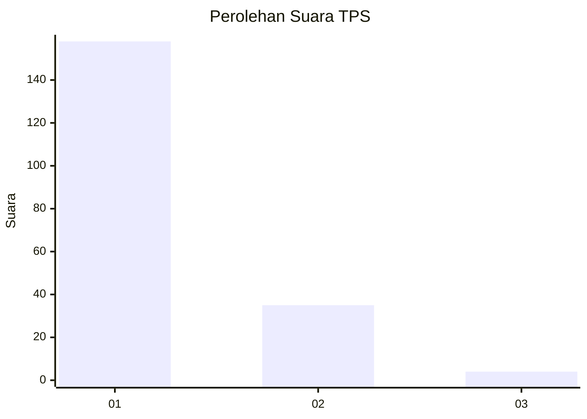
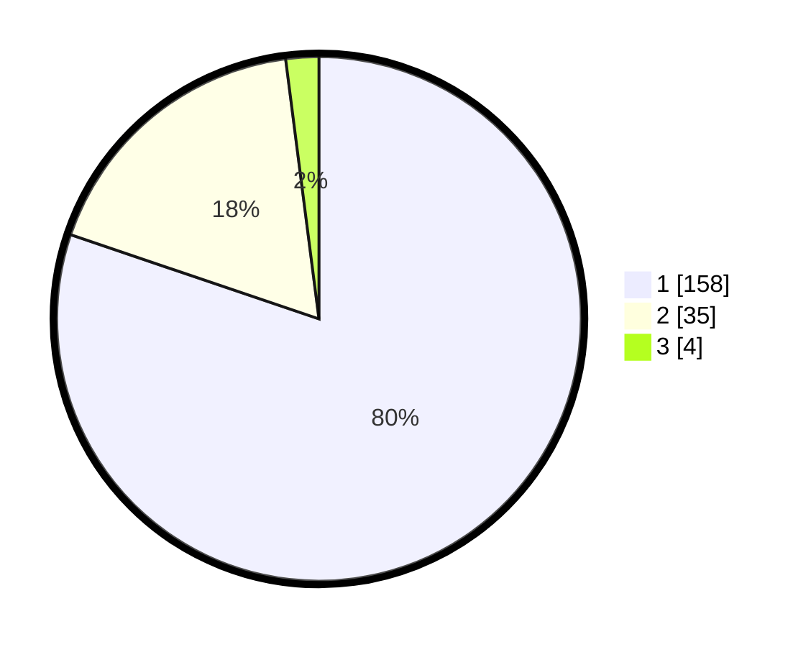

# Hasil

## Grafik

## Tabel

| No. | Nama Paslon    | Suara | Suara (raw) | Persentase |
|:--- |:-------------- | -----:| -----------:| ----------:|
| 1   | ANIES MUHAIMIN | 158   | [158][p-1]  | 80,20      |
| 2   | PRABOWO GIBRAN | 35    | [35][p-2]   | 17,77      |
| 3   | GANJAR MAHFUD  | 4     | [4][p-3]    | 2,03       |

[p-1]: https://github.com/gigit-pemilu/pemilu-2024-13-sumatera-barat/blob/main/pilpres/hitung-suara/sub/13-sumatera-barat/sub/06-agam/sub/06-banuhampu/sub/2004-kubang-putiah/sub/025-tps/sub/paslon-1.txt
[p-2]: https://github.com/gigit-pemilu/pemilu-2024-13-sumatera-barat/blob/main/pilpres/hitung-suara/sub/13-sumatera-barat/sub/06-agam/sub/06-banuhampu/sub/2004-kubang-putiah/sub/025-tps/sub/paslon-2.txt
[p-3]: https://github.com/gigit-pemilu/pemilu-2024-13-sumatera-barat/blob/main/pilpres/hitung-suara/sub/13-sumatera-barat/sub/06-agam/sub/06-banuhampu/sub/2004-kubang-putiah/sub/025-tps/sub/paslon-3.txt

## Foto C Plano

https://sirekap-obj-formc.kpu.go.id/f2a8/pemilu/ppwp/13/06/06/20/04/1306062004025-20240215-043754--fe402325-8c88-4cdb-935d-e4b1fd4efdb1.jpg

https://sirekap-obj-formc.kpu.go.id/f2a8/pemilu/ppwp/13/06/06/20/04/1306062004025-20240221-114827--3bb7da6c-3632-455f-af96-69745fcd028c.jpg

https://sirekap-obj-formc.kpu.go.id/f2a8/pemilu/ppwp/13/06/06/20/04/1306062004025-20240214-220526--9b136bbf-5c9b-4944-9580-a966e137ccbc.jpg

## Metadata

| Key        | Value               |
| ---------- | ------------------- |
| Time Stamp | 2024-02-24 22:31:28 |

