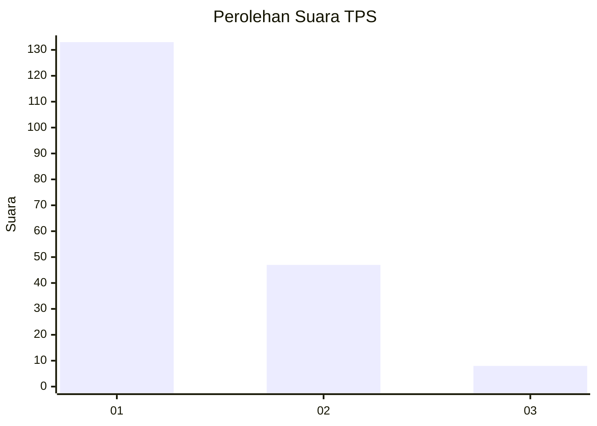
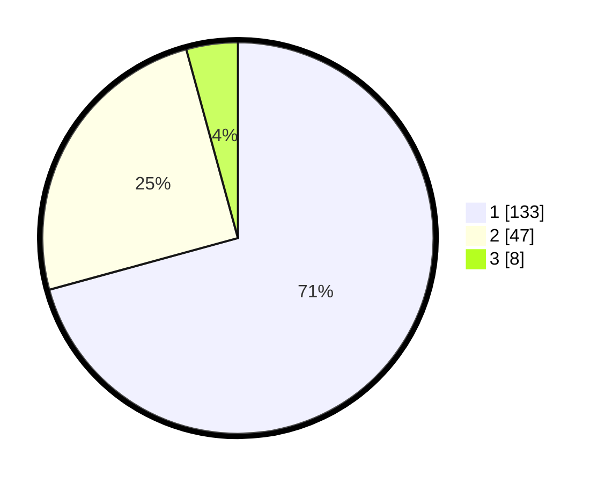

# Hasil

## Grafik

## Tabel

| No. | Nama Paslon    | Suara | Suara (raw) | Persentase |
|:--- |:-------------- | -----:| -----------:| ----------:|
| 1   | ANIES MUHAIMIN | 133   | [133][p-1]  | 70,74      |
| 2   | PRABOWO GIBRAN | 47    | [47][p-2]   | 25,00      |
| 3   | GANJAR MAHFUD  | 8     | [8][p-3]    | 4,26       |

[p-1]: https://github.com/gigit-pemilu/pemilu-2024-13-sumatera-barat/blob/main/pilpres/hitung-suara/sub/13-sumatera-barat/sub/06-agam/sub/06-banuhampu/sub/2005-ladang-laweh/sub/001-tps/sub/paslon-1.txt
[p-2]: https://github.com/gigit-pemilu/pemilu-2024-13-sumatera-barat/blob/main/pilpres/hitung-suara/sub/13-sumatera-barat/sub/06-agam/sub/06-banuhampu/sub/2005-ladang-laweh/sub/001-tps/sub/paslon-2.txt
[p-3]: https://github.com/gigit-pemilu/pemilu-2024-13-sumatera-barat/blob/main/pilpres/hitung-suara/sub/13-sumatera-barat/sub/06-agam/sub/06-banuhampu/sub/2005-ladang-laweh/sub/001-tps/sub/paslon-3.txt

## Foto C Plano

https://sirekap-obj-formc.kpu.go.id/0635/pemilu/ppwp/13/06/06/20/05/1306062005001-20240215-025530--2fc500b4-991a-4602-9042-88939b870bce.jpg

https://sirekap-obj-formc.kpu.go.id/0635/pemilu/ppwp/13/06/06/20/05/1306062005001-20240215-025621--f897b908-f287-463f-8ec7-194e53f5db59.jpg

https://sirekap-obj-formc.kpu.go.id/0635/pemilu/ppwp/13/06/06/20/05/1306062005001-20240215-025702--61394409-6ce8-4752-a0ac-965c75067438.jpg

## Metadata

| Key        | Value               |
| ---------- | ------------------- |
| Time Stamp | 2024-02-25 23:00:00 |

