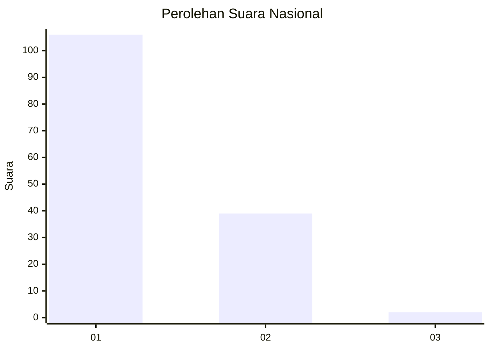
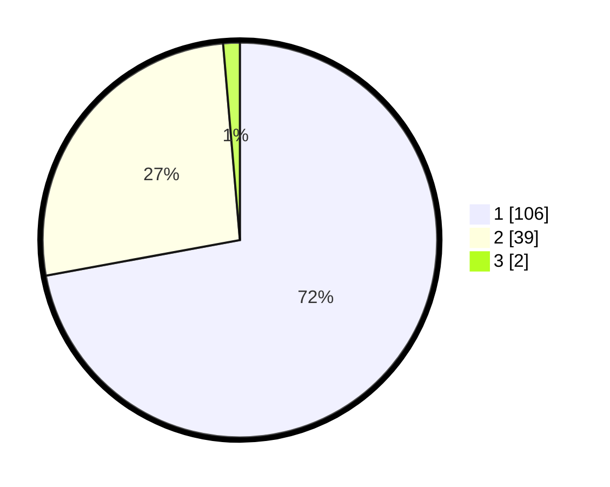

# Hasil

## Grafik

## Tabel

| No. | Nama Paslon    | Suara | Suara (raw) | Persentase |
|:--- |:-------------- | -----:| -----------:| ----------:|
| 1   | ANIES MUHAIMIN | 106   | [106][p-1]  | 72,11      |
| 2   | PRABOWO GIBRAN | 39    | [39][p-2]   | 26,53      |
| 3   | GANJAR MAHFUD  | 2     | [2][p-3]    | 1,36       |

[p-1]: https://github.com/gigit-pemilu/pemilu-2024/blob/main/pilpres/hitung-suara/sub/13-sumatera-barat/sub/06-agam/sub/06-banuhampu/sub/2005-ladang-laweh/sub/007-tps/sub/paslon-1.txt
[p-2]: https://github.com/gigit-pemilu/pemilu-2024/blob/main/pilpres/hitung-suara/sub/13-sumatera-barat/sub/06-agam/sub/06-banuhampu/sub/2005-ladang-laweh/sub/007-tps/sub/paslon-2.txt
[p-3]: https://github.com/gigit-pemilu/pemilu-2024/blob/main/pilpres/hitung-suara/sub/13-sumatera-barat/sub/06-agam/sub/06-banuhampu/sub/2005-ladang-laweh/sub/007-tps/sub/paslon-3.txt

## Foto C Plano

https://sirekap-obj-formc.kpu.go.id/6da9/pemilu/ppwp/13/06/06/20/05/1306062005007-20240220-153013--3b100925-c199-42d1-8aa5-4e3a1ddfac3b.jpg

https://sirekap-obj-formc.kpu.go.id/6da9/pemilu/ppwp/13/06/06/20/05/1306062005007-20240220-152936--62ef593b-7457-4332-a3a6-69e0daf79730.jpg

https://sirekap-obj-formc.kpu.go.id/6da9/pemilu/ppwp/13/06/06/20/05/1306062005007-20240220-153117--0fd51bd3-700f-470d-8164-faf52a3171b2.jpg

## Metadata

| Key        | Value               |
| ---------- | ------------------- |
| Time Stamp | 2024-02-24 22:31:28 |

