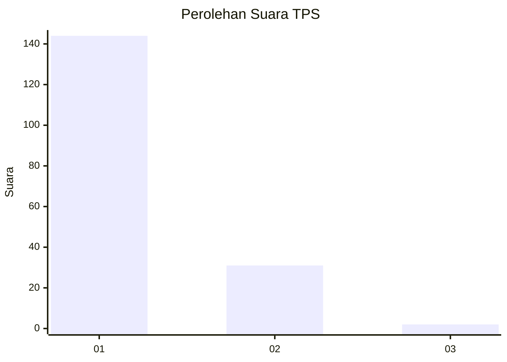
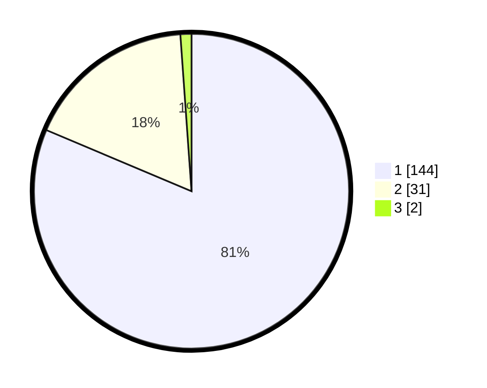

# Hasil

## Grafik

## Tabel

| No. | Nama Paslon    | Suara | Suara (raw) | Persentase |
|:--- |:-------------- | -----:| -----------:| ----------:|
| 1   | ANIES MUHAIMIN | 144   | [144][p-1]  | 81,36      |
| 2   | PRABOWO GIBRAN | 31    | [31][p-2]   | 17,51      |
| 3   | GANJAR MAHFUD  | 2     | [2][p-3]    | 1,13       |

[p-1]: https://github.com/gigit-pemilu/pemilu-2024-13-sumatera-barat/blob/main/pilpres/hitung-suara/sub/13-sumatera-barat/sub/06-agam/sub/06-banuhampu/sub/2005-ladang-laweh/sub/014-tps/sub/paslon-1.txt
[p-2]: https://github.com/gigit-pemilu/pemilu-2024-13-sumatera-barat/blob/main/pilpres/hitung-suara/sub/13-sumatera-barat/sub/06-agam/sub/06-banuhampu/sub/2005-ladang-laweh/sub/014-tps/sub/paslon-2.txt
[p-3]: https://github.com/gigit-pemilu/pemilu-2024-13-sumatera-barat/blob/main/pilpres/hitung-suara/sub/13-sumatera-barat/sub/06-agam/sub/06-banuhampu/sub/2005-ladang-laweh/sub/014-tps/sub/paslon-3.txt

## Foto C Plano

https://sirekap-obj-formc.kpu.go.id/e1e4/pemilu/ppwp/13/06/06/20/05/1306062005014-20240215-030729--4e6a0330-fc1d-42de-a406-b5c3ac6c717c.jpg

https://sirekap-obj-formc.kpu.go.id/e1e4/pemilu/ppwp/13/06/06/20/05/1306062005014-20240215-030853--661fa74b-e5fb-4d31-bd31-b6b14118a742.jpg

https://sirekap-obj-formc.kpu.go.id/e1e4/pemilu/ppwp/13/06/06/20/05/1306062005014-20240215-030958--3e86be54-307f-4451-9542-034b59ff9c13.jpg

## Metadata

| Key        | Value               |
| ---------- | ------------------- |
| Time Stamp | 2024-02-25 15:00:00 |

