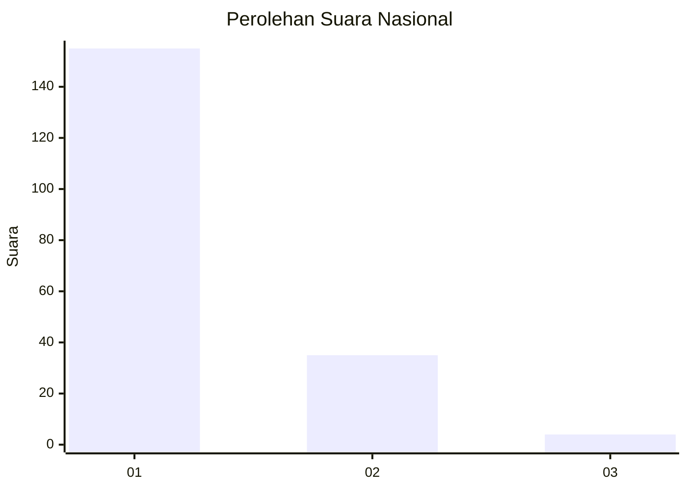
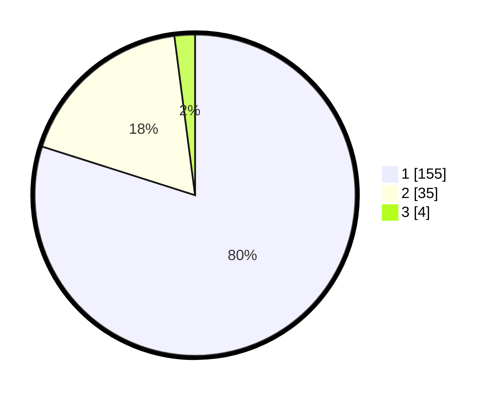

# Hasil

## Grafik

## Tabel

| No. | Nama Paslon    | Suara | Suara (raw) | Persentase |
|:--- |:-------------- | -----:| -----------:| ----------:|
| 1   | ANIES MUHAIMIN | 155   | [155][p-1]  | 79,90      |
| 2   | PRABOWO GIBRAN | 35    | [35][p-2]   | 18,04      |
| 3   | GANJAR MAHFUD  | 4     | [4][p-3]    | 2,06       |

[p-1]: https://github.com/gigit-pemilu/pemilu-2024/blob/main/pilpres/hitung-suara/sub/13-sumatera-barat/sub/06-agam/sub/06-banuhampu/sub/2006-cingkariang/sub/002-tps/sub/paslon-1.txt
[p-2]: https://github.com/gigit-pemilu/pemilu-2024/blob/main/pilpres/hitung-suara/sub/13-sumatera-barat/sub/06-agam/sub/06-banuhampu/sub/2006-cingkariang/sub/002-tps/sub/paslon-2.txt
[p-3]: https://github.com/gigit-pemilu/pemilu-2024/blob/main/pilpres/hitung-suara/sub/13-sumatera-barat/sub/06-agam/sub/06-banuhampu/sub/2006-cingkariang/sub/002-tps/sub/paslon-3.txt

## Foto C Plano

https://sirekap-obj-formc.kpu.go.id/46dd/pemilu/ppwp/13/06/06/20/06/1306062006002-20240219-101718--57f26446-4131-4549-98c6-a46333ce62d7.jpg

https://sirekap-obj-formc.kpu.go.id/46dd/pemilu/ppwp/13/06/06/20/06/1306062006002-20240219-101754--474c4f5f-1be4-4a4b-95f6-486c4699eaf6.jpg

https://sirekap-obj-formc.kpu.go.id/46dd/pemilu/ppwp/13/06/06/20/06/1306062006002-20240219-101843--bc768029-7c71-44bd-8d33-af09eff808b4.jpg

## Metadata

| Key        | Value               |
| ---------- | ------------------- |
| Time Stamp | 2024-02-25 12:00:00 |

