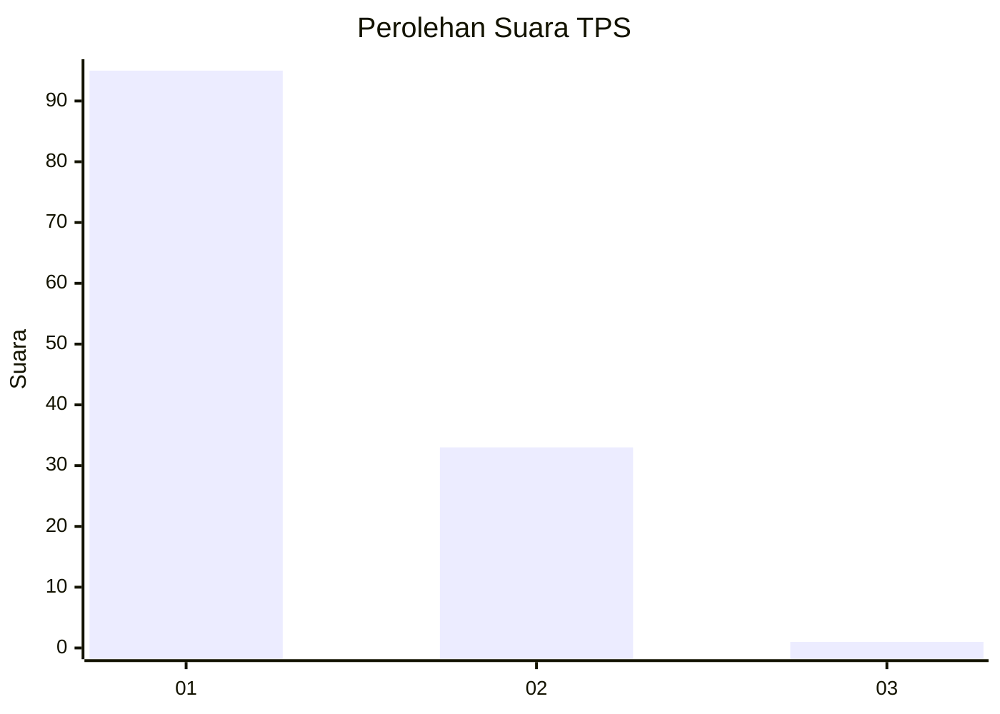
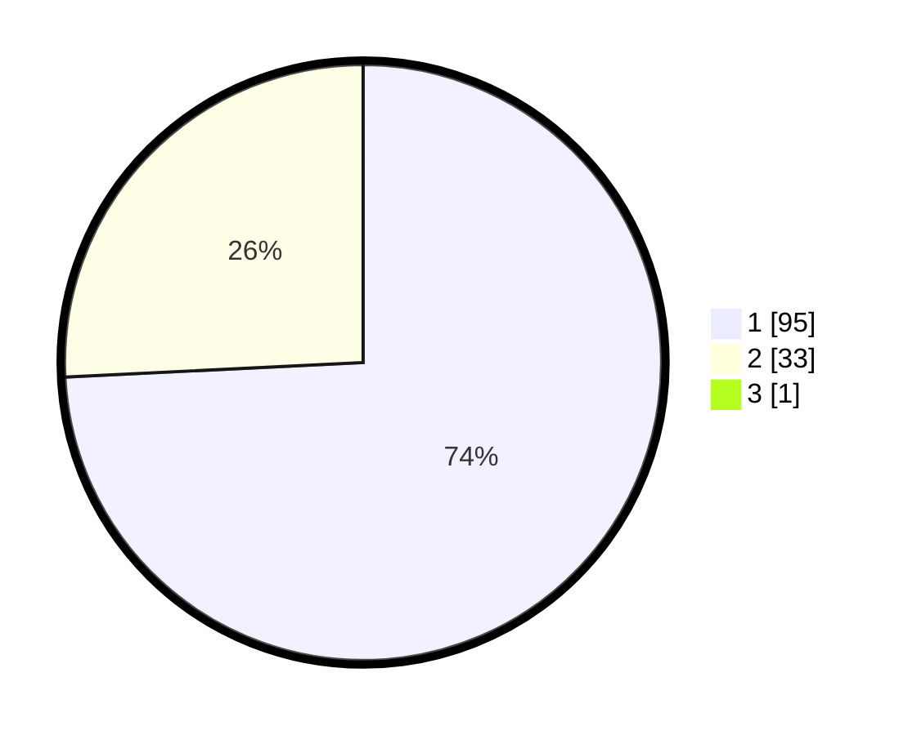

# Hasil

## Grafik

## Tabel

| No. | Nama Paslon    | Suara | Suara (raw) | Persentase |
|:--- |:-------------- | -----:| -----------:| ----------:|
| 1   | ANIES MUHAIMIN | 95    | [95][p-1]   | 73,64      |
| 2   | PRABOWO GIBRAN | 33    | [33][p-2]   | 25,58      |
| 3   | GANJAR MAHFUD  | 1     | [1][p-3]    | 0,78       |

[p-1]: https://github.com/gigit-pemilu/pemilu-2024-13-sumatera-barat/blob/main/pilpres/hitung-suara/sub/13-sumatera-barat/sub/06-agam/sub/06-banuhampu/sub/2006-cingkariang/sub/005-tps/sub/paslon-1.txt
[p-2]: https://github.com/gigit-pemilu/pemilu-2024-13-sumatera-barat/blob/main/pilpres/hitung-suara/sub/13-sumatera-barat/sub/06-agam/sub/06-banuhampu/sub/2006-cingkariang/sub/005-tps/sub/paslon-2.txt
[p-3]: https://github.com/gigit-pemilu/pemilu-2024-13-sumatera-barat/blob/main/pilpres/hitung-suara/sub/13-sumatera-barat/sub/06-agam/sub/06-banuhampu/sub/2006-cingkariang/sub/005-tps/sub/paslon-3.txt

## Foto C Plano

https://sirekap-obj-formc.kpu.go.id/6dac/pemilu/ppwp/13/06/06/20/06/1306062006005-20240215-003013--1a66ca82-6fa7-49cd-a42f-1af14dd989f7.jpg

https://sirekap-obj-formc.kpu.go.id/6dac/pemilu/ppwp/13/06/06/20/06/1306062006005-20240215-003216--61353c99-ea85-4d96-8af2-38077bef5b1a.jpg

https://sirekap-obj-formc.kpu.go.id/6dac/pemilu/ppwp/13/06/06/20/06/1306062006005-20240215-003334--a4578a7b-ec9c-41f9-a367-a7babbed3a83.jpg

## Metadata

| Key        | Value               |
| ---------- | ------------------- |
| Time Stamp | 2024-02-25 13:00:00 |

