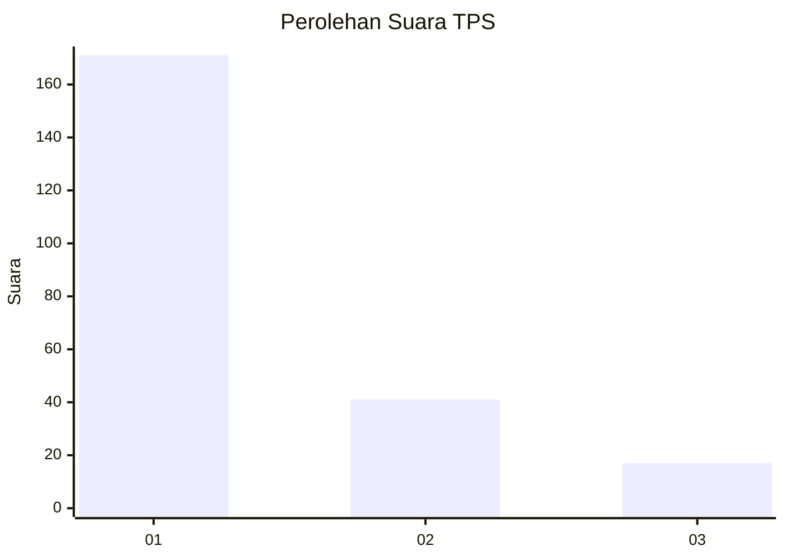
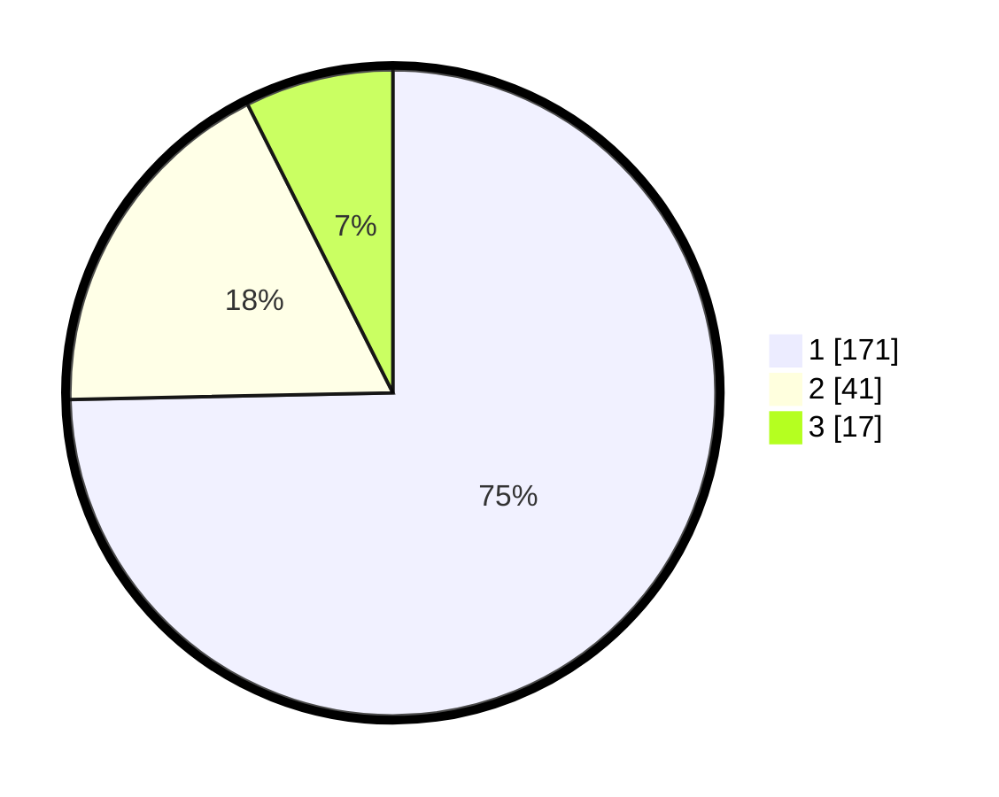

# Hasil

## Grafik

## Tabel

| No. | Nama Paslon    | Suara | Suara (raw) | Persentase |
|:--- |:-------------- | -----:| -----------:| ----------:|
| 1   | ANIES MUHAIMIN | 171   | [171][p-1]  | 74,67      |
| 2   | PRABOWO GIBRAN | 41    | [41][p-2]   | 17,90      |
| 3   | GANJAR MAHFUD  | 17    | [17][p-3]   | 7,42       |

[p-1]: https://github.com/gigit-pemilu/pemilu-2024-13-sumatera-barat/blob/main/pilpres/hitung-suara/sub/13-sumatera-barat/sub/06-agam/sub/07-ampek-angkek/sub/2001-batu-taba/sub/020-tps/sub/paslon-1.txt
[p-2]: https://github.com/gigit-pemilu/pemilu-2024-13-sumatera-barat/blob/main/pilpres/hitung-suara/sub/13-sumatera-barat/sub/06-agam/sub/07-ampek-angkek/sub/2001-batu-taba/sub/020-tps/sub/paslon-2.txt
[p-3]: https://github.com/gigit-pemilu/pemilu-2024-13-sumatera-barat/blob/main/pilpres/hitung-suara/sub/13-sumatera-barat/sub/06-agam/sub/07-ampek-angkek/sub/2001-batu-taba/sub/020-tps/sub/paslon-3.txt

## Foto C Plano

https://sirekap-obj-formc.kpu.go.id/0448/pemilu/ppwp/13/06/07/20/01/1306072001020-20240302-144406--94f3f6e7-ef2c-439f-ad57-965324b8e0d2.jpg

https://sirekap-obj-formc.kpu.go.id/0448/pemilu/ppwp/13/06/07/20/01/1306072001020-20240302-144556--964a762e-bae7-4525-9e15-df1890908034.jpg

https://sirekap-obj-formc.kpu.go.id/0448/pemilu/ppwp/13/06/07/20/01/1306072001020-20240302-145141--4b78e3f3-f654-4176-8735-7cf23c15ec55.jpg

## Metadata

| Key        | Value               |
| ---------- | ------------------- |
| Time Stamp | 2024-03-02 15:00:00 |

## DATA PEMILIH TETAP

Jumlah pemilih dalam DPT: **283**.
 * L: **777**.
 * P: **575**.

## DATA PENGGUNA HAK PILIH

Jumlah pengguna hak pilih dalam DPT: **79**.
 * L: **777**.
 * P: **755**.

Jumlah pengguna hak pilih dalam DPTb: **2**.
 * L: **387**.
 * P: **288**.

Jumlah pengguna hak pilih dalam DPK: **851**.
 * L: **844**.
 * P: **480**.

Jumlah pengguna hak pilih: **205**.
 * L: **883**.
 * P: **484**.

## JUMLAH SUARA SAH DAN TIDAK SAH

JUMLAH SELURUH SUARA SAH: **803**.

JUMLAH SUARA TIDAK SAH: **402**.

JUMLAH SELURUH SUARA SAH DAN SUARA TIDAK SAH: **357**.

