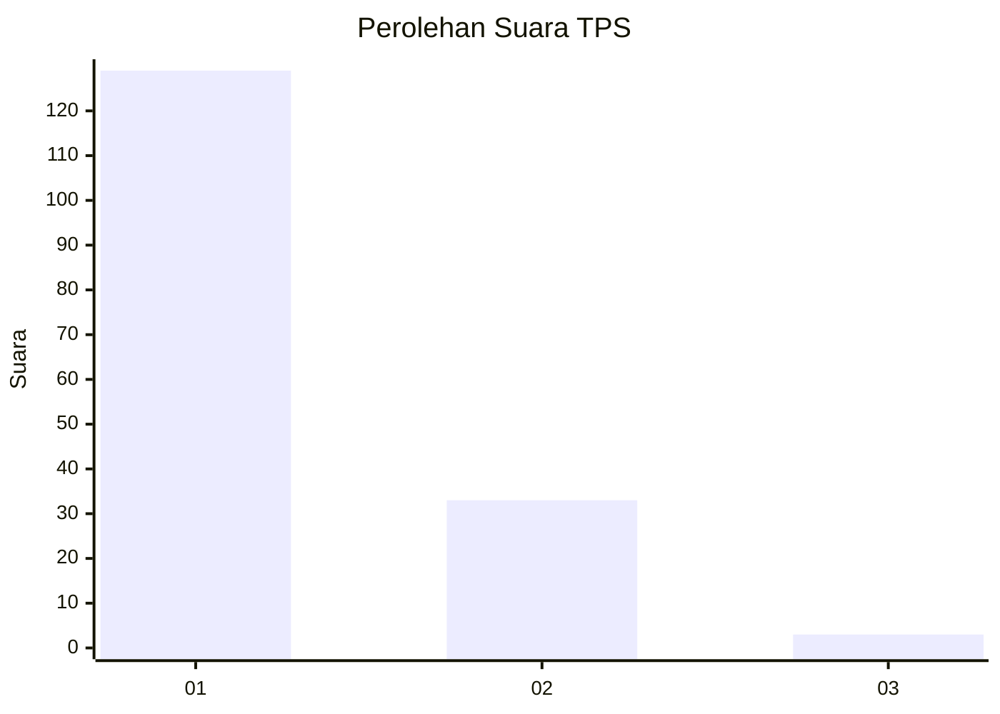
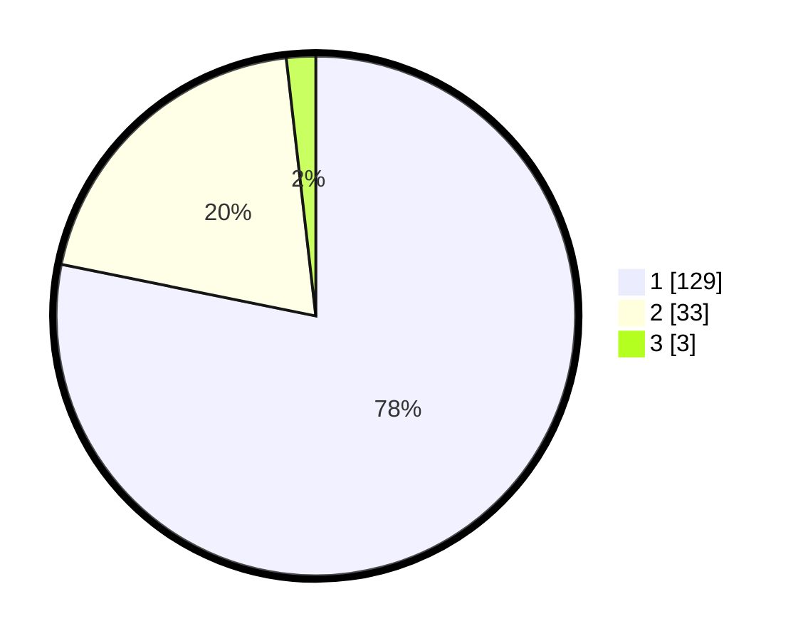

# Hasil

## Grafik

## Tabel

| No. | Nama Paslon    | Suara | Suara (raw) | Persentase |
|:--- |:-------------- | -----:| -----------:| ----------:|
| 1   | ANIES MUHAIMIN | 129   | [129][p-1]  | 78,18      |
| 2   | PRABOWO GIBRAN | 33    | [33][p-2]   | 20,00      |
| 3   | GANJAR MAHFUD  | 3     | [3][p-3]    | 1,82       |

[p-1]: https://github.com/gigit-pemilu/pemilu-2024-13-sumatera-barat/blob/main/pilpres/hitung-suara/sub/13-sumatera-barat/sub/06-agam/sub/07-ampek-angkek/sub/2003-lambah/sub/004-tps/sub/paslon-1.txt
[p-2]: https://github.com/gigit-pemilu/pemilu-2024-13-sumatera-barat/blob/main/pilpres/hitung-suara/sub/13-sumatera-barat/sub/06-agam/sub/07-ampek-angkek/sub/2003-lambah/sub/004-tps/sub/paslon-2.txt
[p-3]: https://github.com/gigit-pemilu/pemilu-2024-13-sumatera-barat/blob/main/pilpres/hitung-suara/sub/13-sumatera-barat/sub/06-agam/sub/07-ampek-angkek/sub/2003-lambah/sub/004-tps/sub/paslon-3.txt

## Foto C Plano

https://sirekap-obj-formc.kpu.go.id/b3a3/pemilu/ppwp/13/06/07/20/03/1306072003004-20240218-155603--aeac0340-b3ea-4b37-96b0-b8856303e570.jpg

https://sirekap-obj-formc.kpu.go.id/b3a3/pemilu/ppwp/13/06/07/20/03/1306072003004-20240218-154959--5d2a0248-03d7-41ce-b585-3e02c69d3bae.jpg

https://sirekap-obj-formc.kpu.go.id/b3a3/pemilu/ppwp/13/06/07/20/03/1306072003004-20240215-043910--a2684941-b54a-4657-8d88-bc07daa4f597.jpg

## Metadata

| Key        | Value               |
| ---------- | ------------------- |
| Time Stamp | 2024-02-24 22:31:28 |

