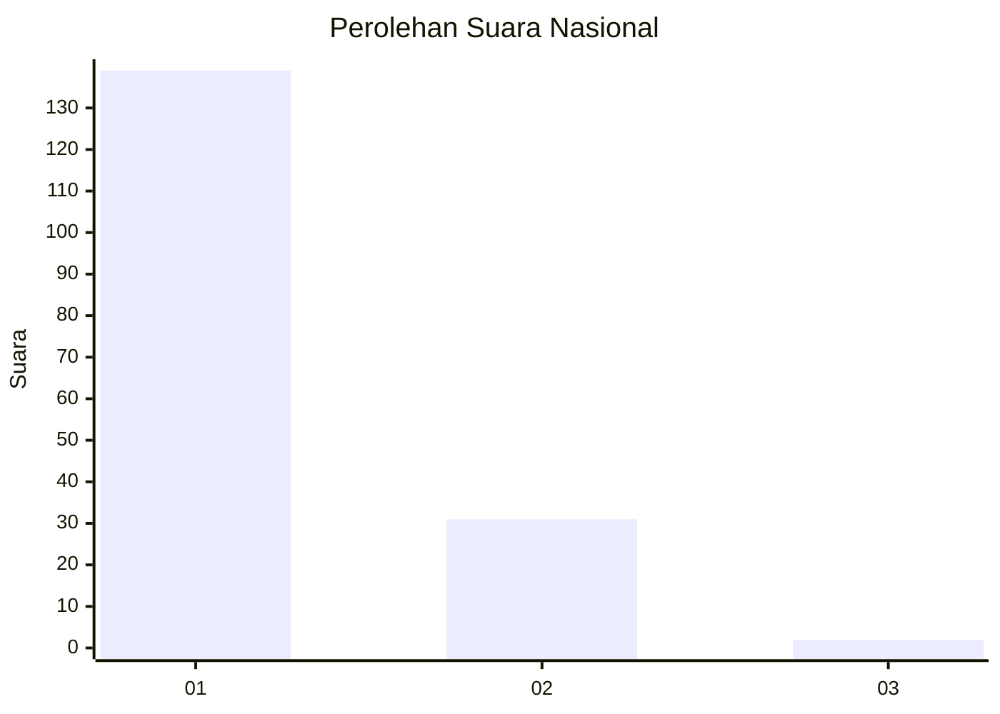
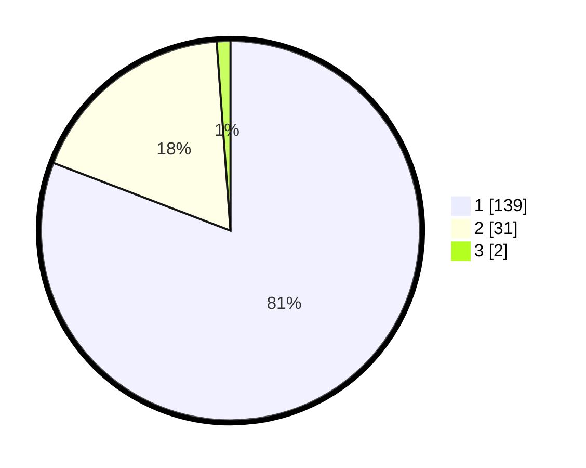

# Hasil

## Grafik

## Tabel

| No. | Nama Paslon    | Suara | Suara (raw) | Persentase |
|:--- |:-------------- | -----:| -----------:| ----------:|
| 1   | ANIES MUHAIMIN | 139   | [139][p-1]  | 80,81      |
| 2   | PRABOWO GIBRAN | 31    | [31][p-2]   | 18,02      |
| 3   | GANJAR MAHFUD  | 2     | [2][p-3]    | 1,16       |

[p-1]: https://github.com/gigit-pemilu/pemilu-2024/blob/main/pilpres/hitung-suara/sub/13-sumatera-barat/sub/06-agam/sub/07-ampek-angkek/sub/2004-panampuang/sub/014-tps/sub/paslon-1.txt
[p-2]: https://github.com/gigit-pemilu/pemilu-2024/blob/main/pilpres/hitung-suara/sub/13-sumatera-barat/sub/06-agam/sub/07-ampek-angkek/sub/2004-panampuang/sub/014-tps/sub/paslon-2.txt
[p-3]: https://github.com/gigit-pemilu/pemilu-2024/blob/main/pilpres/hitung-suara/sub/13-sumatera-barat/sub/06-agam/sub/07-ampek-angkek/sub/2004-panampuang/sub/014-tps/sub/paslon-3.txt

## Foto C Plano

https://sirekap-obj-formc.kpu.go.id/8540/pemilu/ppwp/13/06/07/20/04/1306072004014-20240214-202618--b5132c4f-7504-42c6-a7ba-100a346c971e.jpg

https://sirekap-obj-formc.kpu.go.id/8540/pemilu/ppwp/13/06/07/20/04/1306072004014-20240214-202659--8f521006-1ed4-4e7d-8370-6182df389498.jpg

https://sirekap-obj-formc.kpu.go.id/8540/pemilu/ppwp/13/06/07/20/04/1306072004014-20240214-202725--af684bc2-7ffa-4698-8697-d12ec8d11d7d.jpg

## Metadata

| Key        | Value               |
| ---------- | ------------------- |
| Time Stamp | 2024-02-26 15:00:00 |

