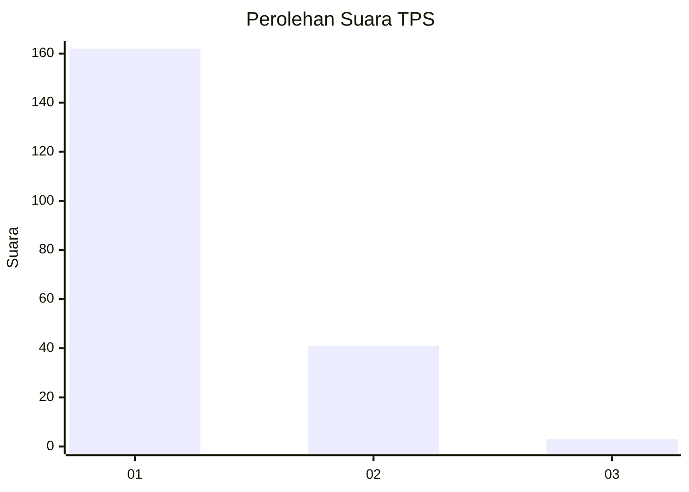
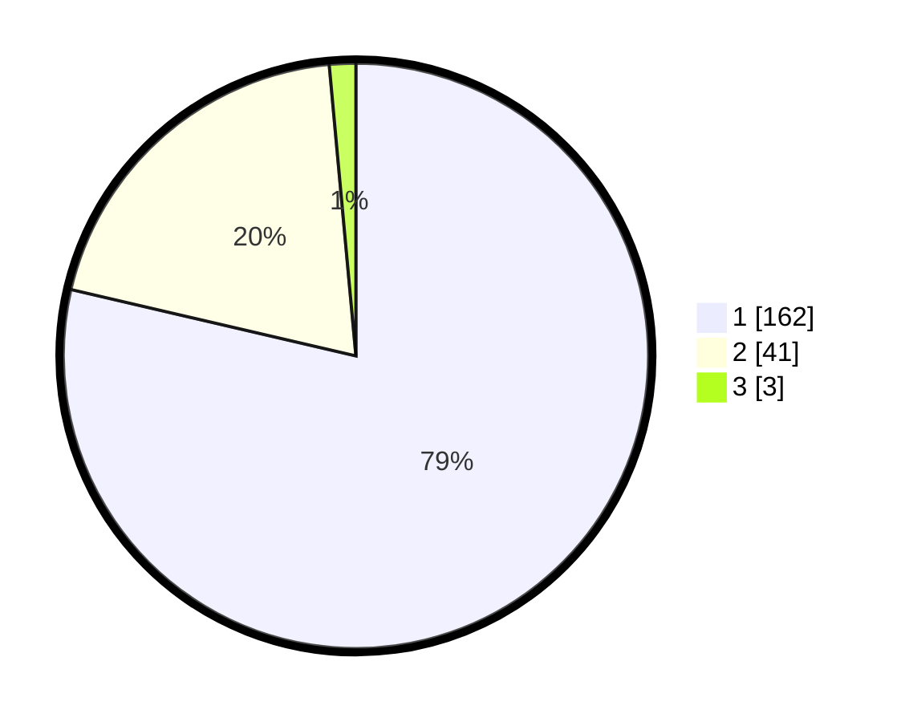

# Hasil

## Grafik

## Tabel

| No. | Nama Paslon    | Suara | Suara (raw) | Persentase |
|:--- |:-------------- | -----:| -----------:| ----------:|
| 1   | ANIES MUHAIMIN | 162   | [162][p-1]  | 78,64      |
| 2   | PRABOWO GIBRAN | 41    | [41][p-2]   | 19,90      |
| 3   | GANJAR MAHFUD  | 3     | [3][p-3]    | 1,46       |

[p-1]: https://github.com/gigit-pemilu/pemilu-2024-13-sumatera-barat/blob/main/pilpres/hitung-suara/sub/13-sumatera-barat/sub/06-agam/sub/07-ampek-angkek/sub/2004-panampuang/sub/016-tps/sub/paslon-1.txt
[p-2]: https://github.com/gigit-pemilu/pemilu-2024-13-sumatera-barat/blob/main/pilpres/hitung-suara/sub/13-sumatera-barat/sub/06-agam/sub/07-ampek-angkek/sub/2004-panampuang/sub/016-tps/sub/paslon-2.txt
[p-3]: https://github.com/gigit-pemilu/pemilu-2024-13-sumatera-barat/blob/main/pilpres/hitung-suara/sub/13-sumatera-barat/sub/06-agam/sub/07-ampek-angkek/sub/2004-panampuang/sub/016-tps/sub/paslon-3.txt

## Foto C Plano

https://sirekap-obj-formc.kpu.go.id/729d/pemilu/ppwp/13/06/07/20/04/1306072004016-20240214-203327--a8b3110c-7ad0-4b2e-b7da-188d092d1987.jpg

https://sirekap-obj-formc.kpu.go.id/729d/pemilu/ppwp/13/06/07/20/04/1306072004016-20240216-063506--22bc66ef-1952-4405-ae74-3aef0511f06a.jpg

https://sirekap-obj-formc.kpu.go.id/729d/pemilu/ppwp/13/06/07/20/04/1306072004016-20240214-203651--3716f519-0e9b-48c4-b69d-01d92a4f7cb7.jpg

## Metadata

| Key        | Value               |
| ---------- | ------------------- |
| Time Stamp | 2024-02-19 06:16:00 |

