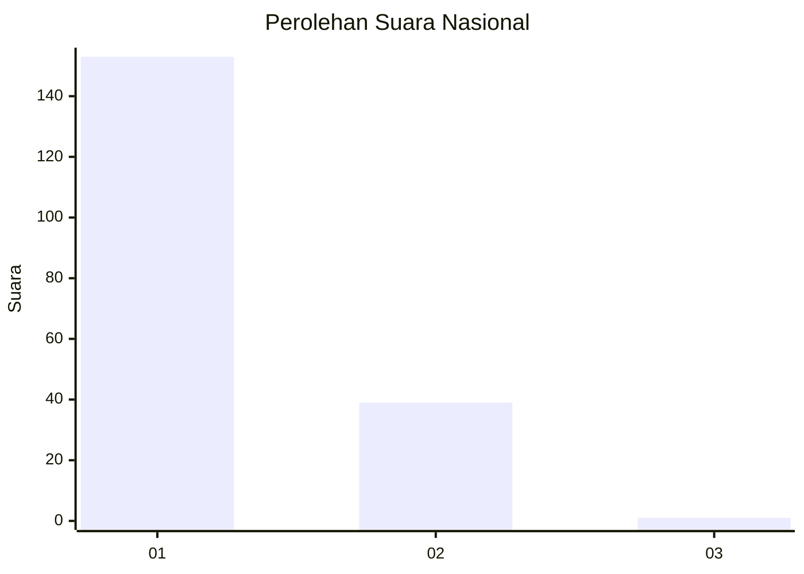
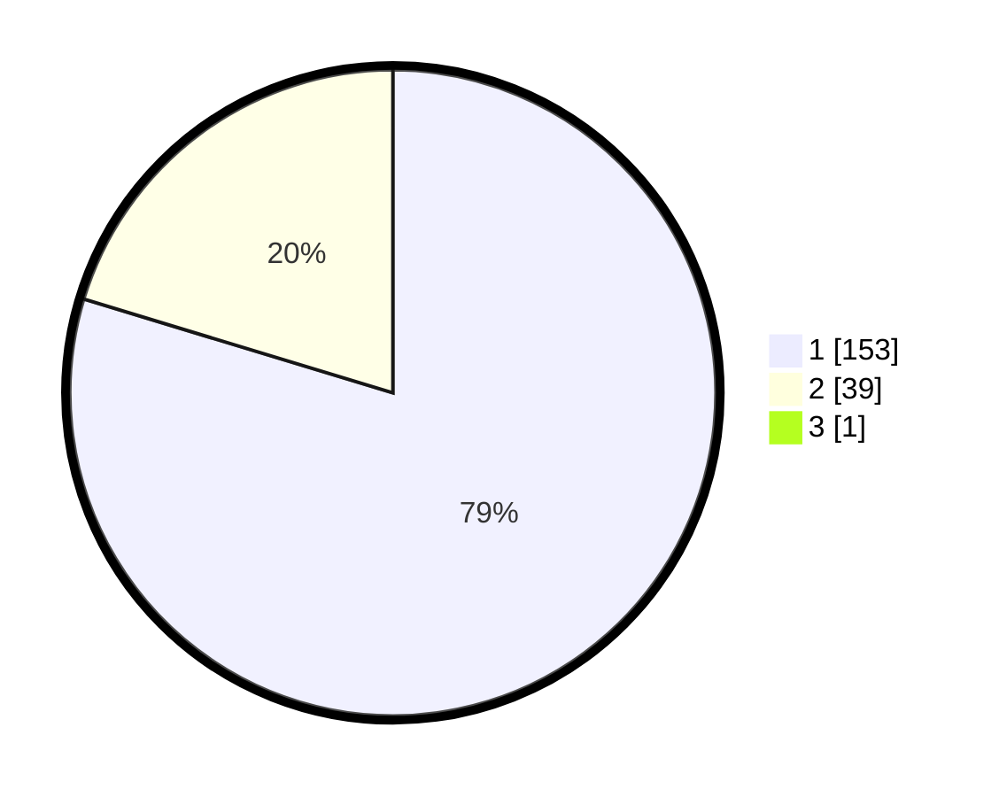

# Hasil

## Grafik

## Tabel

| No. | Nama Paslon    | Suara | Suara (raw) | Persentase |
|:--- |:-------------- | -----:| -----------:| ----------:|
| 1   | ANIES MUHAIMIN | 153   | [153][p-1]  | 79,27      |
| 2   | PRABOWO GIBRAN | 39    | [39][p-2]   | 20,21      |
| 3   | GANJAR MAHFUD  | 1     | [1][p-3]    | 0,52       |

[p-1]: https://github.com/gigit-pemilu/pemilu-2024/blob/main/pilpres/hitung-suara/sub/13-sumatera-barat/sub/06-agam/sub/07-ampek-angkek/sub/2005-ampang-gadang/sub/011-tps/sub/paslon-1.txt
[p-2]: https://github.com/gigit-pemilu/pemilu-2024/blob/main/pilpres/hitung-suara/sub/13-sumatera-barat/sub/06-agam/sub/07-ampek-angkek/sub/2005-ampang-gadang/sub/011-tps/sub/paslon-2.txt
[p-3]: https://github.com/gigit-pemilu/pemilu-2024/blob/main/pilpres/hitung-suara/sub/13-sumatera-barat/sub/06-agam/sub/07-ampek-angkek/sub/2005-ampang-gadang/sub/011-tps/sub/paslon-3.txt

## Foto C Plano

https://sirekap-obj-formc.kpu.go.id/5dd1/pemilu/ppwp/13/06/07/20/05/1306072005011-20240214-215941--c8e86d67-93ce-4f79-87ef-1f13ddaa9df0.jpg

https://sirekap-obj-formc.kpu.go.id/5dd1/pemilu/ppwp/13/06/07/20/05/1306072005011-20240214-220115--7df14050-41a6-41aa-a758-1df031402272.jpg

https://sirekap-obj-formc.kpu.go.id/5dd1/pemilu/ppwp/13/06/07/20/05/1306072005011-20240214-220021--d443a266-952b-468b-96c3-d139f30fc6a7.jpg

## Metadata

| Key        | Value               |
| ---------- | ------------------- |
| Time Stamp | 2024-02-25 12:00:00 |

