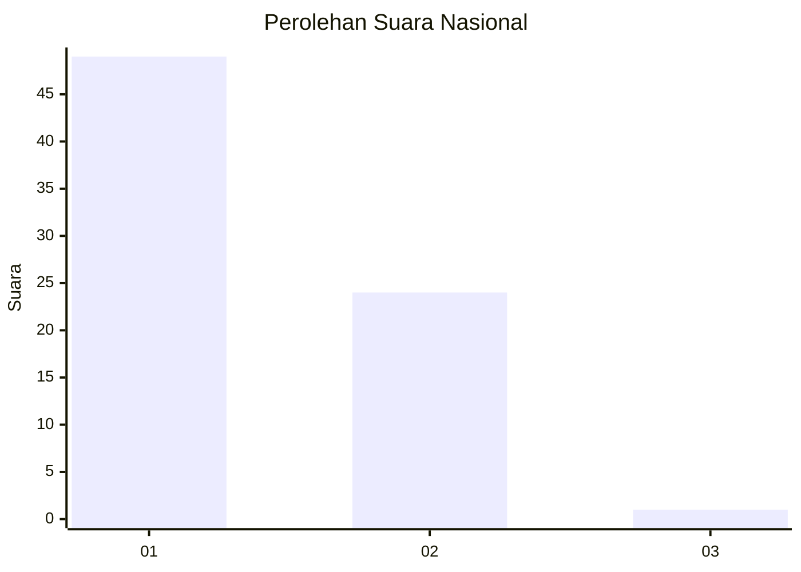
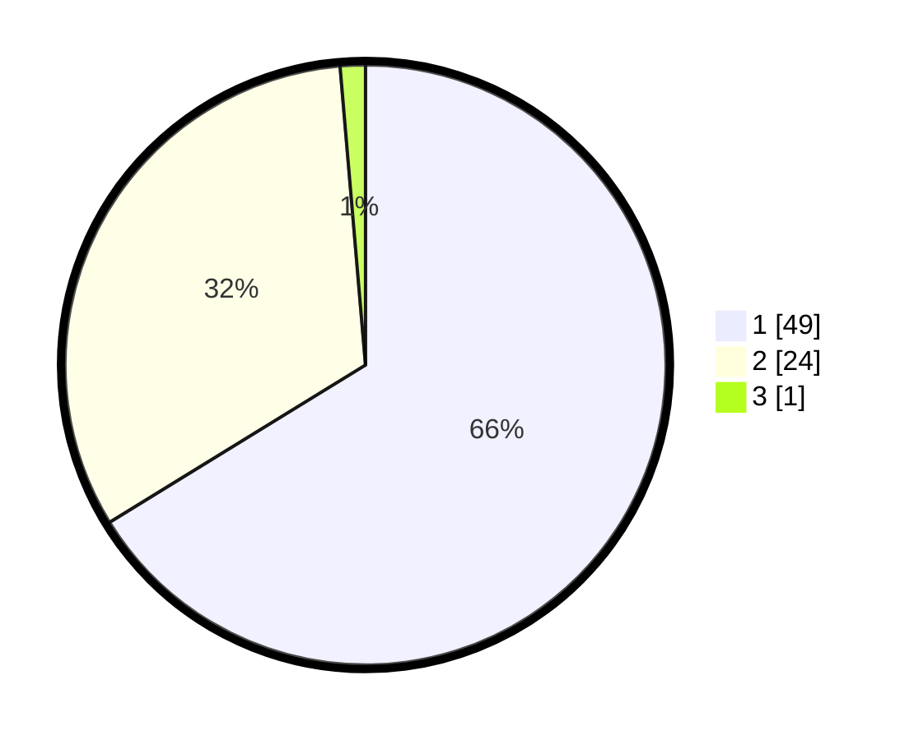

# Hasil

## Grafik

## Tabel

| No. | Nama Paslon    | Suara | Suara (raw) | Persentase |
|:--- |:-------------- | -----:| -----------:| ----------:|
| 1   | ANIES MUHAIMIN | 49    | [49][p-1]   | 66,22      |
| 2   | PRABOWO GIBRAN | 24    | [24][p-2]   | 32,43      |
| 3   | GANJAR MAHFUD  | 1     | [1][p-3]    | 1,35       |

[p-1]: https://github.com/gigit-pemilu/pemilu-2024/blob/main/pilpres/hitung-suara/sub/13-sumatera-barat/sub/06-agam/sub/07-ampek-angkek/sub/2005-ampang-gadang/sub/029-tps/sub/paslon-1.txt
[p-2]: https://github.com/gigit-pemilu/pemilu-2024/blob/main/pilpres/hitung-suara/sub/13-sumatera-barat/sub/06-agam/sub/07-ampek-angkek/sub/2005-ampang-gadang/sub/029-tps/sub/paslon-2.txt
[p-3]: https://github.com/gigit-pemilu/pemilu-2024/blob/main/pilpres/hitung-suara/sub/13-sumatera-barat/sub/06-agam/sub/07-ampek-angkek/sub/2005-ampang-gadang/sub/029-tps/sub/paslon-3.txt

## Foto C Plano

https://sirekap-obj-formc.kpu.go.id/1af0/pemilu/ppwp/13/06/07/20/05/1306072005029-20240214-232205--75152923-6057-4e3c-8121-f6ed2cbe58bc.jpg

https://sirekap-obj-formc.kpu.go.id/1af0/pemilu/ppwp/13/06/07/20/05/1306072005029-20240214-141935--96b88bb9-e5e8-4d8c-9875-10ac310a3d42.jpg

https://sirekap-obj-formc.kpu.go.id/1af0/pemilu/ppwp/13/06/07/20/05/1306072005029-20240214-190758--1700a683-8c29-44b1-bd24-033b42cb925d.jpg

## Metadata

| Key        | Value               |
| ---------- | ------------------- |
| Time Stamp | 2024-02-15 06:00:23 |

