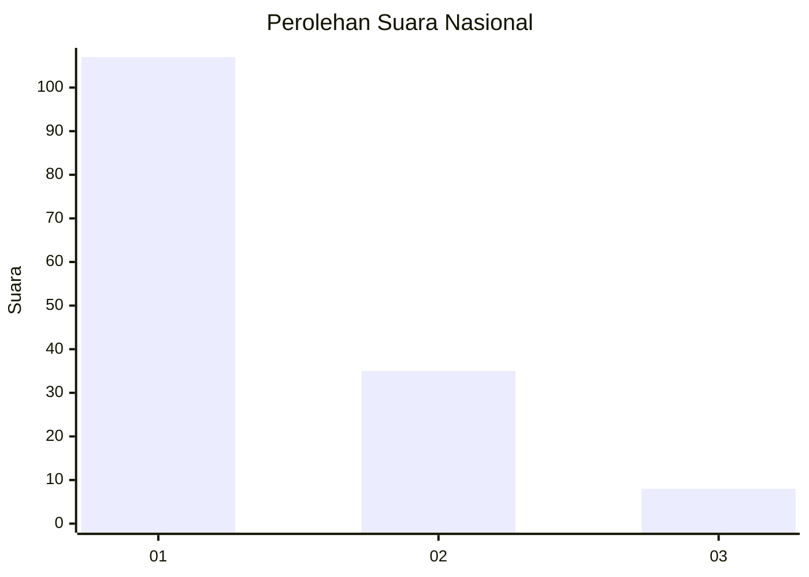
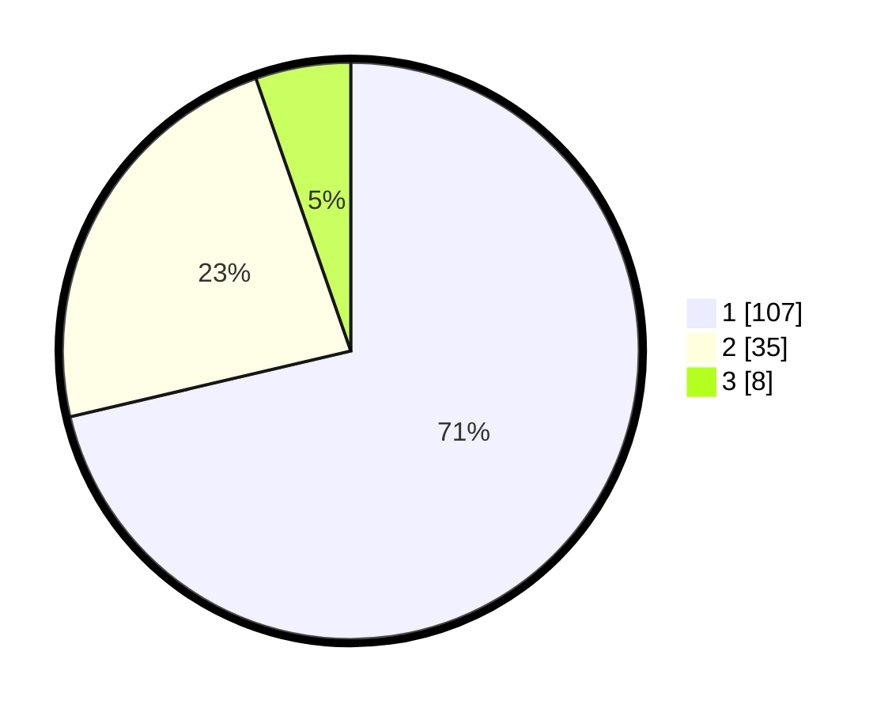

# Hasil

## Grafik

## Tabel

| No. | Nama Paslon    | Suara | Suara (raw) | Persentase |
|:--- |:-------------- | -----:| -----------:| ----------:|
| 1   | ANIES MUHAIMIN | 107   | [107][p-1]  | 71,33      |
| 2   | PRABOWO GIBRAN | 35    | [35][p-2]   | 23,33      |
| 3   | GANJAR MAHFUD  | 8     | [8][p-3]    | 5,33       |

[p-1]: https://github.com/gigit-pemilu/pemilu-2024/blob/main/pilpres/hitung-suara/sub/13-sumatera-barat/sub/06-agam/sub/07-ampek-angkek/sub/2008-balai-gurah/sub/011-tps/sub/paslon-1.txt
[p-2]: https://github.com/gigit-pemilu/pemilu-2024/blob/main/pilpres/hitung-suara/sub/13-sumatera-barat/sub/06-agam/sub/07-ampek-angkek/sub/2008-balai-gurah/sub/011-tps/sub/paslon-2.txt
[p-3]: https://github.com/gigit-pemilu/pemilu-2024/blob/main/pilpres/hitung-suara/sub/13-sumatera-barat/sub/06-agam/sub/07-ampek-angkek/sub/2008-balai-gurah/sub/011-tps/sub/paslon-3.txt

## Foto C Plano

https://sirekap-obj-formc.kpu.go.id/6f72/pemilu/ppwp/13/06/07/20/08/1306072008011-20240217-133150--331549f7-dc2e-4eb3-87e3-5073ebbb2b9d.jpg

https://sirekap-obj-formc.kpu.go.id/6f72/pemilu/ppwp/13/06/07/20/08/1306072008011-20240215-032941--6f91534a-723a-493f-85fb-42c00f4e346d.jpg

https://sirekap-obj-formc.kpu.go.id/6f72/pemilu/ppwp/13/06/07/20/08/1306072008011-20240215-033034--c1643292-dcc4-4eae-8b4d-8f601336ec6d.jpg

## Metadata

| Key        | Value               |
| ---------- | ------------------- |
| Time Stamp | 2024-02-17 13:37:34 |

