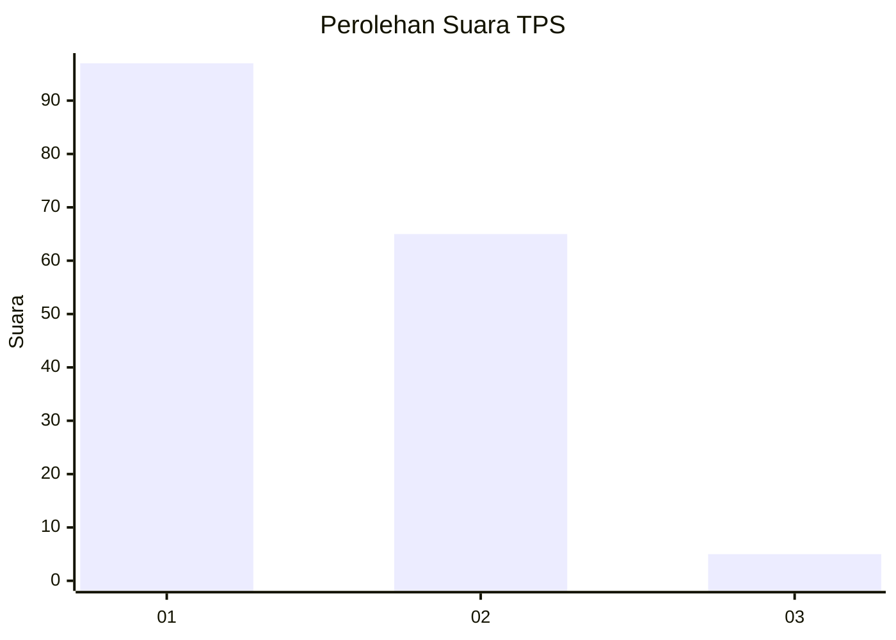
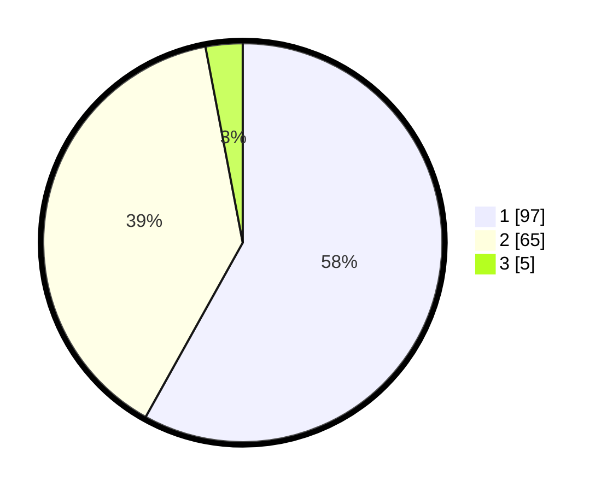

# Hasil

## Grafik

## Tabel

| No. | Nama Paslon    | Suara | Suara (raw) | Persentase |
|:--- |:-------------- | -----:| -----------:| ----------:|
| 1   | ANIES MUHAIMIN | 97    | [97][p-1]   | 58,08      |
| 2   | PRABOWO GIBRAN | 65    | [65][p-2]   | 38,92      |
| 3   | GANJAR MAHFUD  | 5     | [5][p-3]    | 2,99       |

[p-1]: https://github.com/gigit-pemilu/pemilu-2024-13-sumatera-barat/blob/main/pilpres/hitung-suara/sub/13-sumatera-barat/sub/06-agam/sub/08-baso/sub/2001-koto-tinggi/sub/002-tps/sub/paslon-1.txt
[p-2]: https://github.com/gigit-pemilu/pemilu-2024-13-sumatera-barat/blob/main/pilpres/hitung-suara/sub/13-sumatera-barat/sub/06-agam/sub/08-baso/sub/2001-koto-tinggi/sub/002-tps/sub/paslon-2.txt
[p-3]: https://github.com/gigit-pemilu/pemilu-2024-13-sumatera-barat/blob/main/pilpres/hitung-suara/sub/13-sumatera-barat/sub/06-agam/sub/08-baso/sub/2001-koto-tinggi/sub/002-tps/sub/paslon-3.txt

## Foto C Plano

https://sirekap-obj-formc.kpu.go.id/c44c/pemilu/ppwp/13/06/08/20/01/1306082001002-20240218-113419--be82b7e1-cf0c-49b8-a039-3926cf50e41f.jpg

https://sirekap-obj-formc.kpu.go.id/c44c/pemilu/ppwp/13/06/08/20/01/1306082001002-20240218-113631--cbcfffe5-2ddd-48b6-bc82-8ea93d58724e.jpg

https://sirekap-obj-formc.kpu.go.id/c44c/pemilu/ppwp/13/06/08/20/01/1306082001002-20240218-113711--18251154-8f47-432a-b9b2-fba223a5d794.jpg

## Metadata

| Key        | Value               |
| ---------- | ------------------- |
| Time Stamp | 2024-02-25 13:00:00 |

