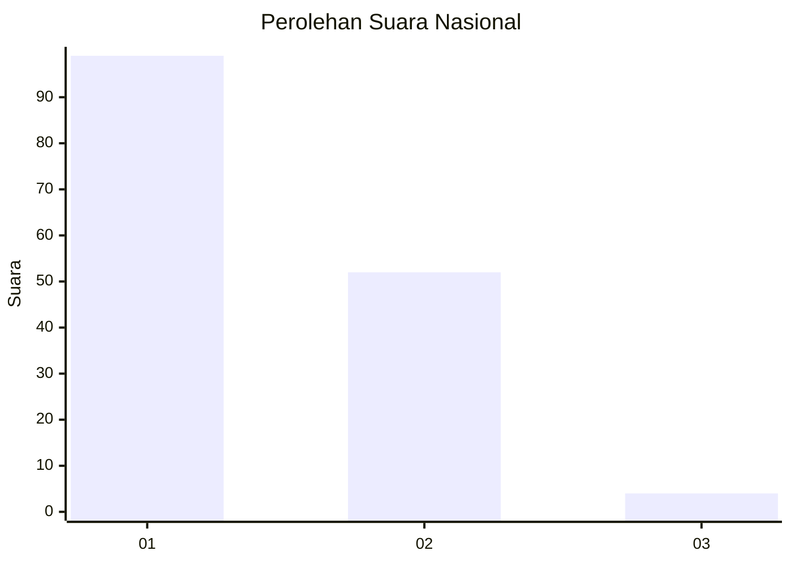
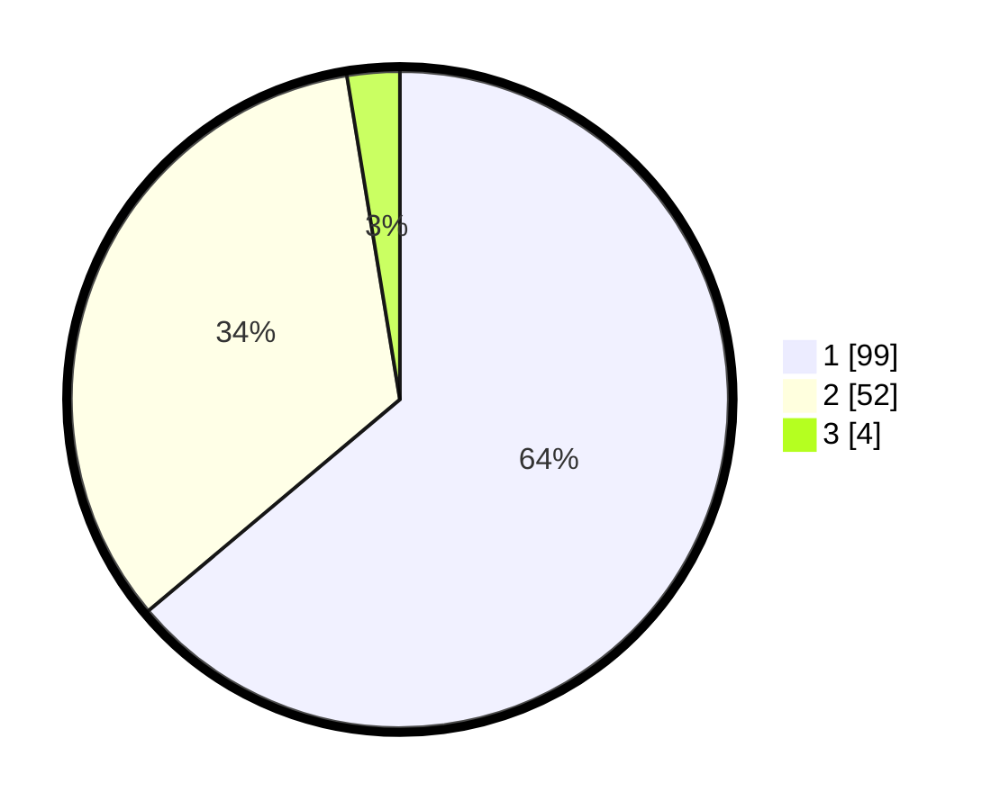

# Hasil

## Grafik

## Tabel

| No. | Nama Paslon    | Suara | Suara (raw) | Persentase |
|:--- |:-------------- | -----:| -----------:| ----------:|
| 1   | ANIES MUHAIMIN | 99    | [99][p-1]   | 63,87      |
| 2   | PRABOWO GIBRAN | 52    | [52][p-2]   | 33,55      |
| 3   | GANJAR MAHFUD  | 4     | [4][p-3]    | 2,58       |

[p-1]: https://github.com/gigit-pemilu/pemilu-2024/blob/main/pilpres/hitung-suara/sub/13-sumatera-barat/sub/06-agam/sub/08-baso/sub/2001-koto-tinggi/sub/004-tps/sub/paslon-1.txt
[p-2]: https://github.com/gigit-pemilu/pemilu-2024/blob/main/pilpres/hitung-suara/sub/13-sumatera-barat/sub/06-agam/sub/08-baso/sub/2001-koto-tinggi/sub/004-tps/sub/paslon-2.txt
[p-3]: https://github.com/gigit-pemilu/pemilu-2024/blob/main/pilpres/hitung-suara/sub/13-sumatera-barat/sub/06-agam/sub/08-baso/sub/2001-koto-tinggi/sub/004-tps/sub/paslon-3.txt

## Foto C Plano

https://sirekap-obj-formc.kpu.go.id/8acb/pemilu/ppwp/13/06/08/20/01/1306082001004-20240214-231818--e18d86e2-dba0-4b75-a497-985d8caba532.jpg

https://sirekap-obj-formc.kpu.go.id/8acb/pemilu/ppwp/13/06/08/20/01/1306082001004-20240214-231925--ee31e62c-e39f-4d1d-84c5-40908b6222f5.jpg

https://sirekap-obj-formc.kpu.go.id/8acb/pemilu/ppwp/13/06/08/20/01/1306082001004-20240214-232050--9ac63894-cc18-402f-9f6c-6ff1ccc38e5d.jpg

## Metadata

| Key        | Value               |
| ---------- | ------------------- |
| Time Stamp | 2024-02-24 22:31:28 |

