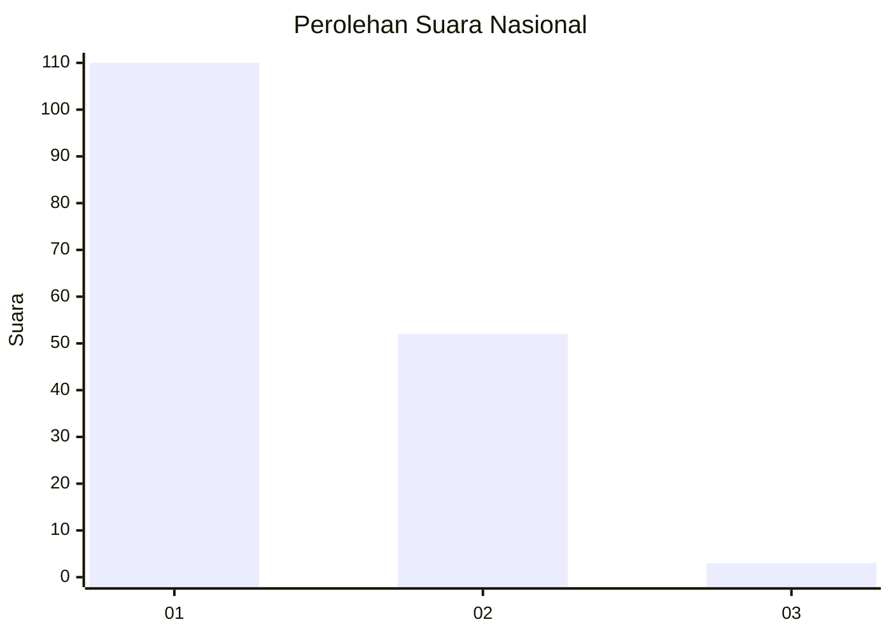
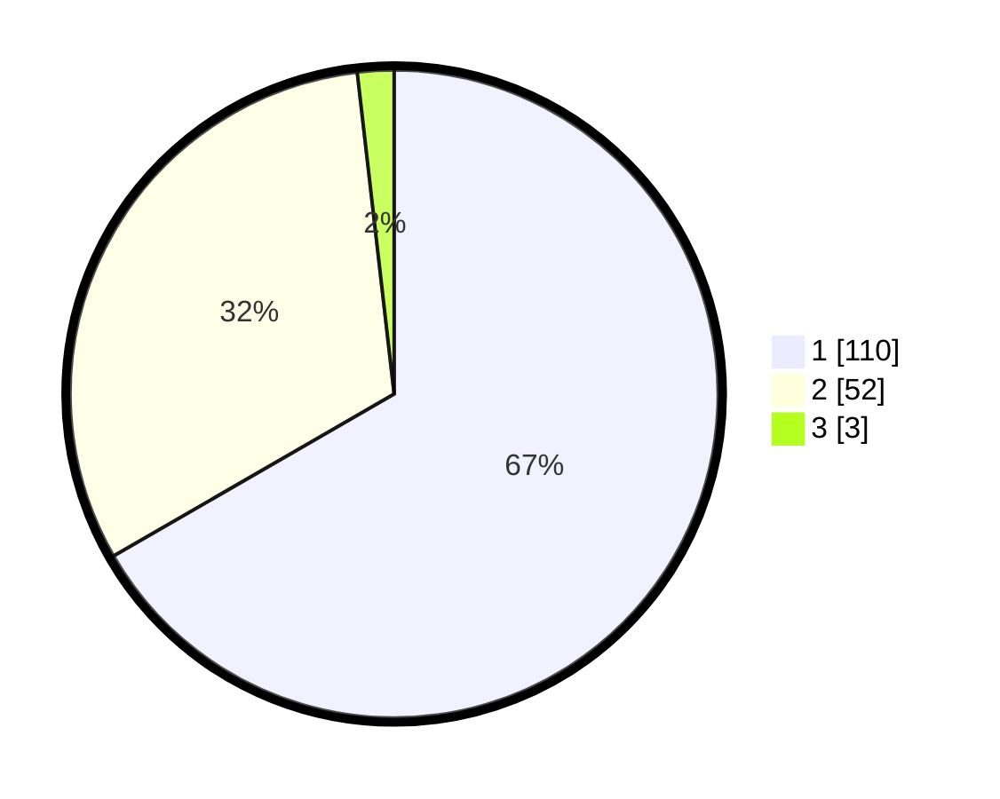

# Hasil

## Grafik

## Tabel

| No. | Nama Paslon    | Suara | Suara (raw) | Persentase |
|:--- |:-------------- | -----:| -----------:| ----------:|
| 1   | ANIES MUHAIMIN | 110   | [110][p-1]  | 66,67      |
| 2   | PRABOWO GIBRAN | 52    | [52][p-2]   | 31,52      |
| 3   | GANJAR MAHFUD  | 3     | [3][p-3]    | 1,82       |

[p-1]: https://github.com/gigit-pemilu/pemilu-2024/blob/main/pilpres/hitung-suara/sub/13-sumatera-barat/sub/06-agam/sub/08-baso/sub/2001-koto-tinggi/sub/007-tps/sub/paslon-1.txt
[p-2]: https://github.com/gigit-pemilu/pemilu-2024/blob/main/pilpres/hitung-suara/sub/13-sumatera-barat/sub/06-agam/sub/08-baso/sub/2001-koto-tinggi/sub/007-tps/sub/paslon-2.txt
[p-3]: https://github.com/gigit-pemilu/pemilu-2024/blob/main/pilpres/hitung-suara/sub/13-sumatera-barat/sub/06-agam/sub/08-baso/sub/2001-koto-tinggi/sub/007-tps/sub/paslon-3.txt

## Foto C Plano

https://sirekap-obj-formc.kpu.go.id/dbf0/pemilu/ppwp/13/06/08/20/01/1306082001007-20240215-023032--dcfeb9a8-ee6a-4416-a09e-2aaf4e8b86aa.jpg

https://sirekap-obj-formc.kpu.go.id/dbf0/pemilu/ppwp/13/06/08/20/01/1306082001007-20240215-023118--317b482a-b3dc-48d7-9ccf-548ae00e6b43.jpg

https://sirekap-obj-formc.kpu.go.id/dbf0/pemilu/ppwp/13/06/08/20/01/1306082001007-20240215-023206--162204e1-0b61-418b-8668-e27e631d24ff.jpg

## Metadata

| Key        | Value               |
| ---------- | ------------------- |
| Time Stamp | 2024-02-25 11:00:00 |

