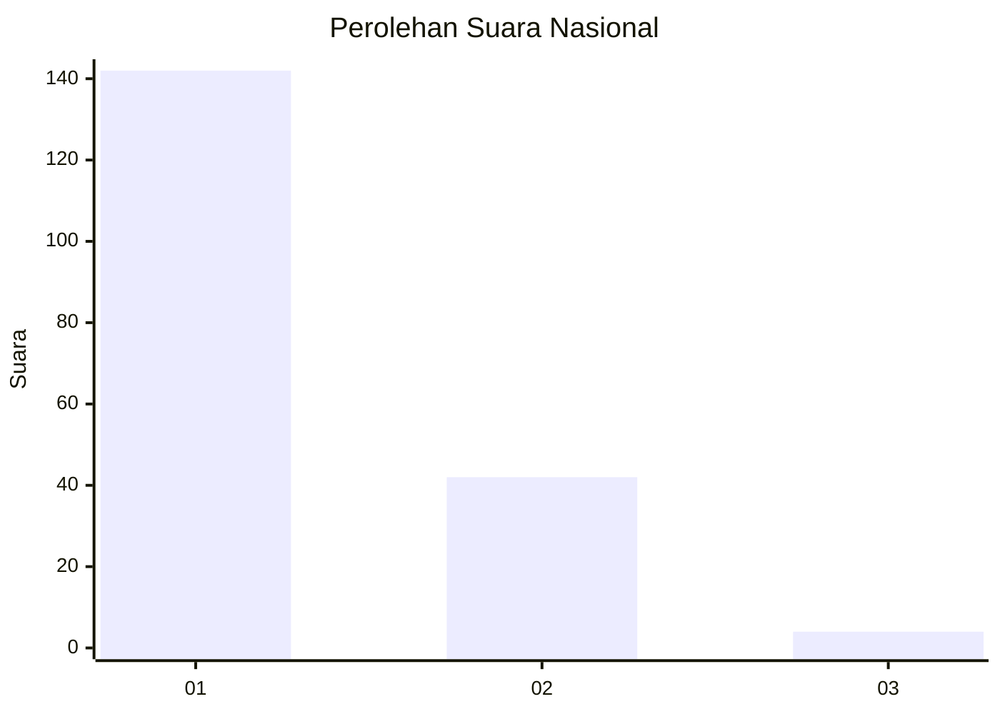
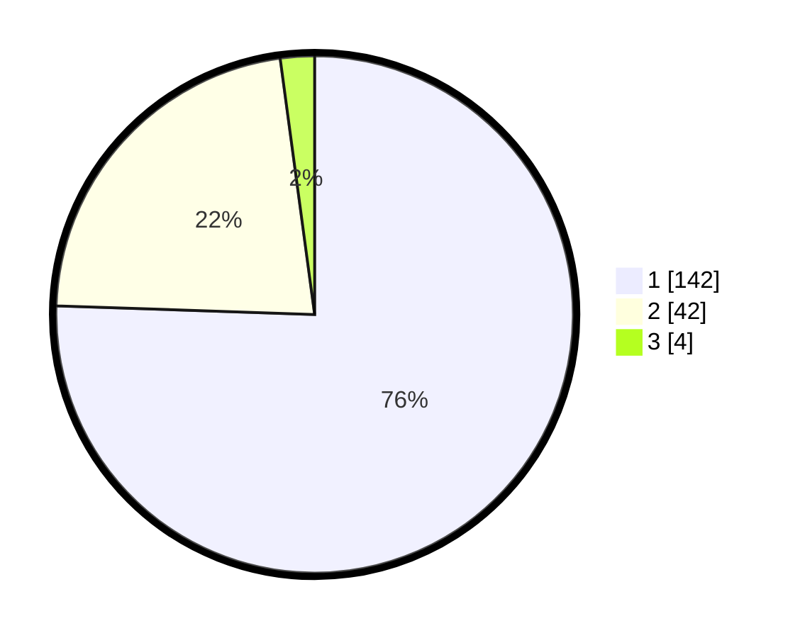

# Hasil

## Grafik

## Tabel

| No. | Nama Paslon    | Suara | Suara (raw) | Persentase |
|:--- |:-------------- | -----:| -----------:| ----------:|
| 1   | ANIES MUHAIMIN | 142   | [142][p-1]  | 75,53      |
| 2   | PRABOWO GIBRAN | 42    | [42][p-2]   | 22,34      |
| 3   | GANJAR MAHFUD  | 4     | [4][p-3]    | 2,13       |

[p-1]: https://github.com/gigit-pemilu/pemilu-2024/blob/main/pilpres/hitung-suara/sub/13-sumatera-barat/sub/06-agam/sub/08-baso/sub/2001-koto-tinggi/sub/016-tps/sub/paslon-1.txt
[p-2]: https://github.com/gigit-pemilu/pemilu-2024/blob/main/pilpres/hitung-suara/sub/13-sumatera-barat/sub/06-agam/sub/08-baso/sub/2001-koto-tinggi/sub/016-tps/sub/paslon-2.txt
[p-3]: https://github.com/gigit-pemilu/pemilu-2024/blob/main/pilpres/hitung-suara/sub/13-sumatera-barat/sub/06-agam/sub/08-baso/sub/2001-koto-tinggi/sub/016-tps/sub/paslon-3.txt

## Foto C Plano

https://sirekap-obj-formc.kpu.go.id/3632/pemilu/ppwp/13/06/08/20/01/1306082001016-20240219-195947--d17c11e0-a640-485d-a9ab-11c4db9b0812.jpg

https://sirekap-obj-formc.kpu.go.id/3632/pemilu/ppwp/13/06/08/20/01/1306082001016-20240219-200102--75f5da13-49be-45f6-91e8-1e433b79bad7.jpg

https://sirekap-obj-formc.kpu.go.id/3632/pemilu/ppwp/13/06/08/20/01/1306082001016-20240219-200205--d2b27664-cf63-48bd-ab7e-3a6ea4a3ebc9.jpg

## Metadata

| Key        | Value               |
| ---------- | ------------------- |
| Time Stamp | 2024-02-25 00:00:00 |

