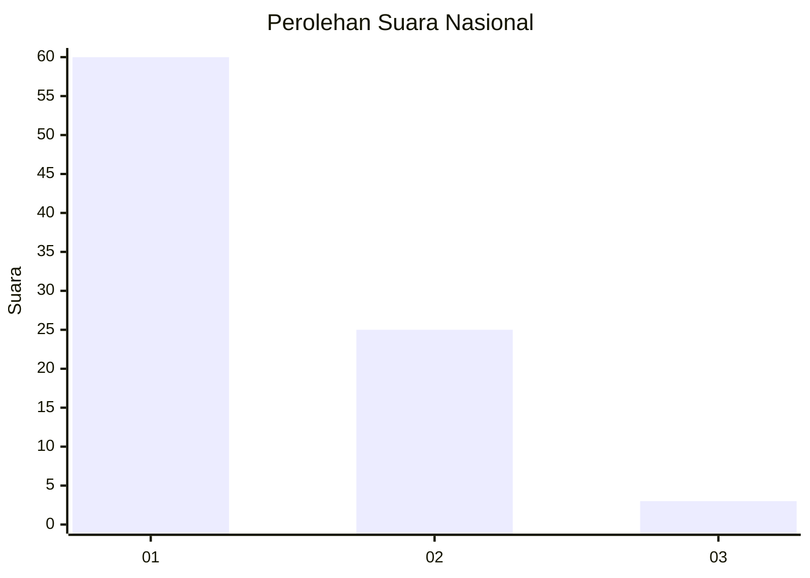
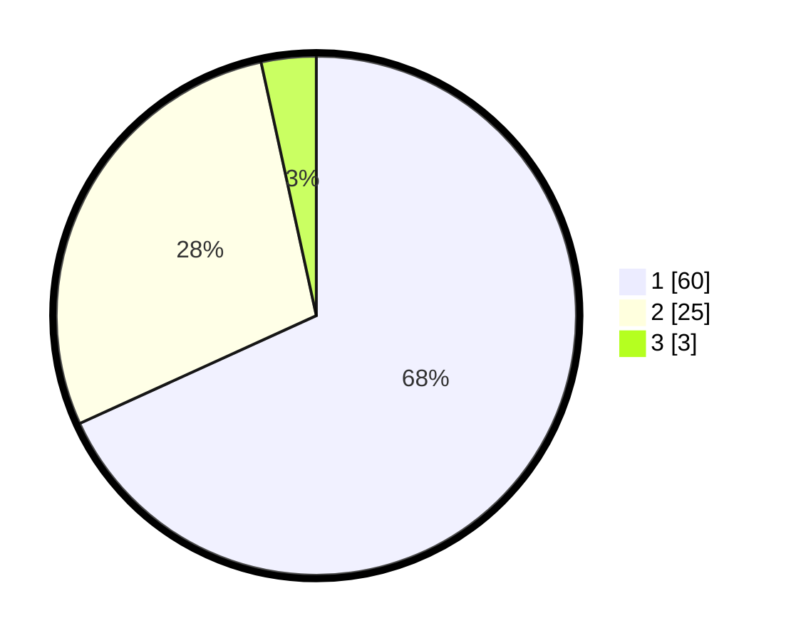

# Hasil

## Grafik

## Tabel

| No. | Nama Paslon    | Suara | Suara (raw) | Persentase |
|:--- |:-------------- | -----:| -----------:| ----------:|
| 1   | ANIES MUHAIMIN | 60    | [60][p-1]   | 68,18      |
| 2   | PRABOWO GIBRAN | 25    | [25][p-2]   | 28,41      |
| 3   | GANJAR MAHFUD  | 3     | [3][p-3]    | 3,41       |

[p-1]: https://github.com/gigit-pemilu/pemilu-2024/blob/main/pilpres/hitung-suara/sub/13-sumatera-barat/sub/06-agam/sub/08-baso/sub/2002-tabek-panjang/sub/013-tps/sub/paslon-1.txt
[p-2]: https://github.com/gigit-pemilu/pemilu-2024/blob/main/pilpres/hitung-suara/sub/13-sumatera-barat/sub/06-agam/sub/08-baso/sub/2002-tabek-panjang/sub/013-tps/sub/paslon-2.txt
[p-3]: https://github.com/gigit-pemilu/pemilu-2024/blob/main/pilpres/hitung-suara/sub/13-sumatera-barat/sub/06-agam/sub/08-baso/sub/2002-tabek-panjang/sub/013-tps/sub/paslon-3.txt

## Foto C Plano

https://sirekap-obj-formc.kpu.go.id/0901/pemilu/ppwp/13/06/08/20/02/1306082002013-20240219-210948--d08ef2cb-7896-4c92-b51f-5026fce77576.jpg

https://sirekap-obj-formc.kpu.go.id/0901/pemilu/ppwp/13/06/08/20/02/1306082002013-20240219-203854--c63b73ee-f816-4a30-a314-27a9b34a4d35.jpg

https://sirekap-obj-formc.kpu.go.id/0901/pemilu/ppwp/13/06/08/20/02/1306082002013-20240219-205122--6a8cc85f-221a-4ea4-af81-6b8de9407c70.jpg

## Metadata

| Key        | Value               |
| ---------- | ------------------- |
| Time Stamp | 2024-02-25 16:00:00 |

