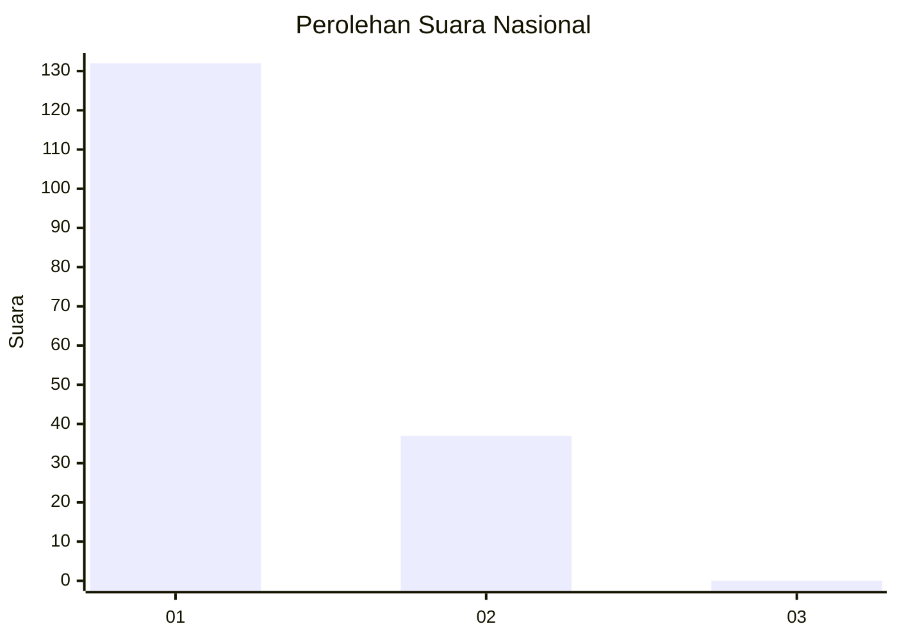
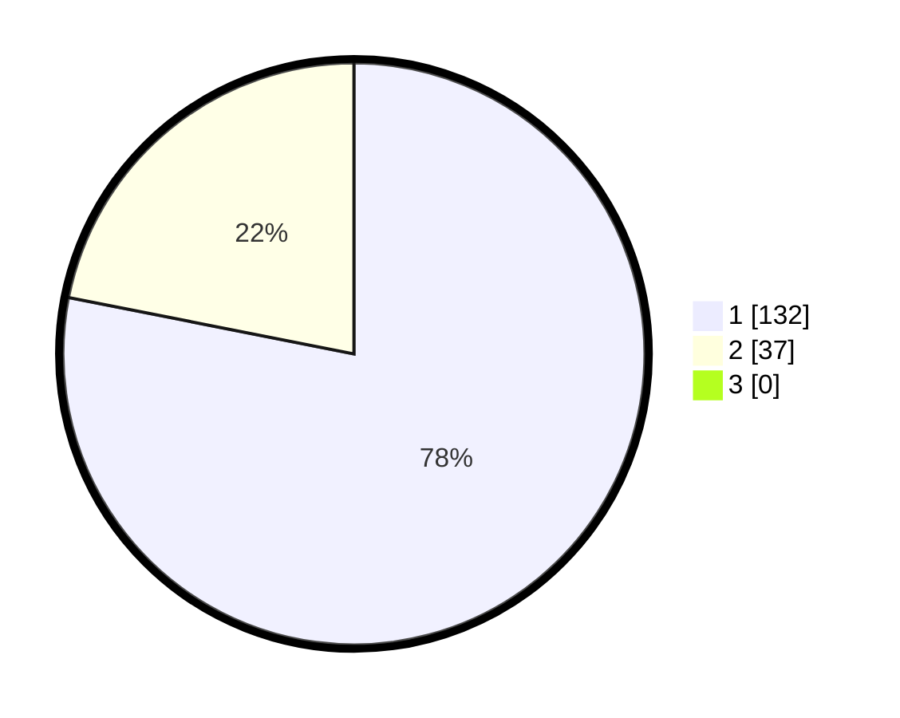

# Hasil

## Grafik

## Tabel

| No. | Nama Paslon    | Suara | Suara (raw) | Persentase |
|:--- |:-------------- | -----:| -----------:| ----------:|
| 1   | ANIES MUHAIMIN | 132   | [132][p-1]  | 78,11      |
| 2   | PRABOWO GIBRAN | 37    | [37][p-2]   | 21,89      |
| 3   | GANJAR MAHFUD  | 0     | [0][p-3]    | 0,00       |

[p-1]: https://github.com/gigit-pemilu/pemilu-2024/blob/main/pilpres/hitung-suara/sub/13-sumatera-barat/sub/06-agam/sub/08-baso/sub/2002-tabek-panjang/sub/016-tps/sub/paslon-1.txt
[p-2]: https://github.com/gigit-pemilu/pemilu-2024/blob/main/pilpres/hitung-suara/sub/13-sumatera-barat/sub/06-agam/sub/08-baso/sub/2002-tabek-panjang/sub/016-tps/sub/paslon-2.txt
[p-3]: https://github.com/gigit-pemilu/pemilu-2024/blob/main/pilpres/hitung-suara/sub/13-sumatera-barat/sub/06-agam/sub/08-baso/sub/2002-tabek-panjang/sub/016-tps/sub/paslon-3.txt

## Foto C Plano

https://sirekap-obj-formc.kpu.go.id/7592/pemilu/ppwp/13/06/08/20/02/1306082002016-20240221-173909--a12894b9-3223-4ec6-8689-cbf8ad3a2b8b.jpg

https://sirekap-obj-formc.kpu.go.id/7592/pemilu/ppwp/13/06/08/20/02/1306082002016-20240221-173954--0e2c0d58-086d-4ec6-8b6c-af28f8ae7dc7.jpg

https://sirekap-obj-formc.kpu.go.id/7592/pemilu/ppwp/13/06/08/20/02/1306082002016-20240221-174210--5899e14a-a5ef-4b3a-aa56-6464bd60fd11.jpg

## Metadata

| Key        | Value               |
| ---------- | ------------------- |
| Time Stamp | 2024-02-24 22:31:28 |

