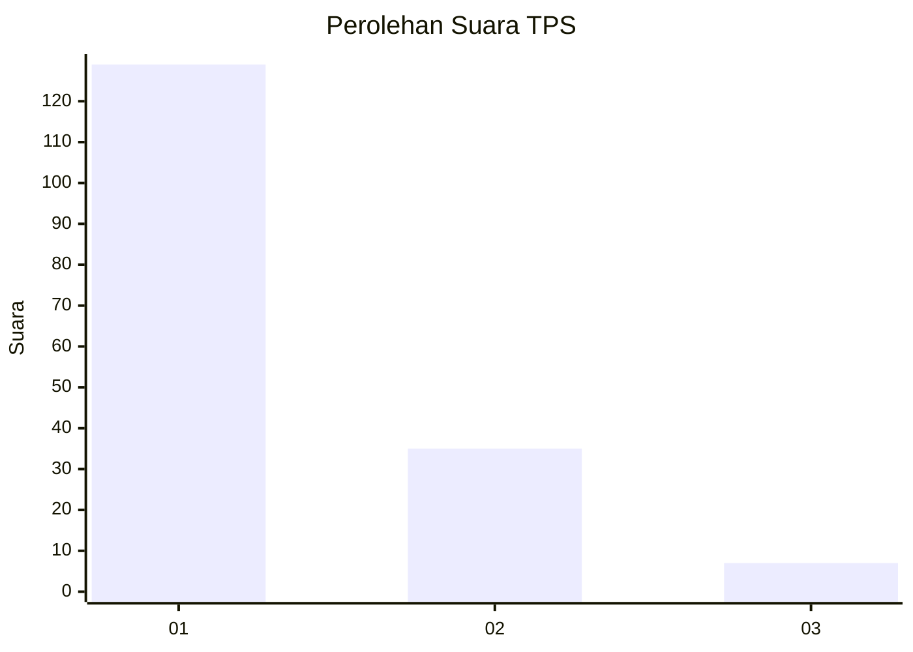
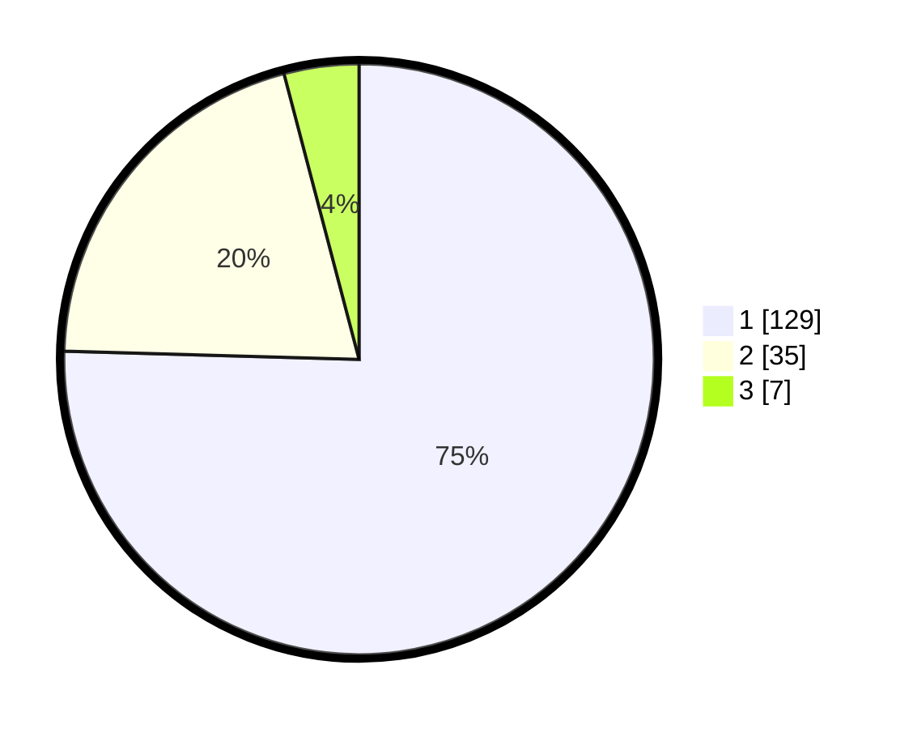

# Hasil

## Grafik

## Tabel

| No. | Nama Paslon    | Suara | Suara (raw) | Persentase |
|:--- |:-------------- | -----:| -----------:| ----------:|
| 1   | ANIES MUHAIMIN | 129   | [129][p-1]  | 75,44      |
| 2   | PRABOWO GIBRAN | 35    | [35][p-2]   | 20,47      |
| 3   | GANJAR MAHFUD  | 7     | [7][p-3]    | 4,09       |

[p-1]: https://github.com/gigit-pemilu/pemilu-2024-13-sumatera-barat/blob/main/pilpres/hitung-suara/sub/13-sumatera-barat/sub/06-agam/sub/08-baso/sub/2002-tabek-panjang/sub/019-tps/sub/paslon-1.txt
[p-2]: https://github.com/gigit-pemilu/pemilu-2024-13-sumatera-barat/blob/main/pilpres/hitung-suara/sub/13-sumatera-barat/sub/06-agam/sub/08-baso/sub/2002-tabek-panjang/sub/019-tps/sub/paslon-2.txt
[p-3]: https://github.com/gigit-pemilu/pemilu-2024-13-sumatera-barat/blob/main/pilpres/hitung-suara/sub/13-sumatera-barat/sub/06-agam/sub/08-baso/sub/2002-tabek-panjang/sub/019-tps/sub/paslon-3.txt

## Foto C Plano

https://sirekap-obj-formc.kpu.go.id/05f9/pemilu/ppwp/13/06/08/20/02/1306082002019-20240221-213014--288ac817-11c7-4aa3-bd4a-698153ab56ac.jpg

https://sirekap-obj-formc.kpu.go.id/05f9/pemilu/ppwp/13/06/08/20/02/1306082002019-20240221-213043--c8b5c6c9-1377-4f58-886c-ada2590a1dfd.jpg

https://sirekap-obj-formc.kpu.go.id/05f9/pemilu/ppwp/13/06/08/20/02/1306082002019-20240221-213113--95749800-4550-496b-996c-df37b2b7da3c.jpg

## Metadata

| Key        | Value               |
| ---------- | ------------------- |
| Time Stamp | 2024-02-26 15:00:00 |

