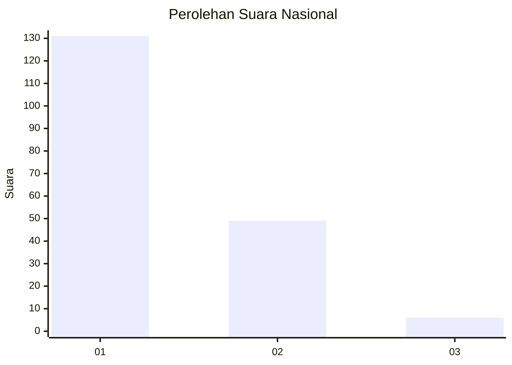
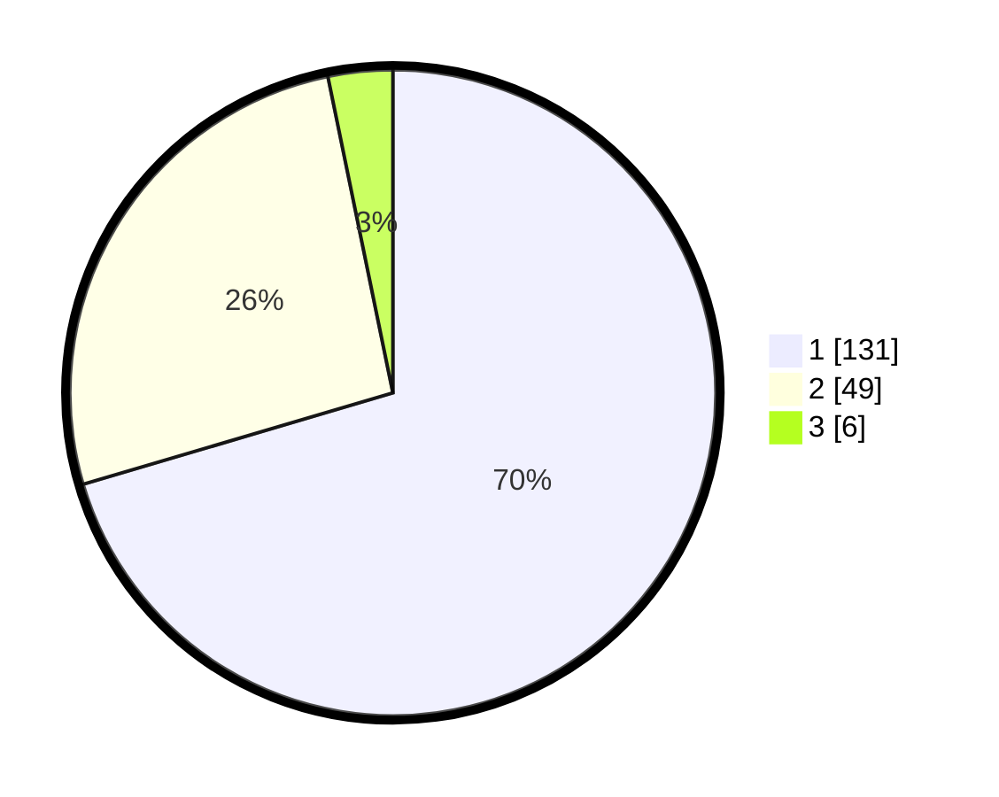

# Hasil

## Grafik

## Tabel

| No. | Nama Paslon    | Suara | Suara (raw) | Persentase |
|:--- |:-------------- | -----:| -----------:| ----------:|
| 1   | ANIES MUHAIMIN | 131   | [131][p-1]  | 70,43      |
| 2   | PRABOWO GIBRAN | 49    | [49][p-2]   | 26,34      |
| 3   | GANJAR MAHFUD  | 6     | [6][p-3]    | 3,23       |

[p-1]: https://github.com/gigit-pemilu/pemilu-2024/blob/main/pilpres/hitung-suara/sub/13-sumatera-barat/sub/06-agam/sub/08-baso/sub/2002-tabek-panjang/sub/021-tps/sub/paslon-1.txt
[p-2]: https://github.com/gigit-pemilu/pemilu-2024/blob/main/pilpres/hitung-suara/sub/13-sumatera-barat/sub/06-agam/sub/08-baso/sub/2002-tabek-panjang/sub/021-tps/sub/paslon-2.txt
[p-3]: https://github.com/gigit-pemilu/pemilu-2024/blob/main/pilpres/hitung-suara/sub/13-sumatera-barat/sub/06-agam/sub/08-baso/sub/2002-tabek-panjang/sub/021-tps/sub/paslon-3.txt

## Foto C Plano

https://sirekap-obj-formc.kpu.go.id/1905/pemilu/ppwp/13/06/08/20/02/1306082002021-20240221-202316--4901af42-3e8a-466c-996d-c1b22ddd6ec9.jpg

https://sirekap-obj-formc.kpu.go.id/1905/pemilu/ppwp/13/06/08/20/02/1306082002021-20240221-202356--533a4537-3b7c-4237-8be4-6dbc8c41aa20.jpg

https://sirekap-obj-formc.kpu.go.id/1905/pemilu/ppwp/13/06/08/20/02/1306082002021-20240221-202434--c1faaff3-0433-4988-9f7b-55736a07afa5.jpg

## Metadata

| Key        | Value               |
| ---------- | ------------------- |
| Time Stamp | 2024-02-25 12:00:00 |

